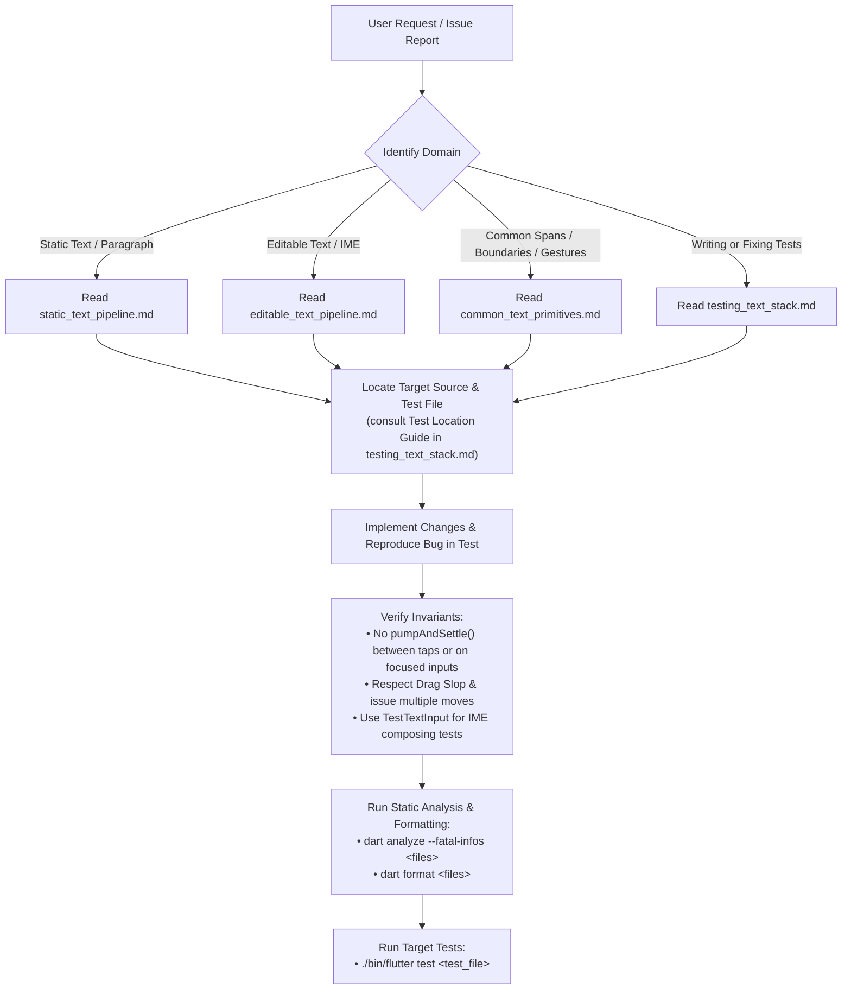

# Flutter Text Domain Expert Skill (`flutter/flutter`)

This skill provides authoritative architectural guidance, subsystem reference mappings, testing invariants, and development workflows for contributing to the text subsystem in the `flutter/flutter` repository.

---

## 1. Subsystem Reference Navigation

The text stack is organized into modular reference guides located under [`references/`](references/):

| Subsystem Area | Reference Document | Key Topics & Components Covered |
| :--- | :--- | :--- |
| **Common Foundation & Primitives** | [`common_text_primitives.md`](references/common_text_primitives.md) | • `dart:ui` Engine primitives (`ParagraphBuilder`, `Paragraph`, `LineMetrics`, `TextBox`) • `TextPainter` layout caching (`_TextPainterLayoutCacheWithOffset`) • `InlineSpan` hierarchy (`TextSpan`, `WidgetSpan`, visitor pattern) • Text geometry, BiDi, and `TextAffinity` • `TextBoundary` iterators (character, word, line, paragraph) • Shared gesture recognizers (`TapAndPanGestureRecognizer`, `BaseTapAndDragGestureRecognizer`) • Shared selection overlays, toolbars, handles, and magnifiers |
| **Static Text & Unified Selection** | [`static_text_pipeline.md`](references/static_text_pipeline.md) | • `Text`, `RichText`, `_RichText` • `RenderParagraph` layout, intrinsics, inline child layout (`WidgetSpan`), and span hit-testing • `SelectionArea` & `SelectableRegion` • `SelectionContainer` & delegates (`StaticSelectionContainerDelegate`, `_SelectableTextContainerDelegate`) • `Scrollable` integration & `_ScrollableSelectionContainerDelegate` (`_selectionStartsInScrollable`, autoscrolling) • `_SelectableFragment` & leaf `Selectable`s • 7 concrete `SelectionEvent` subclasses & `compareOrder` reading order sorting |
| **Editable Text & Platform IME** | [`editable_text_pipeline.md`](references/editable_text_pipeline.md) | • `TextField`, `CupertinoTextField`, `EditableText`, `EditableTextState` • `RenderEditable`, `_CaretPainter` (blinking/floating cursor), `ViewportOffset` • `TextInputClient` (standard) vs. `DeltaTextInputClient` (`TextEditingDelta` stream) • Platform channel: `MethodChannel('flutter/textinput')` • `TextInputFormatter`, `SpellCheckService`, `LiveText`, `ProcessTextService` • `DefaultTextEditingShortcuts`, `Actions`, `TextEditingIntents`, macOS selectors • `TextSelectionOverlay` (isolated from `SelectionArea`) |
| **Testing, Traps & Simulation** | [`testing_text_stack.md`](references/testing_text_stack.md) | • **Test Location Guide**: directory map across `packages/flutter/test/` • Multi-tap timing & `pumpAndSettle()` tap reset trap (`kDoubleTapTimeout`) • Caret blinking timer hang & timeout trap • Ahem font geometry & drag slop trap (`kTouchSlop` / `kPanSlop`) • Multi-move event requirements (`onDragStart` vs `onDragUpdate`) • Floating overlay, toolbar & handle testing patterns (geometric dragging vs. `FadeTransition`) • Realistic IME simulation with `TestTextInput` (composing ranges & actions) • BiDi & `TextAffinity` assertions |
| **Debugging Playbooks** | [`text_debugging_playbooks.md`](references/text_debugging_playbooks.md) | Diagnostic trees and triage runbooks for common text bug patterns *(iterative reference)*. |

---

## 2. Core Architectural Invariants to Uphold

When reading, modifying, or reviewing text subsystem code in `flutter/flutter`, always maintain these structural rules:

1. **Repository Scope & Frozen Design Systems**:
   - In the `flutter/flutter` repository, active text development takes place in `packages/flutter` across `widgets/`, `rendering/`, `services/`, and `painting/`.
   - The legacy `packages/flutter/lib/src/material/` and `packages/flutter/lib/src/cupertino/` implementations are **frozen**.
   - Active development of Material and Cupertino text UI components (`TextField`, `CupertinoTextField`, `AdaptiveTextSelectionToolbar`, `SelectionArea`, selection handles) belongs in the **`material_ui`** and **`cupertino_ui`** packages under the **`flutter/packages`** repository.

2. **Subsystem Isolation**:
   - `RenderEditable` does **not** participate in the `SelectionArea` / `SelectableRegion` selection tree. It maintains its own selection and overlay state machine via `TextSelectionOverlay`.
   - `SelectableRegion` coordinates unified selection across read-only leaf registrants (`_SelectableFragment` in `RenderParagraph`, custom selectables) via the `SelectionRegistrarScope`.

3. **Layer Boundary Rules in `packages/flutter`**:
   - **`widgets/`**, **`rendering/`**, and **`services/`** must **never** import `package:flutter/material.dart` or `package:flutter/cupertino.dart`.
   - Legacy `material/` and `cupertino/` tests in `packages/flutter/test/` only verify frozen components.

4. **IME Composing Range Preservation**:
   - Never mutate `TextEditingValue.text` without recalculating or explicitly resetting `TextEditingValue.composing` (`TextRange`). Clobbering active composing ranges breaks multilingual IMEs (Japanese, Chinese, Korean, Vietnamese).

5. **BiDi & TextAffinity Disambiguation**:
   - At soft line wrap points and RTL/LTR junctions, a single glyph offset corresponds to two visually distinct caret positions. Always specify or account for `TextAffinity.upstream` vs `TextAffinity.downstream`.

6. **Geometry Resolution vs. Lifecycle Coupling**:
   - Resolve continuous coordinate and gesture-geometry calculations directly at the geometry layer (e.g. coordinate transformations, directional projection, inner proximity thresholds).
   - Never introduce cross-widget state or lifecycle listeners (e.g. subscribing to selection status notifiers) to forcibly cancel animations or reset state upon gesture release as a workaround for inaccurate or inflated spatial calculations.

---

## 3. General Contribution & Triage Workflow

Follow this step-by-step workflow when addressing an issue or PR in the Flutter text stack:

> [!IMPORTANT]
> **Framework Test Runner**: Always execute framework unit and widget tests using the repository's local Flutter tool (`./bin/flutter test <test_file>`). Do not use `dart test`, which lacks Flutter engine, binary messenger, and font bindings.

### Pre-Completion Checklist
Before declaring any Flutter text task complete:
- [ ] Address all lints, warnings, and errors (`dart analyze --fatal-infos <modified_files>`).
- [ ] Format all modified Dart files (`dart format <modified_files>`).
- [ ] Verify that tests avoid `pumpAndSettle()` hangs on focused `EditableText` widgets.
- [ ] Verify that gesture tests avoid `pumpAndSettle()` between multi-taps.
- [ ] Verify that drag-selection tests account for `kTouchSlop` / `kPanSlop` (large font or multiple move events).
- [ ] Verify that all layer boundary rules are respected.
- [ ] Execute target tests with `./bin/flutter test <test_file>`.
