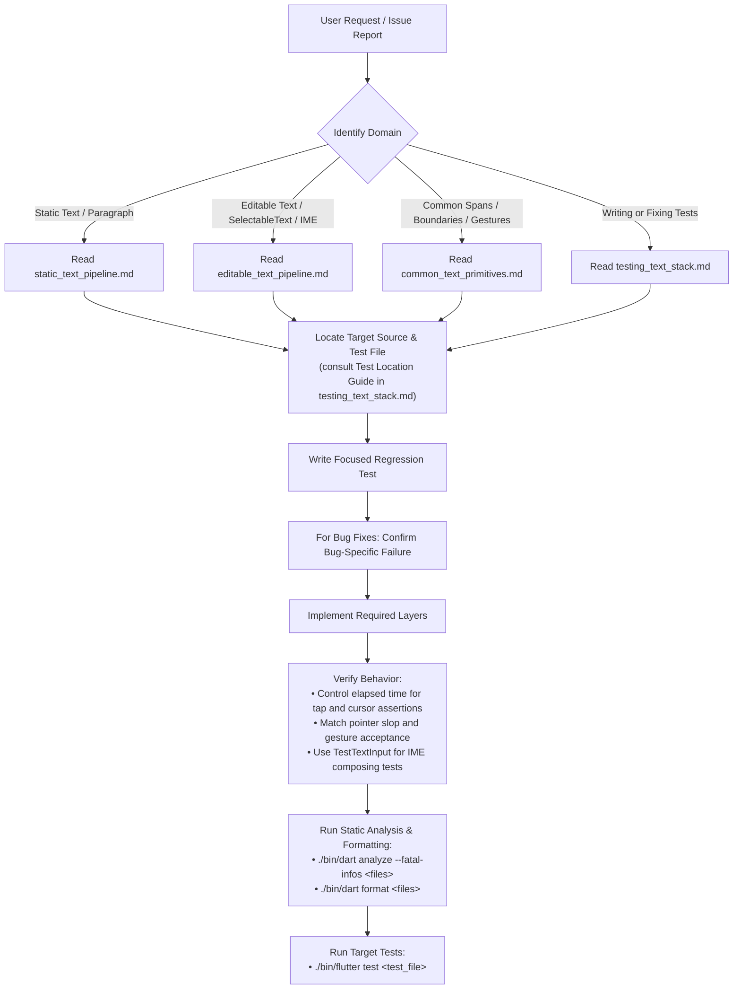

# Flutter Text Domain Expert Skill (`flutter/flutter`)

Use this skill to locate text-subsystem code, understand its current behavior, and choose focused regression tests in `flutter/flutter`. The references describe the implementation in this repository; verify the relevant source and tests when working on a change.

> [!IMPORTANT]
> **Start with the relevant reference**:
> 1. Read the corresponding document under `references/` with an available file-reading tool before investigating its implementation. Load only the references relevant to the task.
> 2. Treat current source, tests, and in-code assertions as authoritative. Use the references as navigation and architectural notes; resolve disagreements in favor of verified repository behavior.
> 3. Consult commit history or issue discussions when they help establish context, then check that the described behavior still applies. Keep these reference documents about the current implementation, without proposed changes or speculative algorithms.

---

## 1. Subsystem Reference Navigation

The text stack is organized into modular reference guides located under [`references/`](references/):

| Subsystem Area | Reference Document | Key Topics & Components Covered |
| :--- | :--- | :--- |
| **Common Foundation & Primitives** | [`common_text_primitives.md`](references/common_text_primitives.md) | • `dart:ui` Engine primitives (`ParagraphBuilder`, `Paragraph`, `LineMetrics`, `TextBox`) • `TextPainter` layout caching (`_TextPainterLayoutCacheWithOffset`) • `InlineSpan` hierarchy (`TextSpan`, `WidgetSpan`, visitor pattern) • Text geometry, BiDi, and `TextAffinity` • `TextBoundary` iterators (character, word, line, paragraph) • Shared gesture recognizers (`TapAndPanGestureRecognizer`, `BaseTapAndDragGestureRecognizer`) • Shared selection overlays, toolbars, handles, and magnifiers |
| **Static Text & Unified Selection** | [`static_text_pipeline.md`](references/static_text_pipeline.md) | • `Text`, `RichText`, `_RichText` • `RenderParagraph` layout, intrinsics, inline child layout (`WidgetSpan`), and span hit-testing • `SelectionArea` & `SelectableRegion` • `SelectionContainer` & delegates (`StaticSelectionContainerDelegate`, `_SelectableTextContainerDelegate`) • `Scrollable` integration & `_ScrollableSelectionContainerDelegate` (`_selectionStartsInScrollable`, autoscrolling) • Edge-scrolling: `EdgeDraggingAutoScroller`, `SelectionEdgeUpdateEvent` • `_SelectableFragment` & leaf `Selectable`s • 7 concrete `SelectionEvent` subclasses & `compareOrder` reading order sorting |
| **Editable Text & Platform IME** | [`editable_text_pipeline.md`](references/editable_text_pipeline.md) | • `TextField`, `CupertinoTextField`, `EditableText`, `EditableTextState` • `SelectableText` (wraps a read-only `EditableText`) • `RenderEditable`, `_CaretPainter` (regular/floating cursor painting), `ViewportOffset` • `TextInputClient` (standard) vs. `DeltaTextInputClient` (`TextEditingDelta` stream) • Platform channel: `OptionalMethodChannel('flutter/textinput', JSONMethodCodec())` • `TextInputFormatter`, `SpellCheckService`, `LiveText`, `ProcessTextService` • `DefaultTextEditingShortcuts`, `Actions`, `TextEditingIntents`, macOS selectors • `TextSelectionOverlay` (isolated from `SelectionArea`) |
| **Testing, Traps & Simulation** | [`testing_text_stack.md`](references/testing_text_stack.md) | • **Test Location Guide**: directory map across `packages/flutter/test/` • Multi-tap timing & controlled pumps (`kDoubleTapTimeout`) • Cursor blinking, scheduled frames, and settlement • `FlutterTest` font metrics & pointer-specific drag slop • Gesture acceptance and first-move callbacks (`onDragStart` / `onDragUpdate`) • Floating overlay, toolbar & handle testing patterns (geometric dragging vs. `FadeTransition`) • Realistic IME simulation with `TestTextInput` (composing ranges & actions) • BiDi & `TextAffinity` assertions |
| **Debugging Playbooks** | [`text_debugging_playbooks.md`](references/text_debugging_playbooks.md) | Coordinate conversions, conditional boundary clamping, and selection-scroll diagnostics. |

---

## 2. Architectural Rules and Contribution Responsibilities

Apply these rules to the affected layers and the capabilities required by the task:

1. **Repository Scope & Frozen Design Systems**:
   - Framework text development spans `packages/flutter/lib/src/widgets/`, `rendering/`, `services/`, `painting/`, and `gestures/`. Engine text layout and platform input implementations live under `engine/src/flutter/`.
   - Legacy Material/Cupertino implementations, examples, and tests are **frozen** by the repository's [freeze workflow](../../../.github/workflows/freeze.yml), which provides an explicit code-reviewer override.
   - Active development of Material and Cupertino text UI components (`TextField`, `CupertinoTextField`, `AdaptiveTextSelectionToolbar`, `SelectionArea`, selection handles) belongs in the **`material_ui`** and **`cupertino_ui`** packages under the **`flutter/packages`** repository.
   - Determine which layers require changes to complete the requested behavior. When Material or Cupertino components, wrappers, or their integration tests require changes, read and follow the [material-cupertino-packages skill](../material-cupertino-packages/SKILL.md). Complete the required core and companion-package work, including review artifacts.

2. **Subsystem Isolation**:
   - `RenderEditable` does **not** participate in the `SelectionArea` / `SelectableRegion` selection tree. `EditableTextState` manages its editing and selection state and uses `TextSelectionOverlay` for floating controls. `TextSelectionOverlay` wraps the shared `SelectionOverlay` implementation, so changes to `SelectionOverlay` can affect both editable and static selection.
   - Route `SelectableText` issues to [editable_text_pipeline.md](references/editable_text_pipeline.md): it wraps `EditableText(readOnly: true)` and uses the editable selection machinery. The similarly named `_SelectableTextContainerDelegate` belongs to ordinary `Text` in the unified-selection pipeline.
   - Text-field wrappers use `TextSelectionGestureDetector` to recognize pointer interactions and `TextSelectionGestureDetectorBuilder` callbacks to coordinate caret placement and selection with `RenderEditable` and `EditableTextState`. These gesture callbacks are one input path alongside keyboard, IME, and selection-handle updates.
   - `SelectableRegionState` wires its own recognizers through `RawGestureDetector` and coordinates unified selection across read-only leaf registrants (`_SelectableFragment` in `RenderParagraph`, custom selectables) via `SelectionRegistrarScope`. It does not use `TextSelectionGestureDetector` for this selection tree.

3. **Layer Boundary Rules in `packages/flutter`**:
   - Follow the repository's [Dart layer dependency rules](../../rules/dart-editing.md#layer-dependency-rules) for implementation files and tests. Use the [core text test fixtures](references/testing_text_stack.md#core-text-test-fixtures), including `TestWidgetsApp` and `TestTextField`, when exercising core text behavior.

4. **IME Composing Range Preservation**:
   - Keep `TextEditingValue.composing` (`TextRange`) consistent with text changes. Custom formatters should generally defer transformations of active composing text until composition ends; disrupting composition can break IME input. Built-in `MaxLengthEnforcement.enforced` deliberately truncates composing text with range adjustment. See the [formatter guidance and supported exception](references/editable_text_pipeline.md#ancillary-services-formatters-spell-check-live-text-process-text).

5. **BiDi & TextAffinity Disambiguation**:
   - At soft line wraps and RTL/LTR junctions, a single UTF-16 text offset can correspond to two visually distinct caret positions. Always specify or account for `TextAffinity.upstream` vs `TextAffinity.downstream`.

6. **Diagnose Geometry and Lifecycle Separately**:
   - Determine whether the failure is in coordinate conversion, selection state, or animation lifecycle. Correct demonstrated geometry errors at the geometry layer.
   - Investigate lifecycle and selection-status handling when the evidence points there. A geometry-first debugging preference does not prohibit a necessary lifecycle fix; verify the behavior with a focused test.
   - **Trace Invariant Violations to Their Source**: When an assertion, crash, or invalid calculation occurs, identify the violated contract and trace where the data or state first stops satisfying it. Distinguish invalid values from supported sentinels, unbounded constraints, and legitimate absent or transient state.
   - Correct the layer responsible for the violation. Do not hide an established upstream defect with downstream null checks, finite-value checks, or clamping. Consumer validation is appropriate when it enforces that consumer's contract or handles valid input states.
   - Verify the intended behavior with a regression test; merely eliminating the exception does not establish correctness.

7. **Delegating Constructor Parity and Complete Platform Support**:
   - **Mandatory Caller Audit**: When extending a primitive, helper, parameter, or callback, inspect all affected callers, including delegating named constructors, factories, and adapters. Completion includes customizable constructors as well as default builders.
   - **Mandatory Forwarding**: Expose and forward the task-required parameters and capabilities through all affected wrappers. Optional parameters compiling successfully does not establish API parity; do not silently drop a required callback or leave it `null`.
   - **Consumer Regression Coverage**: When a change spans core primitives and design-system consumers, test the core behavior and its integration through affected public wrappers. Exercise delegating or customizable constructors where their forwarding paths differ.
   - **Complete Required Support**: Follow the capability through companion packages, framework services, platform channels, and native embedders. Existing TODOs or missing-support comments identify dependencies to investigate and implement when the task requires that support. Complete the necessary plumbing, tests, and comment updates as part of the work.

---

## 3. General Contribution & Triage Workflow

Before implementing, inspect comparable handlers, delegates, and recognizers in the affected subsystem. Identify the applicable callback contracts and associated state transitions, coordinate conversions, scrolling, toolbar dismissal, platform calls, and notifications.

For bug fixes, write a focused regression test and run it against the unfixed behavior. Confirm that it fails at the bug-specific assertion or exception; compilation errors, setup failures, and unrelated assertions do not establish reproduction. Verify that the same test passes after implementing the fix.

For test scope and interaction setup, follow [Focused Test Responsibilities](references/testing_text_stack.md#focused-test-responsibilities).

Follow this step-by-step workflow when addressing an issue or PR in the Flutter text stack:

> [!IMPORTANT]
> **Framework Test Runner**: Always execute framework unit and widget tests using the repository's local Flutter tool (`./bin/flutter test <test_file>`). Do not use `dart test`, which lacks Flutter engine, binary messenger, and font bindings.

### Keep references synchronized with code

When using this skill to modify a described text pipeline, check the affected descriptions in `SKILL.md` and `references/` against the final implementation and tests before completing the task.

Update any behavior descriptions, symbol names, source links, diagrams, or examples made inaccurate by the change. Search for repeated descriptions across the references and update those consistently. Include these documentation updates in the same change.

Keep updates limited to verified implementation facts. Leave accurate content unchanged, avoid task history or speculative guidance, and exclude `evals/` from this maintenance.

### Pre-Completion Checklist
Before declaring any Flutter text task complete:

- [ ] For bug fixes, confirm the regression test fails for the bug-specific reason without the fix and passes with it.
- [ ] Analyze modified Dart files and resolve diagnostics (`./bin/dart analyze --fatal-infos <modified_files>`).
- [ ] Format modified Dart files (`./bin/dart format <modified_files>`).
- [ ] Control elapsed time for multi-tap and cursor-phase tests. `pumpAndSettle()` waits for scheduled frames; a focused input alone does not make it hang.
- [ ] Match drag tests to pointer kind, recognizer, gesture settings, and `DragStartBehavior`; the first accepted move can deliver both start and update callbacks.
- [ ] Base geometry expectations on the actual font and coordinate space. Selection auto-scroll tests should distinguish inside/outside targets and eventual stability after release.
- [ ] Verify that all layer boundary rules are respected.
- [ ] Verify forwarding through all affected constructors and wrappers, including companion design-system packages. Confirm regression coverage at the affected core and consumer layers, and complete platform support required by the task.
- [ ] Execute target tests with `./bin/flutter test <test_file>`.
