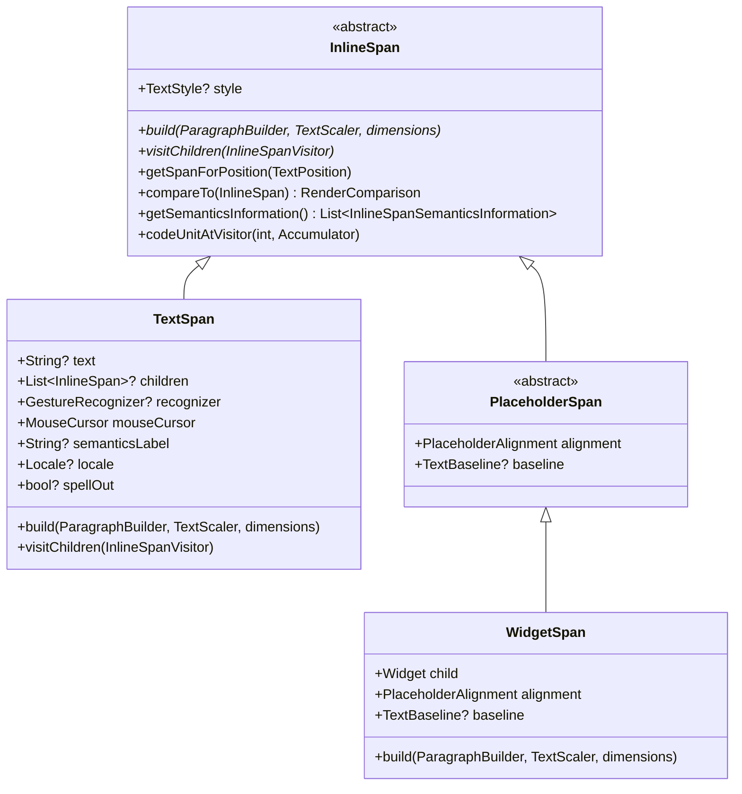
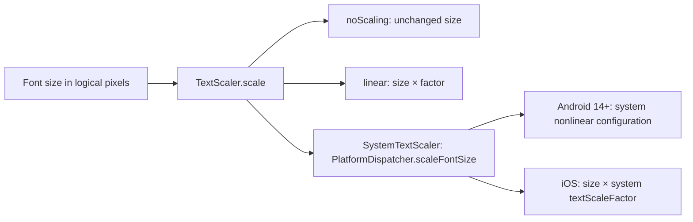
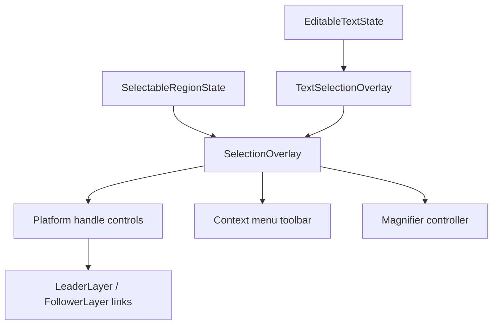

# Flutter Text Architecture: Common Text Primitives & Foundations

This document provides an architectural navigation reference for the foundational text subsystems in Flutter. These primitives, geometry models, boundary iterators, gesture recognizers, and selection overlays are shared across both the [Static Text Pipeline](static_text_pipeline.md) and the [Editable Text Pipeline](editable_text_pipeline.md).

---

### Table of Contents
- [Component & Class Index](#component--class-index)
1. [Engine Architecture & `dart:ui` Primitives](#1-engine-architecture--dartui-primitives)
   - [C++ Engine Backend & Subsystems](#c-engine-backend--subsystems)
   - [Core `dart:ui` APIs & Data Structures](#core-dartui-apis--data-structures)
2. [`InlineSpan` Tree & Structural Hierarchy](#2-inlinespan-tree--structural-hierarchy)
   - [`InlineSpan` Abstract Base & Core Lifecycle](#inlinespan-abstract-base--core-lifecycle)
   - [`TextSpan` Concrete Implementation](#textspan-concrete-implementation)
   - [`PlaceholderSpan` & `WidgetSpan`](#placeholderspan--widgetspan)
   - [Shared Consumption: `RenderParagraph` vs. `RenderEditable`](#shared-consumption-renderparagraph-vs-rendereditable)
3. [Painting & Styling Foundation](#3-painting--styling-foundation)
   - [`TextPainter` Architecture & Layout Caching](#textpainter-architecture--layout-caching)
   - [`TextStyle` & `StrutStyle`](#textstyle--strutstyle)
   - [`TextScaler` & Non-Linear Accessibility Scaling](#textscaler--non-linear-accessibility-scaling)
4. [Text Geometry & Directionality](#4-text-geometry--directionality)
   - [`TextPosition`, `TextAffinity` & Soft Wrap / BiDi Disambiguation](#textposition-textaffinity--soft-wrap--bidi-disambiguation)
   - [`TextRange` & `TextDirection`](#textrange--textdirection)
5. [Logical Text Boundaries & Iterators](#5-logical-text-boundaries--iterators)
   - [`TextBoundary` Contract & Subclasses](#textboundary-contract--subclasses)
6. [Shared Text Gesture Recognizers](#6-shared-text-gesture-recognizers)
   - [Gesture Recognizer Class Hierarchy](#gesture-recognizer-class-hierarchy)
   - [Multi-Tap Resolution vs. Multiple Discrete Recognizers](#multi-tap-resolution-vs-multiple-discrete-recognizers)
7. [Shared Selection Overlays, Toolbars, Handles & Magnifiers](#7-shared-selection-overlays-toolbars-handles--magnifiers)
   - [Static vs. Editable Overlay Sharing](#static-vs-editable-overlay-sharing)
   - [Selection Handle Controls & Painters](#selection-handle-controls--painters)
   - [Platform Selection Toolbars & `ContextMenuController`](#platform-selection-toolbars--contextmenucontroller)
   - [Platform Context Menu Action & Button Ordering Matrix](#platform-context-menu-action--button-ordering-matrix)
   - [Text Subsystem `SystemChannels` Reference Map](#text-subsystem-systemchannels-reference-map)
   - [Magnifier Subsystem & Controllers](#magnifier-subsystem--controllers)
   - [Composited Layer Linking (`LeaderLayer` & `FollowerLayer`)](#composited-layer-linking-leaderlayer--followerlayer)

---

## Component & Class Index

| Component / Symbol | Source File / Location | Concise Summary |
| :--- | :--- | :--- |
| `ui.ParagraphBuilder` | `dart:ui` | Low-level engine builder used to record styled text runs and placeholder dimensions into an engine paragraph. |
| `ui.Paragraph` | `dart:ui` | Paragraph with fixed text/style content and mutable layout state, plus line-breaking and geometry query APIs. |
| `ui.LineMetrics` | `dart:ui` | Physical metrics for a formatted line (ascent, descent, baseline, line index, height, width). |
| `ui.TextBox` | `dart:ui` | Bounding rectangle and `TextDirection` of a glyph cluster or selection box. |
| `ui.GlyphInfo` | `dart:ui` | Grapheme-cluster layout bounds, UTF-16 range, and resolved writing direction; bounds use font metrics and character advance. |
| `ui.TextPosition` | `dart:ui` | Logical character offset and `TextAffinity` index in a string. |
| `ui.TextAffinity` | `dart:ui` | Disambiguates whether a caret at a soft line break or BiDi boundary associates upstream or downstream. |
| [`InlineSpan`](../../../../packages/flutter/lib/src/painting/inline_span.dart) | [`packages/flutter/lib/src/painting/inline_span.dart`](../../../../packages/flutter/lib/src/painting/inline_span.dart) | Abstract immutable tree node representing styled inline content (text or placeholders). |
| [`TextSpan`](../../../../packages/flutter/lib/src/painting/text_span.dart) | [`packages/flutter/lib/src/painting/text_span.dart`](../../../../packages/flutter/lib/src/painting/text_span.dart) | Concrete immutable text span containing a string, styling, gesture recognizers, and child spans. |
| [`PlaceholderSpan`](../../../../packages/flutter/lib/src/painting/placeholder_span.dart) | [`packages/flutter/lib/src/painting/placeholder_span.dart`](../../../../packages/flutter/lib/src/painting/placeholder_span.dart) | Abstract span that embeds a sized inline box aligned with font metrics. |
| [`WidgetSpan`](../../../../packages/flutter/lib/src/widgets/widget_span.dart) | [`packages/flutter/lib/src/widgets/widget_span.dart`](../../../../packages/flutter/lib/src/widgets/widget_span.dart) | Concrete span that embeds an arbitrary Flutter `Widget` inside static or editable text. |
| [`TextPainter`](../../../../packages/flutter/lib/src/painting/text_painter.dart) | [`packages/flutter/lib/src/painting/text_painter.dart`](../../../../packages/flutter/lib/src/painting/text_painter.dart) | Core painting engine bridging `InlineSpan` trees to engine paragraphs with layout caching. |
| [`TextStyle`](../../../../packages/flutter/lib/src/painting/text_style.dart) | [`packages/flutter/lib/src/painting/text_style.dart`](../../../../packages/flutter/lib/src/painting/text_style.dart) | Visual typography attributes (font family, weight, size, color, decorations). |
| [`StrutStyle`](../../../../packages/flutter/lib/src/painting/strut_style.dart) | [`packages/flutter/lib/src/painting/strut_style.dart`](../../../../packages/flutter/lib/src/painting/strut_style.dart) | Defines minimum line height struts to enforce uniform vertical line spacing across mixed font styles. |
| [`TextScaler`](../../../../packages/flutter/lib/src/painting/text_scaler.dart) | [`packages/flutter/lib/src/painting/text_scaler.dart`](../../../../packages/flutter/lib/src/painting/text_scaler.dart) | Linear and non-linear accessibility font scaling interface replacing legacy scale factors. |
| [`TextBoundary`](../../../../packages/flutter/lib/src/services/text_boundary.dart) | [`packages/flutter/lib/src/services/text_boundary.dart`](../../../../packages/flutter/lib/src/services/text_boundary.dart) | Base contract for logical text boundary iterators (characters, words, lines, paragraphs). |
| [`CharacterBoundary`](../../../../packages/flutter/lib/src/services/text_boundary.dart) | [`packages/flutter/lib/src/services/text_boundary.dart`](../../../../packages/flutter/lib/src/services/text_boundary.dart) | Locates extended grapheme-cluster boundaries using the Dart `characters` package and `CharacterRange`. |
| [`WordBoundary`](../../../../packages/flutter/lib/src/painting/text_painter.dart) | [`packages/flutter/lib/src/painting/text_painter.dart`](../../../../packages/flutter/lib/src/painting/text_painter.dart) | Identifies linguistic word boundaries for double-tap selection and word jumping. |
| [`LineBoundary`](../../../../packages/flutter/lib/src/services/text_boundary.dart) | [`packages/flutter/lib/src/services/text_boundary.dart`](../../../../packages/flutter/lib/src/services/text_boundary.dart) | Identifies soft-wrapped and hard-break visual line boundaries using `TextPainter`. |
| [`ParagraphBoundary`](../../../../packages/flutter/lib/src/services/text_boundary.dart) | [`packages/flutter/lib/src/services/text_boundary.dart`](../../../../packages/flutter/lib/src/services/text_boundary.dart) | Identifies hard newline (`\n`) separated paragraph boundaries. |
| [`DocumentBoundary`](../../../../packages/flutter/lib/src/services/text_boundary.dart) | [`packages/flutter/lib/src/services/text_boundary.dart`](../../../../packages/flutter/lib/src/services/text_boundary.dart) | Identifies the start (`0`) and end of the entire document string. |
| [`BaseTapAndDragGestureRecognizer`](../../../../packages/flutter/lib/src/gestures/tap_and_drag.dart) | [`packages/flutter/lib/src/gestures/tap_and_drag.dart`](../../../../packages/flutter/lib/src/gestures/tap_and_drag.dart) | Base recognizer unifying multi-tap counting (single/double/triple) with drag gestures. |
| [`TapAndPanGestureRecognizer`](../../../../packages/flutter/lib/src/gestures/tap_and_drag.dart) | [`packages/flutter/lib/src/gestures/tap_and_drag.dart`](../../../../packages/flutter/lib/src/gestures/tap_and_drag.dart) | Pan recognizer used by `SelectableRegion` and `TextSelectionGestureDetector` for 2D drag selection. |
| [`TapAndHorizontalDragGestureRecognizer`](../../../../packages/flutter/lib/src/gestures/tap_and_drag.dart) | [`packages/flutter/lib/src/gestures/tap_and_drag.dart`](../../../../packages/flutter/lib/src/gestures/tap_and_drag.dart) | Horizontal drag recognizer used by editable text selection detectors. |
| [`LongPressGestureRecognizer`](../../../../packages/flutter/lib/src/gestures/long_press.dart) | [`packages/flutter/lib/src/gestures/long_press.dart`](../../../../packages/flutter/lib/src/gestures/long_press.dart) | Detects touch hold gestures to trigger word selection or magnifying loupes on mobile devices. |
| [`ForcePressGestureRecognizer`](../../../../packages/flutter/lib/src/gestures/force_press.dart) | [`packages/flutter/lib/src/gestures/force_press.dart`](../../../../packages/flutter/lib/src/gestures/force_press.dart) | Detects 3D touch pressure changes on supported iOS devices to trigger word selection. |
| [`SelectionOverlay`](../../../../packages/flutter/lib/src/widgets/text_selection.dart) | [`packages/flutter/lib/src/widgets/text_selection.dart`](../../../../packages/flutter/lib/src/widgets/text_selection.dart) | Shared overlay implementation used directly by `SelectableRegionState` and wrapped by `TextSelectionOverlay`. |
| [`TextSelectionOverlay`](../../../../packages/flutter/lib/src/widgets/text_selection.dart) | [`packages/flutter/lib/src/widgets/text_selection.dart`](../../../../packages/flutter/lib/src/widgets/text_selection.dart) | Adapts editable state and `RenderEditable` geometry to the shared `SelectionOverlay`. |
| [`LeaderLayer`](../../../../packages/flutter/lib/src/rendering/layer.dart) & [`FollowerLayer`](../../../../packages/flutter/lib/src/rendering/layer.dart) | [`packages/flutter/lib/src/rendering/layer.dart`](../../../../packages/flutter/lib/src/rendering/layer.dart) | Composited layer pair linking floating overlay handles to scrolling render boxes without widget rebuilds. |
| [`TextSelectionControls`](../../../../packages/flutter/lib/src/widgets/text_selection.dart) | [`packages/flutter/lib/src/widgets/text_selection.dart`](../../../../packages/flutter/lib/src/widgets/text_selection.dart) | Abstract interface for building platform selection handles and toolbars. |
| [`MaterialTextSelectionHandleControls`](../../../../packages/flutter/lib/src/material/text_selection.dart) | [`packages/flutter/lib/src/material/text_selection.dart`](../../../../packages/flutter/lib/src/material/text_selection.dart) | Material handle controls (frozen here; active in `material_ui` under `flutter/packages`). |
| [`CupertinoTextSelectionHandleControls`](../../../../packages/flutter/lib/src/cupertino/text_selection.dart) | [`packages/flutter/lib/src/cupertino/text_selection.dart`](../../../../packages/flutter/lib/src/cupertino/text_selection.dart) | Cupertino handle controls (frozen here; active in `cupertino_ui` under `flutter/packages`). |
| [`AdaptiveTextSelectionToolbar`](../../../../packages/flutter/lib/src/material/adaptive_text_selection_toolbar.dart) | [`packages/flutter/lib/src/material/adaptive_text_selection_toolbar.dart`](../../../../packages/flutter/lib/src/material/adaptive_text_selection_toolbar.dart) | Adaptive toolbar wrapper (frozen here; active in `material_ui` under `flutter/packages`). |
| [`TextMagnifier`](../../../../packages/flutter/lib/src/material/magnifier.dart) | [`packages/flutter/lib/src/material/magnifier.dart`](../../../../packages/flutter/lib/src/material/magnifier.dart) | Android/Material magnifying glass widget (frozen here; active in `material_ui` under `flutter/packages`). |
| [`CupertinoTextMagnifier`](../../../../packages/flutter/lib/src/cupertino/magnifier.dart) | [`packages/flutter/lib/src/cupertino/magnifier.dart`](../../../../packages/flutter/lib/src/cupertino/magnifier.dart) | iOS magnifying glass widget (frozen here; active in `cupertino_ui` under `flutter/packages`). |
| [`RawMagnifier`](../../../../packages/flutter/lib/src/widgets/magnifier.dart) | [`packages/flutter/lib/src/widgets/magnifier.dart`](../../../../packages/flutter/lib/src/widgets/magnifier.dart) | Low-level magnifier widget whose render object uses `BackdropFilterLayer` to scale background pixels. |
| [`MagnifierController`](../../../../packages/flutter/lib/src/widgets/magnifier.dart) | [`packages/flutter/lib/src/widgets/magnifier.dart`](../../../../packages/flutter/lib/src/widgets/magnifier.dart) | Controls showing, hiding, and animating magnifiers in the application `Overlay`. |

---

## 1. Engine Architecture & `dart:ui` Primitives

At Flutter's lowest architectural boundary, the framework interacts with the native C++ engine via `dart:ui`. The C++ engine contains the core layout, text shaping, BiDi analysis, line-breaking, and rasterization pipeline.

```
+-----------------------------------------------------------------------------+
|                                  dart:ui                                    |
|   ui.ParagraphBuilder  --->  ui.Paragraph  --->  ui.LineMetrics / TextBox   |
+-----------------------------------------------------------------------------+
                                       |
                                       v (C++ FFI Bridge)
+-----------------------------------------------------------------------------+
|                               Engine (C++)                                  |
|   SkParagraph / LibTxt                                                      |
|     |---> HarfBuzz (Font shaping, glyph cluster formation, OpenType)        |
|     |---> ICU (UAX #14 Line Breaking, UAX #29 Text Segments, BiDi UAX #9)  |
|     |---> Impeller Typographer (CPU glyph rasterization, atlas upload)     |
|              |---> GPU drawing of atlas-backed glyph geometry             |
+-----------------------------------------------------------------------------+
```

### C++ Engine Backend & Subsystems

1. **SkParagraph / LibTxt**:
   - **SkParagraph** is the primary text layout engine in Flutter (replacing legacy LibTxt).
   - Coordinates line layout, paragraph styling, font resolution, placeholder dimensions, and inline strut metrics.
2. **HarfBuzz**:
   - The industry-standard font shaping engine used for converting Unicode character sequences into positioned glyph IDs.
   - Handles complex scripts (Arabic, Devanagari, Thai, etc.), kerning, ligatures, contextual glyph substitutions (GSUB), and glyph positioning (GPOS).
3. **ICU (International Components for Unicode)**:
   - Implements standard Unicode algorithms:
     - **UAX #9**: Unicode Bidirectional Algorithm (BiDi) for resolving mixed LTR/RTL text runs.
     - **UAX #14**: Unicode Line Breaking Algorithm for determining valid wrap opportunity boundaries.
     - **UAX #29**: Unicode Text Segmentation for resolving grapheme clusters, words, and sentences.
4. **Impeller Typographer: CPU Glyph Rasterization & GPU Drawing**:
   - Impeller's Skia typographer backend rasterizes glyphs into CPU `SkBitmap` pixels through a raster `SkSurface`/`SkCanvas`, then uploads them to GPU atlas textures. See [`typographer_context_skia.cc`](../../../../engine/src/flutter/impeller/typographer/backends/skia/typographer_context_skia.cc).
   - Impeller draws shaped glyph positions using atlas-backed textured geometry. Text shaping and paragraph layout occur before this GPU drawing stage.

---

### Core `dart:ui` APIs & Data Structures

#### 1. `ui.ParagraphBuilder`
[`ui.ParagraphBuilder`](../../../../engine/src/flutter/lib/ui/text.dart) is a native host object used to build shaped text trees.
- Instantiated with [`ui.ParagraphStyle`](../../../../engine/src/flutter/lib/ui/text.dart) configuring text direction, alignment, max lines, ellipsis, locale, strut style, and text height behavior.
- **`pushStyle(ui.TextStyle style)`**: Pushes a style onto the builder stack. All subsequent text added inherits this style until `pop()` is invoked.
- **`pop()`**: Pops the top style from the stack.
- **`addText(String text)`**: Appends a UTF-16 string chunk using current style configurations.
- **`addPlaceholder(double width, double height, ui.PlaceholderAlignment alignment, ...)`**: Reserves rectangular inline space for non-text children (e.g. `WidgetSpan`).
- **`build()`**: Creates a native `ui.Paragraph` with fixed text/style content; call `layout()` before painting or reading layout-dependent metrics.

#### 2. `ui.Paragraph`
[`ui.Paragraph`](../../../../engine/src/flutter/lib/ui/text.dart) has immutable text/style content and mutable layout state. It is created without layout and can be laid out again with a different width.
- **`layout(ui.ParagraphConstraints constraints)`**: Computes line breaks, soft wraps, and glyph positions for the given width. Must be called before querying layout metrics or painting.
- **Measurement Metrics**:
  - `minIntrinsicWidth`: The smallest width required to fit text without clipping individual non-breakable words.
  - `maxIntrinsicWidth`: The smallest width beyond which increasing width no longer decreases paragraph height; explicit line breaks remain.
  - `width` / `height`: The physical bounding box dimensions calculated during `layout()`.
  - `alphabeticBaseline` / `ideographicBaseline`: Baseline offsets from the top edge.
  - `longestLine`: The horizontal extent of the longest physical laid-out line.
  - `didExceedMaxLines`: True if the text was truncated due to `maxLines` or `ellipsis`.
- **Geometry & Query Methods**:
  - `getBoxesForRange(int start, int end, {ui.BoxHeightStyle boxHeightStyle, ui.BoxWidthStyle boxWidthStyle})`: Computes a list of `ui.TextBox` rectangles bounding the specified code unit range.
  - `getPositionForOffset(Offset offset)`: Returns the `ui.TextPosition` (offset and affinity) corresponding to a 2D local pixel coordinate.
  - `getWordBoundary(ui.TextPosition position)`: Returns a `ui.TextRange` bounding the word enclosing `position` according to Unicode UAX #29.
  - `getLineMetricsAt(int lineNumber)` / `computeLineMetrics()`: Retrieves detailed metric records for individual or all physical lines.
  - `getGlyphInfoAt(int codeUnitIndex)`: Returns `ui.GlyphInfo` containing `graphemeClusterLayoutBounds`, `graphemeClusterCodeUnitRange`, and `writingDirection`.
  - `getClosestGlyphInfoForOffset(Offset offset)`: Locates the nearest glyph to a 2D offset.
  - `getBoxesForPlaceholders()`: Returns a list of `ui.TextBox` bounds for all embedded placeholders.

#### 3. `ui.LineMetrics`
[`ui.LineMetrics`](../../../../engine/src/flutter/lib/ui/text.dart) encapsulates geometry for a single laid-out physical line:
- `hardBreak`: True when the line ends with an explicit line break or is the final line of the paragraph.
- `ascent`: Distance from the top of the line to the baseline.
- `descent`: Distance from the baseline to the bottom of the line.
- `unscaledAscent`: Ascent calculated from the font and style while ignoring `TextStyle.height`; it is not an unscaled font-size measurement.
- `height`: Total line height, equal to `round(ascent + descent)`; rounding can produce a subpixel difference from the sum.
- `width`: Logical width of the line content.
- `left`: Horizontal offset of the line's start relative to the paragraph origin.
- `baseline`: Vertical offset of the line's baseline from the paragraph top.
- `lineNumber`: 0-indexed index of the line within the paragraph.

#### 4. `ui.TextBox`
[`ui.TextBox`](../../../../engine/src/flutter/lib/ui/text.dart) encapsulates a rectangular selection or placeholder boundary:
- Properties: `left`, `top`, `right`, `bottom`, and `direction` (`TextDirection.ltr` or `TextDirection.rtl`).
- Method: `toRect()` produces a `Rect`.

#### 5. `ui.GlyphInfo`
[`ui.GlyphInfo`](../../../../engine/src/flutter/lib/ui/text.dart) provides detailed grapheme cluster layout bounds:
- `graphemeClusterLayoutBounds`: Layout `Rect` in paragraph coordinates. Its vertical extent comes from font metrics and its horizontal extent is the character advance; it is not a tight bounding box around the glyph outline.
- `graphemeClusterCodeUnitRange`: UTF-16 code unit range `TextRange(start: ..., end: ...)`.
- `writingDirection`: The resolved `TextDirection` of the glyph.

#### 6. `ui.TextPosition` & `ui.TextAffinity`
[`ui.TextPosition`](../../../../engine/src/flutter/lib/ui/text.dart) and [`ui.TextAffinity`](../../../../engine/src/flutter/lib/ui/text.dart) encapsulate logical string offsets and their visual line/BiDi run binding.

---

## 2. `InlineSpan` Tree & Structural Hierarchy

In Flutter, rich formatted text is modeled as an immutable tree of [`InlineSpan`](../../../../packages/flutter/lib/src/painting/inline_span.dart) objects. Because `InlineSpan`, [`TextSpan`](../../../../packages/flutter/lib/src/painting/text_span.dart), [`PlaceholderSpan`](../../../../packages/flutter/lib/src/painting/placeholder_span.dart), and [`WidgetSpan`](../../../../packages/flutter/lib/src/widgets/widget_span.dart) represent the structural description of styled and embedded content, they are shared across **both** the [Static Text Pipeline](static_text_pipeline.md) (`RenderParagraph.text`) and the [Editable Text Pipeline](editable_text_pipeline.md) (`RenderEditable.text`).



### `InlineSpan` Abstract Base & Core Lifecycle

[`InlineSpan`](../../../../packages/flutter/lib/src/painting/inline_span.dart) is the abstract base class defining the contract for styled text segments and embedded inline widgets:

1. **`build(ui.ParagraphBuilder builder, {TextScaler textScaler = TextScaler.noScaling, List<PlaceholderDimensions>? dimensions})`**:
   - Compiles the span and its descendants into the native engine `ui.ParagraphBuilder`.
   - Pushes its `TextStyle` onto the builder stack, adds plain text chunks or placeholder slots, recursively invokes `build` on nested children, and pops the style.
2. **Visitor Pattern (`visitChildren`)**:
   - Traversal contract: `bool visitChildren(InlineSpanVisitor visitor)` where `typedef InlineSpanVisitor = bool Function(InlineSpan span)`.
   - Traverses the span tree in depth-first reading order.
   - Allows early termination by returning `false` from the visitor callback (used in offset indexing, hit testing, and text extraction).
   - Related traversal and lookup methods:
     - `visitDirectChildren(InlineSpanVisitor visitor)`: Independently traverses only immediate children.
     - `getSpanForPosition(TextPosition position)` / `getSpanForPositionVisitor`: Uses `visitChildren` to find the specific leaf or branch span containing the specified string offset.
     - `computeToPlainText(StringBuffer buffer, ...)`: Extracts flattened plain text by recursively calling `computeToPlainText` on child spans.
     - `codeUnitAtVisitor(int index, Accumulator offset)`: Retrieves a character code unit at a logical index; `codeUnitAt` invokes this callback through `visitChildren`.
3. **Structural Tree Diffing (`compareTo`)**:
   - `compareTo(InlineSpan other)` computes a [`RenderComparison`](../../../../packages/flutter/lib/src/painting/basic_types.dart) enum value:
     - `RenderComparison.identical`: The compared properties match. `TextSpan.compareTo` does not compare `semanticsLabel` or `mouseCursor`, so changes to those properties alone also return `identical`.
     - `RenderComparison.metadata`: A `TextSpan` recognizer changed without a change requiring paint or layout; no layout or paint update needed.
     - `RenderComparison.paint`: Paint attributes changed (e.g. `TextStyle.color`, `TextStyle.backgroundColor`, `TextStyle.decoration`). `RenderParagraph.text` calls `markNeedsPaint()` and `markNeedsSemanticsUpdate()` without requesting framework layout. `RenderEditable.text` calls `markNeedsLayout()` and `markNeedsSemanticsUpdate()` for every unequal span, including paint-only changes. In both cases, `TextPainter` preserves its cached paragraph geometry; with unchanged layout inputs, subsequent `layout()` calls can reuse it. When painting occurs, `TextPainter` recreates and lays out the engine paragraph to apply the changed paint attributes.
     - `RenderComparison.layout`: Structural or style properties classified as requiring layout changed (e.g. `text`, `fontSize`, `fontFamily`, `letterSpacing`, `foreground`, `background`, `shadows`, child span count); triggers a full layout pass (`markNeedsLayout()`).
4. **Semantics Extraction (`getSemanticsInformation`)**:
   - Returns a `List<InlineSpanSemanticsInformation>` describing accessibility metadata.
   - `InlineSpanSemanticsInformation.requiresOwnNode` is true for placeholders, non-null recognizers, or non-null semantics identifiers.
   - This metadata does not guarantee one OS accessibility node per span. Placeholder children can contribute zero or multiple nodes, and `RenderParagraph` can merge their semantics configurations upward. Node assembly also depends on the renderer and platform; `RenderEditable` excludes macOS from its recognizer-driven separate-node path.

---

### `TextSpan` Concrete Implementation

[`TextSpan`](../../../../packages/flutter/lib/src/painting/text_span.dart) is the primary concrete `InlineSpan` implementation representing a styled string chunk or a branching node with nested children:

- **`text`**: The UTF-16 text string to render.
- **`children`**: An optional list of child `InlineSpan` instances nested inside this span. Child spans inherit unresolved style properties from their parent span.
- **`recognizer`**: An optional [`GestureRecognizer`](../../../../packages/flutter/lib/src/gestures/recognizer.dart) (e.g. [`TapGestureRecognizer`](../../../../packages/flutter/lib/src/gestures/tap.dart)) responding to pointer events directly on this span (such as clickable hyperlinks or mention tags).
- **`mouseCursor`**: Non-nullable `MouseCursor` field shown when hovering over the span. The constructor accepts `MouseCursor?`; when omitted or null, it defaults to `MouseCursor.defer` if `recognizer` is null and `SystemMouseCursors.click` otherwise.
- **`semanticsLabel`**: Optional accessibility string replacing the plain text content for screen readers.
- **`locale` & `spellOut`**: Control assistive-technology pronunciation and whether text is spoken character by character. `TextStyle.locale` controls language-specific glyph selection.

---

### `PlaceholderSpan` & `WidgetSpan`

1. **[`PlaceholderSpan`](../../../../packages/flutter/lib/src/painting/placeholder_span.dart)**:
   - Abstract subclass of `InlineSpan` that reserves empty rectangular space inside the laid-out text paragraph for arbitrary non-text content.
   - Defines alignment and baseline contracts:
     - **`alignment` ([`ui.PlaceholderAlignment`](../../../../engine/src/flutter/lib/ui/text.dart))**:
       - `baseline`: Aligns the placeholder's baseline with the surrounding text baseline.
       - `aboveBaseline`: Sits entirely above the text baseline.
       - `belowBaseline`: Sits entirely below the text baseline.
       - `top`: Aligns the top of the placeholder with the top of the line.
       - `bottom`: Aligns the bottom of the placeholder with the bottom of the line.
       - `middle`: Centers the placeholder vertically with the line's center.
     - **`baseline` ([`TextBaseline`](../../../../engine/src/flutter/lib/ui/text.dart))**:
       - `alphabetic`: Standard baseline for Latin/Cyrillic scripts (bottom of letters without descenders).
       - `ideographic`: Baseline for CJK scripts (bottom of square glyph bounding box).
   - `PlaceholderSpan` leaves `build()` abstract. It does not store child dimensions or a baseline offset.
2. **[`WidgetSpan`](../../../../packages/flutter/lib/src/widgets/widget_span.dart)**:
   - Concrete `PlaceholderSpan` defined in the Widgets layer.
   - Holds an arbitrary Flutter `Widget child`.
   - Embeds interactive badges, inline icons, buttons, or custom widgets directly into flowing text.
   - `WidgetSpan.build()` reads the matching `PlaceholderDimensions` and calls `builder.addPlaceholder(width, height, alignment, baseline: ..., baselineOffset: ...)`. `PlaceholderDimensions.baselineOffset` is the measured distance from the top of the child to its baseline; it is not a `PlaceholderSpan` property.

---

### Shared Consumption: `RenderParagraph` vs. `RenderEditable`

Both static and editable text render objects consume `InlineSpan` trees directly via their `text` property:

```
                  +-----------------------------------+
                  |      InlineSpan Tree              |
                  |  (TextSpan / WidgetSpan / etc.)   |
                  +-----------------------------------+
                                    |
                 +------------------+------------------+
                 |                                     |
                 v                                     v
+---------------------------------+   +---------------------------------+
|         RenderParagraph         |   |         RenderEditable          |
|    (Static Text Pipeline)       |   |    (Editable Text Pipeline)     |
| • Consumes RenderParagraph.text |   | • Consumes RenderEditable.text  |
| • Manages child RenderBoxes     |   | • Supports rich formatting in   |
|   for embedded WidgetSpans      |   |   editable text & custom syntax |
| • Coordinates dry layout &      |   |   controllers                   |
|   ContainerRenderObjectMixin    |   | • plainText returns flat string |
+---------------------------------+   +---------------------------------+
```

- **`RenderParagraph.text` ([Static Text Pipeline](static_text_pipeline.md))**:
  - `RenderParagraph` mixes in `ContainerRenderObjectMixin<RenderBox, TextParentData>` to host, lay out, and paint the child render boxes created for embedded `WidgetSpan`s.
  - Generates multiple `_SelectableFragment` registrants across placeholders for document-wide selection.
- **`RenderEditable.text` ([Editable Text Pipeline](editable_text_pipeline.md))**:
  - `RenderEditable.text` accepts any `InlineSpan` tree, allowing custom controllers (e.g. subclasses of `TextEditingController` overriding `buildTextSpan`) to render multi-colored syntax highlighting, mention tags, hashtags, and styled token runs inside interactive editable text fields.
  - `RenderEditable.plainText` returns the `TextPainter`'s flattened display text, including obscuring characters when applicable, while `text` preserves the rich formatting tree.
  - Clipboard operations use `textEditingValue.text`, and IME synchronization uses `widget.controller.value` in `EditableTextState`. Accessibility text is assembled from span semantics information, with obscuring characters used for obscured fields.

---

## 3. Painting & Styling Foundation

The Painting layer (`painting/`) bridges raw engine primitives with Flutter's widget and rendering pipeline.

### `TextPainter` Architecture & Layout Caching

[`TextPainter`](../../../../packages/flutter/lib/src/painting/text_painter.dart) coordinates paragraph building, measurement, caret positioning, and canvas painting for an `InlineSpan` tree.

#### 1. Layout Caching (`_TextPainterLayoutCacheWithOffset`)
Constructing and shaping a `ui.Paragraph` is an expensive operation involving native FFI calls, HarfBuzz shaping, and ICU line break traversals. `TextPainter` mitigates layout costs through cached state:
- **`_layoutCache`**: An instance of `_TextPainterLayoutCacheWithOffset` that retains:
  - The laid-out native `ui.Paragraph`.
  - The calculated `paintOffset` (which centers or aligns text according to `TextAlign` and `textWidthBasis`).
  - Stored fields: `layout` (`_TextLayout`), `layoutMaxWidth`, `contentWidth`, and `textAlignment`. `paragraph` and `paintOffset` are derived getters; metrics are accessed through the nested layout/paragraph.

#### 2. Fast Constraints Relayout (`_resizeToFit`)
When `TextPainter.layout(minWidth, maxWidth)` is called with updated constraints:
- `TextPainter` invokes `_resizeToFit(minWidth, maxWidth, textWidthBasis)`.
- `_resizeToFit` reuses the paragraph when the input `maxWidth` equals `layoutMaxWidth`, or when both the old paragraph width and new `maxWidth` are at least `paragraph.maxIntrinsicWidth` within `precisionErrorTolerance`. It also has an early tight-width path when `minWidth == maxWidth == contentWidth`; the non-finite paint-offset/paragraph-width case can require layout instead.
- On a successful fast path, it updates `contentWidth`; `paintOffset` is derived from that width, the paragraph width, and `textAlignment`. This avoids a native paragraph layout call for those constraint changes.

#### 3. Deferred Paint Rebuilds (`_rebuildParagraphForPaint`)
`ui.Paragraph` text/style content cannot be changed in place. If styling changes produce `RenderComparison.paint` (such as changes to `TextStyle.color`, `TextStyle.backgroundColor`, or `TextStyle.decoration`):
- `TextPainter` marks an internal flag: `_rebuildParagraphForPaint = true`.
- It avoids triggering a synchronous engine rebuild or invalidating layout geometry.
- The `ui.Paragraph` is recreated during the next `paint()` call using `_createParagraph(text!)`, then laid out again at `layoutCache.layoutMaxWidth`. This defers engine work until paint and preserves the framework layout cache; it does not eliminate engine paragraph layout.

Changes to `TextStyle.foreground`, background `Paint`, or `TextStyle.shadows` instead produce `RenderComparison.layout` and invalidate the layout cache.

---

### `TextStyle` & `StrutStyle`

- **[`TextStyle`](../../../../packages/flutter/lib/src/painting/text_style.dart)**:
  - Controls font family, fallback font families (`fontFamilyFallback`), font size, font weight, font style (italic/normal), letter spacing, word spacing, height, foreground/background `Paint`, shadows, decorations (`TextDecoration.underline`, `lineThrough`), and font features (`FontFeature.enable('smcp')`, `FontVariation`).
- **[`StrutStyle`](../../../../packages/flutter/lib/src/painting/strut_style.dart)**:
  - Sets the minimum line height strut metrics across a paragraph.
  - Dictates line spacing independently of individual inline child font sizes when `forceStrutHeight: true`, guaranteeing baseline grid alignment across mixed inline fonts or embedded emojis.

---

### `TextScaler` & Non-Linear Accessibility Scaling

Flutter uses [`TextScaler`](../../../../packages/flutter/lib/src/painting/text_scaler.dart) to support accessible dynamic font scaling.



1. **`TextScaler.noScaling`**: Unscaled identity scaling (factor 1.0).
2. **`TextScaler.linear(double factor)`**: Multiplies all font sizes uniformly by `factor`.
3. **Non-Linear Accessibility Scaling**:
   - Android 14+ supports system nonlinear scaling through the platform configuration used by `PlatformDispatcher.scaleFontSize`. `SystemTextScaler.scale` delegates to that engine API.
   - In this checkout, iOS sends a single `textScaleFactor` and uses linear multiplication. It does not provide the nonlinear configuration used by Android.
   - With Android nonlinear scaling, the effective scale depends on the input font size; larger text can scale less than smaller text. Query the system scaler for actual values.
   - `TextScaler.scale(double fontSize)` evaluates a scaling strategy. `TextScaler.clamp(...)` bounds its effective scale factors; it does not define a platform curve.

---

## 4. Text Geometry & Directionality

### `TextPosition`, `TextAffinity` & Soft Wrap / BiDi Disambiguation

A [`TextPosition`](../../../../engine/src/flutter/lib/ui/text.dart) represents a 0-indexed logical offset into a UTF-16 string paired with an affinity:
```dart
const TextPosition({required this.offset, this.affinity = TextAffinity.downstream});
```

#### 1. Soft Line Wrap Disambiguation
When text wraps across multiple visual lines due to width constraints, a single code unit offset exists simultaneously at the end of the top line and the beginning of the bottom line.

```
Logical Text: "Hello World Flutter Text"
Visual Line 1: [Hello World ] (offsets 0..11)
Visual Line 2: [Flutter Text] (offsets 12..23)

Caret at Offset 12:
- TextAffinity.upstream:   Anchored to the trailing end of Line 1 (after space ' ').
- TextAffinity.downstream: Anchored to the leading start of Line 2 (before 'F').
```

- **`TextAffinity.upstream`**: Affiliated with the preceding character (visual end of upper line).
- **`TextAffinity.downstream`**: Affiliated with the subsequent character (visual start of lower line).

#### 2. Bidirectional (BiDi) Boundaries
In mixed-direction text (e.g. English LTR juxtaposed with Hebrew or Arabic RTL), a single logical string index can correspond to two distinct 2D physical screen positions.

```
Logical String: "abc אבג def"
                 ^^^ ^^^ ^^^
                 LTR RTL LTR
```
- At the transition between `"abc"` and `"אבג"`, an offset of `4` with `TextAffinity.upstream` places the caret at the right of `"abc"`.
- The same offset `4` with `TextAffinity.downstream` places the caret at the rightmost boundary of the RTL Hebrew cluster `"אבג"`.
- `TextPainter.getOffsetForCaret()` resolves BiDi boundaries by inspecting `ui.GlyphInfo.writingDirection` and selecting the matching glyph edge.

---

### `TextRange` & `TextDirection`

- **[`TextRange`](../../../../engine/src/flutter/lib/ui/text.dart)**:
  - Defined by `start` and `end` indices.
  - `isCollapsed`: `start == end`.
  - `isNormalized`: `start <= end`.
  - `textInside(String text)`: Returns `text.substring(start, end)`.
  - `textBefore(String text)` / `textAfter(String text)`: Slices adjacent substrings.
  - `TextRange.empty`: `TextRange(start: -1, end: -1)`.
- **[`TextDirection`](../../../../engine/src/flutter/lib/ui/text.dart)**:
  - `TextDirection.ltr`: Left-to-right (Latin, Cyrillic, Hanzi, etc.).
  - `TextDirection.rtl`: Right-to-left (Arabic, Hebrew, Persian, Urdu).

---

## 5. Logical Text Boundaries & Iterators

Logical text boundaries locate grapheme clusters, words, lines, and paragraphs during keyboard navigation, double/triple clicks, and drag selection.

```
DocumentBoundary:   [========================================================]
ParagraphBoundary:  [========================\n] [===========================\n]
LineBoundary:       [==============wrap] [=====] [================wrap] [====]
WordBoundary:       [Hello] [ ] [World] [ ]      [Flutter] [ ] [Text]
CharacterBoundary:  [H][e][l][l][o]
```

### `TextBoundary` Contract & Subclasses

The abstract base class [`TextBoundary`](../../../../packages/flutter/lib/src/services/text_boundary.dart) exposes:
- **`getLeadingTextBoundaryAt(int position)`**: Closest boundary offset before or at `position`.
- **`getTrailingTextBoundaryAt(int position)`**: Closest boundary offset after `position`.
- **`getTextBoundaryAt(int position)`**: Returns the enclosing `TextRange(start: leading, end: trailing)`.

#### 1. `CharacterBoundary` ([`services/text_boundary.dart`](../../../../packages/flutter/lib/src/services/text_boundary.dart))
- Uses `package:characters` and `CharacterRange` to navigate Unicode extended grapheme clusters.
- Ensures composite emojis (e.g. `👨‍👩‍👧‍👦` containing zero-width joiners) and surrogate pairs are traversed as single atomic characters.

#### 2. `WordBoundary` ([`painting/text_painter.dart`](../../../../packages/flutter/lib/src/painting/text_painter.dart))
- Accesses native Unicode UAX #29 word segmentation via `ui.Paragraph.getWordBoundary()`.
- Implements `moveByWordBoundary` via `_UntilTextBoundary` to skip whitespace and punctuation when navigating using `Alt+Left/Right` (macOS) or `Ctrl+Left/Right` (Windows/Linux).

#### 3. `LineBoundary` ([`services/text_boundary.dart`](../../../../packages/flutter/lib/src/services/text_boundary.dart))
- Uses [`TextLayoutMetrics`](../../../../packages/flutter/lib/src/services/text_layout_metrics.dart) (`getLineAtOffset`) to find physical line boundaries based on active layout wrapping.
- When positioned at a hard line break (`\n`), returns the line content range preceding the break.

#### 4. `ParagraphBoundary` ([`services/text_boundary.dart`](../../../../packages/flutter/lib/src/services/text_boundary.dart))
- Traverses code units to identify enclosing hard line terminators (`\r`, `\n`, `\r\n`).
- If no line terminators exist, spans the entire document.

#### 5. `DocumentBoundary` ([`services/text_boundary.dart`](../../../../packages/flutter/lib/src/services/text_boundary.dart))
- Spans the entire document extent `[0, text.length]`.
- Used for full-document caret jumps and selection extension, such as `Cmd+Up/Down`. `Cmd+A` / `Ctrl+A` uses a separate Select All action: editable text constructs the full `TextSelection` directly, while static selection dispatches `SelectAllSelectionEvent`.

---

## 6. Shared Text Gesture Recognizers

Flutter provides specialized gesture recognizers designed specifically for text interaction across mouse, touch, trackpad, and stylus devices.

```
                     GestureRecognizer (gestures/recognizer.dart)
                                   |
                     OneSequenceGestureRecognizer
                                   |
                +------------------+------------------+
                |                                     |
    PrimaryPointerGestureRecognizer         BaseTapAndDragGestureRecognizer (sealed)
                |                          (Consecutive tap counter & drag slop)
    LongPressGestureRecognizer                         |
    (Touch hold word selection)                        |
                                                      |
                   +----------------------------------+----------------------------------+
                   |                                  |                                  |
     TapAndPanGestureRecognizer       TapAndHorizontalDragGestureRecognizer     TapAndDragGestureRecognizer
     (2D Pan + Multi-tap)             (Horizontal Drag + Multi-tap)            (Deprecated; same as Pan)
```

### Gesture Recognizer Class Hierarchy

1. **[`BaseTapAndDragGestureRecognizer`](../../../../packages/flutter/lib/src/gestures/tap_and_drag.dart) (Sealed Base Class)**:
   - Tracks consecutive taps using `_TapStatusTrackerMixin`.
   - Fires callbacks with `consecutiveTapCount` in `TapDragDownDetails`, `TapDragUpDetails`, `TapDragStartDetails`, and `TapDragUpdateDetails`.
   - Manages transitions between `ready`, `possible`, and `accepted` drag states based on precision pan slop thresholds (`kPanSlop`, `kTouchSlop`).
   - Supports `eagerVictoryOnDrag` (defaults to `true`) to claim the gesture arena immediately upon detecting drag motion.
2. **[`TapAndPanGestureRecognizer`](../../../../packages/flutter/lib/src/gestures/tap_and_drag.dart)**:
   - Tracks full 2D dragging across both X and Y axes.
   - [`SelectableRegion`](../../../../packages/flutter/lib/src/widgets/selectable_region.dart) uses it for mouse pointers.
   - [`TextSelectionGestureDetector`](../../../../packages/flutter/lib/src/widgets/text_selection.dart) uses it on Linux, macOS, and Windows, regardless of pointer kind.
3. **[`TapAndHorizontalDragGestureRecognizer`](../../../../packages/flutter/lib/src/gestures/tap_and_drag.dart)**:
   - Detects drags based on horizontal motion along the X axis.
   - [`SelectableRegion`](../../../../packages/flutter/lib/src/widgets/selectable_region.dart) uses it for all non-mouse pointer kinds.
   - [`TextSelectionGestureDetector`](../../../../packages/flutter/lib/src/widgets/text_selection.dart) uses it on Android, Fuchsia, and iOS, regardless of pointer kind.
4. **[`TapAndDragGestureRecognizer`](../../../../packages/flutter/lib/src/gestures/tap_and_drag.dart)**:
   - Deprecated legacy equivalent of `TapAndPanGestureRecognizer`; use `TapAndPanGestureRecognizer` for new code.
5. **[`LongPressGestureRecognizer`](../../../../packages/flutter/lib/src/gestures/long_press.dart)**:
   - Detects touch hold gestures to trigger word selection or display magnifying loupes on mobile devices.
   - Selection handle drags use `PanGestureRecognizer` in the shared handle overlay in [`text_selection.dart`](../../../../packages/flutter/lib/src/widgets/text_selection.dart).
6. **[`ForcePressGestureRecognizer`](../../../../packages/flutter/lib/src/gestures/force_press.dart)**:
   - Detects 3D touch pressure changes on supported iOS devices to trigger word selection.

---

### Multi-Tap Resolution vs. Multiple Discrete Recognizers

> [!IMPORTANT]
> **Unified Tap-and-Drag Architecture**:
> A discrete `TapGestureRecognizer` competing with a `DoubleTapGestureRecognizer` can wait for double-tap resolution before winning the arena. Text interaction instead uses `BaseTapAndDragGestureRecognizer` and its `TapAndPanGestureRecognizer` / `TapAndHorizontalDragGestureRecognizer` implementations to retain consecutive-tap and drag state in one recognizer. `TapAndDragGestureRecognizer` is a deprecated equivalent of `TapAndPanGestureRecognizer`.
>
> 1. **Consecutive Tap Tracking**: `_TapStatusTrackerMixin` tracks nearby taps within the timing/slop limits and supplies `consecutiveTapCount` to callbacks.
> 2. **Platform-Specific Dispatch**: Each pipeline wires these recognizers to its own handlers. Text-field wrappers use `TextSelectionGestureDetector` with `TextSelectionGestureDetectorBuilder` callbacks for caret placement and selection; static `SelectableRegion` selection uses recognizers and handlers owned by `SelectableRegionState`, installed through its internal `RawGestureDetector`.
>    - In `TextSelectionGestureDetectorBuilder`, desktop single-tap selection occurs on tap down; ordinary Android, Fuchsia, and iOS single-tap selection occurs on tap up. These are editable gesture-builder rules; inspect `SelectableRegionState` handlers for static selection behavior.
>    - The shared recognizers also have a tap-down deadline, so tap counting alone does not imply instantaneous pointer-down caret placement. See the [editable pointer-routing path](editable_text_pipeline.md#textselectiongesturedetector--pointer-routing) and [static selection path](static_text_pipeline.md#selectableregion--selectionregistrarscope).
> 3. **Drag Extension**: The same recognizer tracks dragging after each tap count, allowing handlers to extend word or paragraph selections while preserving the tap sequence.

---

## 7. Shared Selection Overlays, Toolbars, Handles & Magnifiers

Selection UI components share a single overlay implementation. `SelectableRegionState` uses [`SelectionOverlay`](../../../../packages/flutter/lib/src/widgets/text_selection.dart) directly; `EditableTextState` uses [`TextSelectionOverlay`](../../../../packages/flutter/lib/src/widgets/text_selection.dart), which wraps `SelectionOverlay`.



### Static vs. Editable Overlay Sharing

- **[`TextSelectionOverlay`](../../../../packages/flutter/lib/src/widgets/text_selection.dart)**: Editable adapter holding the editing value, `RenderEditable`, and selection delegate. It constructs a `SelectionOverlay` and updates its metrics and visibility from editable state.
- **[`SelectionOverlay`](../../../../packages/flutter/lib/src/widgets/text_selection.dart)**: Shared manager accepting handle types, line heights, `TextSelectionPoint` endpoints, layer links, visibility listenables, and handle-drag callbacks. `SelectableRegionState` converts its `SelectionGeometry` into these arguments.
- Changes to the shared `SelectionOverlay` can affect both static and editable selection handles, toolbars, and magnifiers.

---

### Selection Handle Controls & Painters

> [!NOTE]
> Concrete Material and Cupertino handle controls, toolbars, and magnifiers in `packages/flutter` are frozen. Active development of design-system controls takes place in **`material_ui`** and **`cupertino_ui`** under the **`flutter/packages`** repository.

#### 1. Contracts
- **[`TextSelectionControls`](../../../../packages/flutter/lib/src/widgets/text_selection.dart)**: Abstract delegate interface defining `buildHandle()`, `buildToolbar()`, `getHandleSize()`, `getHandleAnchor()`.
- **[`TextSelectionHandleControls`](../../../../packages/flutter/lib/src/widgets/text_selection.dart)**: Mixin that disables the legacy toolbar/clipboard-control path so `contextMenuBuilder` can manage the toolbar. Concrete `TextSelectionControls` subclasses implement platform handle rendering.
- **[`TextSelectionHandleType`](../../../../packages/flutter/lib/src/rendering/selection.dart)**: Enum specifying the handle role:
  - `left`: Handle positioned to the left of its selection endpoint.
  - `right`: Handle positioned to the right of its selection endpoint.
  - `collapsed`: Single cursor handle for collapsed selection / caret positioning on mobile.
  - Start/end handle types depend on writing direction; mixed-direction text can have the same handle type at both endpoints. Editable iOS handles follow the field's text direction.

#### 2. Material Platform Controls
- **[`materialTextSelectionHandleControls`](../../../../packages/flutter/lib/src/material/text_selection.dart)** ([`MaterialTextSelectionHandleControls`](../../../../packages/flutter/lib/src/material/text_selection.dart)): Renders teardrop-shaped handles with a custom painter, using `TextSelectionTheme.selectionHandleColor` or the theme primary color.
- **[`desktopTextSelectionHandleControls`](../../../../packages/flutter/lib/src/material/desktop_text_selection.dart)** (`_DesktopTextSelectionHandleControls`): Desktop Material handle controls (handles hidden, mouse context menus enabled).

#### 3. Cupertino Platform Controls
- **[`cupertinoTextSelectionHandleControls`](../../../../packages/flutter/lib/src/cupertino/text_selection.dart)** ([`CupertinoTextSelectionHandleControls`](../../../../packages/flutter/lib/src/cupertino/text_selection.dart)): Renders iOS-style lollipop handles with circular endpoints using `CupertinoTheme.selectionHandleColor`.
- **[`cupertinoDesktopTextSelectionHandleControls`](../../../../packages/flutter/lib/src/cupertino/desktop_text_selection.dart)** (`_CupertinoDesktopTextSelectionHandleControls`): macOS-specific text selection controls.
- **[`_CupertinoTextSelectionHandlePainter`](../../../../packages/flutter/lib/src/cupertino/text_selection.dart)**: Custom painter drawing the iOS teardrop/lollipop handle vector path.

---

### Platform Selection Toolbars & `ContextMenuController`

Floating context menus provide standard clipboard actions (Cut, Copy, Paste, Select All, Share, Look Up, Search Web).

#### 1. Material Toolbars
- **[`TextSelectionToolbar`](../../../../packages/flutter/lib/src/material/text_selection_toolbar.dart)**: Mobile Material floating toolbar with overflow navigation.
- **[`DesktopTextSelectionToolbar`](../../../../packages/flutter/lib/src/material/desktop_text_selection_toolbar.dart)**: Vertical context menu card positioned at right-click mouse coordinates.
- **[`AdaptiveTextSelectionToolbar`](../../../../packages/flutter/lib/src/material/adaptive_text_selection_toolbar.dart)**: Uses `Theme.of(context).platform`: Android → `TextSelectionToolbar`; iOS → `CupertinoTextSelectionToolbar`; macOS → `CupertinoDesktopTextSelectionToolbar`; Fuchsia/Linux/Windows → `DesktopTextSelectionToolbar`.

#### 2. Cupertino Toolbars
- **[`CupertinoTextSelectionToolbar`](../../../../packages/flutter/lib/src/cupertino/text_selection_toolbar.dart)**: iOS-style horizontal toolbar clipped to a rounded shape with an arrow callout pointing to the selection.
- **[`CupertinoDesktopTextSelectionToolbar`](../../../../packages/flutter/lib/src/cupertino/desktop_text_selection_toolbar.dart)**: macOS-styled floating right-click context menu.
- **[`CupertinoAdaptiveTextSelectionToolbar`](../../../../packages/flutter/lib/src/cupertino/adaptive_text_selection_toolbar.dart)**: Cupertino adaptive toolbar factory.

#### 3. `ContextMenuController`
- [`ContextMenuController`](../../../../packages/flutter/lib/src/widgets/context_menu_controller.dart) manages the insertion and removal of context menus into the application's root [`Overlay`](../../../../packages/flutter/lib/src/widgets/overlay.dart). The widget returned by `contextMenuBuilder` and its layout delegate determine positioning.

---

### Platform Context Menu Action & Button Ordering Matrix

The static and editable pipelines build different button lists. The following table describes [`SelectableRegionState.contextMenuButtonItems`](../../../../packages/flutter/lib/src/widgets/selectable_region.dart). Buttons are conditional: Copy needs an uncollapsed selection; Select All needs selectable content; Share is available only on native Android with an uncollapsed selection and a non-null callback.

| Platform | Static Selection Button Order | Action Behavior |
| :--- | :--- | :--- |
| **iOS** | `Copy` → `Select All` | Copy calls `hideToolbar(false)`, preserving handles and selection. Select All selects content and shows handles/toolbar. The static builder does not supply Look Up, Search Web, or Share. |
| **Android** | `Copy` → `Share` → `Select All` → available text-processing actions | Copy and Share clear selection. Select All keeps a selection and shows handles/toolbar. A text-processing action awaits `ProcessText.processTextAction` and then hides the toolbar. |
| **Fuchsia** | `Copy` → `Select All` | Copy clears selection. Select All shows handles/toolbar. |
| **macOS / Linux / Windows** | `Copy` → `Select All` | Copy hides the toolbar. Select All selects content and hides the toolbar. |
| **Web** | Native browser menu on supported desktop `SelectableRegion` configurations; otherwise the Flutter toolbar | The static DOM bridge transfers selected text into a transparent div. Share is omitted on web. See the [static web context-menu path](static_text_pipeline.md#web-desktop-platform-context-menus-platformselectableregioncontextmenu). |

[`EditableText.getEditableButtonItems`](../../../../packages/flutter/lib/src/widgets/editable_text.dart) instead orders non-null callbacks as Cut → Copy → Paste → Android Share → Select All → Look Up → Search Web → non-Android Share, followed by Live Text when supplied. Availability is determined by `EditableTextState` and clipboard state; these are not unconditional buttons on every platform. Editable actions apply their own selection/toolbar behavior. Editable web menus use the engine's transparent editing control (`input` or `textarea`), not the `SelectableRegion` div bridge.

---

### Text Subsystem `SystemChannels` Reference Map

The following platform channels under `SystemChannels` coordinate text editing, selection actions, IME input, and system-level text services:

| Channel | Wire Method / Event | Direction | Payload & Types | Subsystem & Purpose |
| :--- | :--- | :---: | :--- | :--- |
| **`SystemChannels.platform`**<br>`'flutter/platform'` | `Clipboard.setData`<br>`Clipboard.getData`<br>`Clipboard.hasStrings`<br>`LookUp.invoke`<br>`SearchWeb.invoke`<br>`Share.invoke`<br>`LiveText.isLiveTextInputAvailable`<br>`HapticFeedback.vibrate` | Outgoing | `{'text': String}`<br>`'text/plain'` $\to$ `{'text': String}`<br>`'text/plain'` $\to$ `{'value': bool}`<br>`String` (selected plain text)<br>`String` (selected plain text)<br>`String` (selected plain text)<br>`void` $\to$ `bool`<br>`String` haptic type or no argument; text selection sends `'HapticFeedbackType.selectionClick'` | System clipboard data transfer, iOS dictionary popup, iOS web search invocation, iOS/Android share sheet modal, Apple Live Text availability detection, and text selection haptic vibration. |
| **`SystemChannels.textInput`**<br>`'flutter/textinput'` | `TextInput.setClient`<br>`TextInput.show`<br>`TextInput.hide`<br>`TextInput.setEditingState`<br>`TextInput.clearClient`<br>`TextInput.startLiveTextInput`<br><br>*Incoming:*<br>`TextInputClient.updateEditingState`<br>`TextInputClient.performAction`<br>`TextInputClient.onConnectionClosed` | Outgoing<br><br><br><br><br><br><br>Incoming | `[int clientId, Map config]`<br>`void`<br>`void`<br>`Map textEditingValue`<br>`void`<br>`void`<br><br>`[int id, Map state]`<br>`[int id, String action]`<br>`[int id]` | Primary IME transaction channel: opens/closes soft keyboard, synchronizes text buffer and composing range, dispatches action button presses (`done`, `go`, `newline`). |
| **`SystemChannels.processText`**<br>`'flutter/processtext'` | `ProcessText.queryTextActions`<br>`ProcessText.processTextAction` | Outgoing | `void` $\to$ `Map<String, String>`<br>`[String id, String text, bool readOnly]` $\to$ `String?` | Android 6.0+ Text Processing Intents (exposing third-party application actions in context menus). |
| **`SystemChannels.spellCheck`**<br>`'flutter/spellcheck'` | `SpellCheck.initiateSpellCheck` | Outgoing | `[String locale, String text]` → list of maps with `startIndex`, `endIndex`, and `suggestions` | `DefaultSpellCheckService` in `services/spell_check.dart` sends a language tag, then text; it converts returned maps into `SuggestionSpan` objects. |
| **`SystemChannels.scribe`**<br>`'flutter/scribe'` | `Scribe.startStylusHandwriting`<br>`Scribe.isStylusHandwritingAvailable`<br>`Scribe.isFeatureAvailable` | Outgoing | `void`<br>`void` $\to$ `bool`<br>`void` $\to$ `bool` | Android Scribe stylus handwriting detection and direct input. |
| **`SystemChannels.contextMenu`**<br>`'flutter/contextmenu'` | `enableContextMenu`<br>`disableContextMenu` | Outgoing | `void`<br>`void` | Browser menu suppression; the public Dart calls are `BrowserContextMenu.enableContextMenu()` / `.disableContextMenu()`, while the wire strings have no class prefix. |
| **`SystemChannels.undoManager`**<br>`'flutter/undomanager'` | `UndoManager.setUndoState`<br>`UndoManagerClient.handleUndo` | Outgoing<br>Incoming | `{'canUndo': bool, 'canRedo': bool}`<br>`['undo']` or `['redo']` | Flutter publishes operation availability; iOS sends undo/redo requests back to Flutter's current `UndoManagerClient`. |

**iOS undo ownership and flow**: [`UndoHistoryState`](../../../../packages/flutter/lib/src/widgets/undo_history.dart) owns the historical `TextEditingValue` snapshots for `EditableText`. Its focused instance publishes availability through [`UndoManager.setUndoState`](../../../../packages/flutter/lib/src/services/undo_manager.dart). [`FlutterUndoManagerPlugin`](../../../../engine/src/flutter/shell/platform/darwin/ios/framework/Source/FlutterUndoManagerPlugin.mm) registers native `NSUndoManager` callback actions matching those flags. UIKit invokes a callback, and `FlutterEngine` sends `UndoManagerClient.handleUndo` to Flutter, where the current `UndoHistoryState` executes its Dart history operation. The resulting editing value is synchronized through the normal text-input connection. The native callback stack exposes operations to UIKit; the undo-manager channel does not transfer text-history snapshots.

---

### Magnifier Subsystem & Controllers

During touch handle dragging on mobile devices, a magnifying loupe floats above the finger to display obscured text.

- **[`RawMagnifier`](../../../../packages/flutter/lib/src/widgets/magnifier.dart)**: Builds a custom `_Magnifier` render-object widget. Its `_RenderMagnification` uses `BackdropFilterLayer` with an `ImageFilter.matrix` scale transform and focal point translation to magnify the underlying canvas layer.
- **[`MagnifierController`](../../../../packages/flutter/lib/src/widgets/magnifier.dart)**: Manages showing, hiding, shifting, and removing the magnifier overlay entry.
- **[`TextMagnifierConfiguration`](../../../../packages/flutter/lib/src/widgets/magnifier.dart)**: Configuration contract passed into text fields or selectable regions.
- **[`TextMagnifier`](../../../../packages/flutter/lib/src/material/magnifier.dart)**: Material / Android implementation using `Magnifier`, whose `RawMagnifier` decoration has a `RoundedRectangleBorder`.
- **[`CupertinoTextMagnifier`](../../../../packages/flutter/lib/src/cupertino/magnifier.dart)**: Cupertino / iOS implementation using `CupertinoMagnifier`, with a `RoundedRectangleBorder`, shadow, and default size of 80 × 47.5 logical pixels.

---

### Composited Layer Linking (`LeaderLayer` & `FollowerLayer`)

Selection handles and toolbars float above sibling widgets without being clipped by intermediate layout containers, while tracking scrolling text through composited layer links.

```
Render Tree (Inside Scrollable Viewport):
[RenderEditable]
  |---> startHandleLayerLink (LeaderLayer at clamped start endpoint + paint offset)
  |---> endHandleLayerLink   (LeaderLayer at clamped end endpoint + paint offset)

[RenderParagraph's selectable fragments]
  |---> _startHandleLayerLink (LeaderLayer at start selection point + paint offset)
  |---> _endHandleLayerLink   (LeaderLayer at end selection point + paint offset)

Overlay Tree (Root Overlay):
[OverlayEntry]
  |---> FollowerLayer (linked to corresponding start LayerLink) ---> [Start Handle Widget]
  |---> FollowerLayer (linked to corresponding end LayerLink)   ---> [End Handle Widget]
```

1. **`LayerLink`**: Identifies a pair of linked composited layers.
2. **`LeaderLayer`**: Pushed into the layer tree during `paint()` by `RenderEditable` or `RenderParagraph`. `RenderEditable` clamps each selection endpoint's coordinates to its render-box bounds (`0..size.width` and `0..size.height`) before adding the paint offset and positioning its leader. `RenderParagraph`'s selectable fragments use each selection point's local position plus the paint offset, without that render-box clamping.
3. **`FollowerLayer`**: Wrapped around handle widgets inside `OverlayEntry`. During framework scene construction, `FollowerLayer._establishTransform()` computes the transform between the leader and follower layer chains, including offsets. `addToScene()` passes that matrix to `SceneBuilder.pushTransform()` for engine rendering, without requiring widget rebuilds or framework layout passes for the follower transform.
