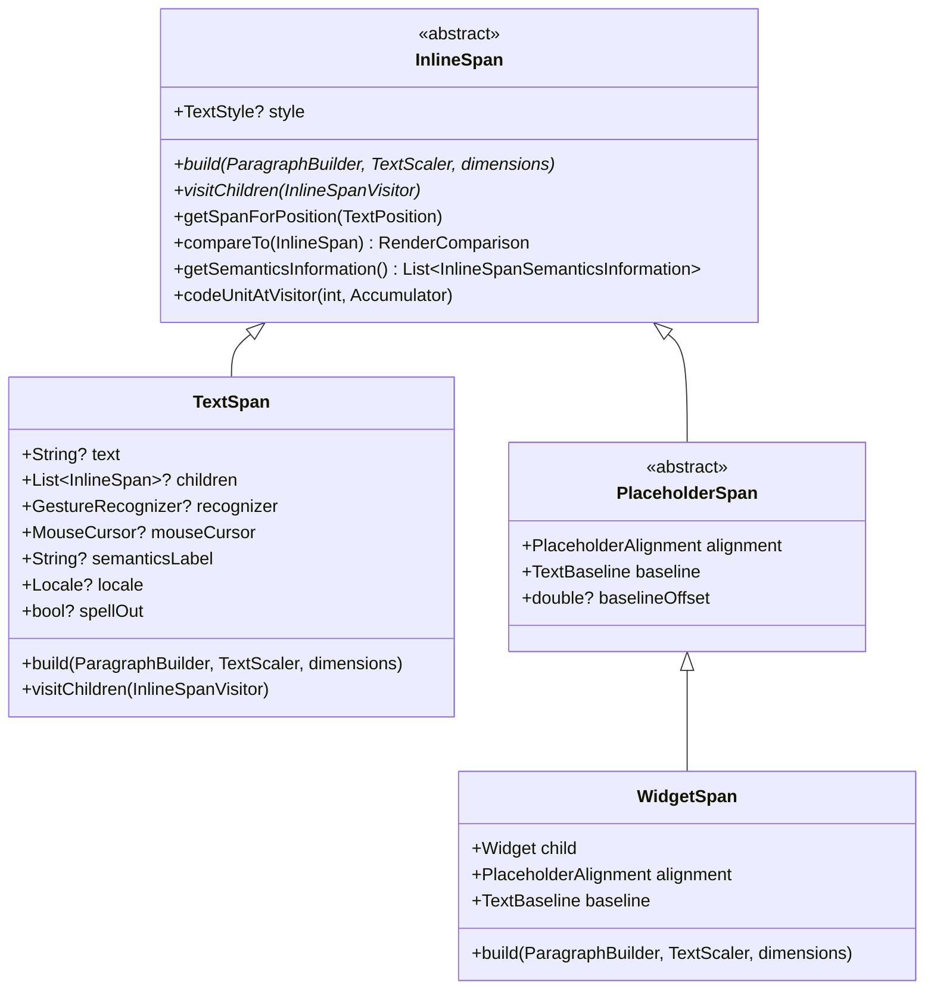

# Flutter Text Architecture: Common Text Primitives & Foundations

This document provides a deep, authoritative architectural reference for the foundational text subsystems in Flutter. These primitives, geometry models, boundary iterators, gesture recognizers, and selection overlays are shared across both the [Static Text Pipeline](file:///Users/roliv/flutter/.agents/skills/flutter-text-domain-expert/references/static_text_pipeline.md) and the [Editable Text Pipeline](file:///Users/roliv/flutter/.agents/skills/flutter-text-domain-expert/references/editable_text_pipeline.md).

---

### Table of Contents
- [Component & Class Index](#component--class-index)
1. [Engine Architecture & `dart:ui` Primitives](#1-engine-architecture--dartui-primitives)
   - [C++ Engine Backend & Subsystems](#c-engine-backend--subsystems)
   - [Core `dart:ui` APIs & Data Structures](#core-dartui-apis--data-structures)
2. [`InlineSpan` Tree & Structural Hierarchy](#2-inlinespan-tree--structural-hierarchy)
   - [`InlineSpan` Abstract Base & Core Lifecycle](#inlinespan-abstract-base--core-lifecycle)
   - [`TextSpan` Concrete Implementation](#textspan-concrete-implementation)
   - [`PlaceholderSpan` & `WidgetSpan`](#placeholderspan--widgetspan)
   - [Shared Consumption: `RenderParagraph` vs. `RenderEditable`](#shared-consumption-renderparagraph-vs-rendereditable)
3. [Painting & Styling Foundation](#3-painting--styling-foundation)
   - [`TextPainter` Architecture & Layout Caching](#textpainter-architecture--layout-caching)
   - [`TextStyle` & `StrutStyle`](#textstyle--strutstyle)
   - [`TextScaler` & Non-Linear Accessibility Scaling](#textscaler--non-linear-accessibility-scaling)
4. [Text Geometry & Directionality](#4-text-geometry--directionality)
   - [`TextPosition`, `TextAffinity` & Soft Wrap / BiDi Disambiguation](#textposition-textaffinity--soft-wrap--bidi-disambiguation)
   - [`TextRange` & `TextDirection`](#textrange--textdirection)
5. [Logical Text Boundaries & Iterators](#5-logical-text-boundaries--iterators)
   - [`TextBoundary` Contract & Subclasses](#textboundary-contract--subclasses)
   - [Word & Character Boundary Mechanics](#word--character-boundary-mechanics)
6. [Shared Text Gesture Recognizers](#6-shared-text-gesture-recognizers)
   - [Gesture Recognizer Class Hierarchy](#gesture-recognizer-class-hierarchy)
   - [Multi-Tap Resolution vs. Multiple Discrete Recognizers](#multi-tap-resolution-vs-multiple-discrete-recognizers)
7. [Shared Selection Overlays, Toolbars, Handles & Magnifiers](#7-shared-selection-overlays-toolbars-handles--magnifiers)
   - [Static vs. Editable Overlay Sharing](#static-vs-editable-overlay-sharing)
   - [Selection Handle Controls & Painters](#selection-handle-controls--painters)
   - [Platform Selection Toolbars & `ContextMenuController`](#platform-selection-toolbars--contextmenucontroller)
   - [Platform Context Menu Action & Button Ordering Matrix](#platform-context-menu-action--button-ordering-matrix)
   - [Text Subsystem `SystemChannels` Reference Map](#text-subsystem-systemchannels-reference-map)
   - [Magnifier Subsystem & Controllers](#magnifier-subsystem--controllers)
   - [Composited Layer Linking (`LeaderLayer` & `FollowerLayer`)](#composited-layer-linking-leaderlayer--followerlayer)

---

## Component & Class Index

| Component / Symbol | Source File / Location | Concise Summary |
| :--- | :--- | :--- |
| `ui.ParagraphBuilder` | `dart:ui` | Low-level engine builder used to record styled text runs and placeholder dimensions into an engine paragraph. |
| `ui.Paragraph` | `dart:ui` | Immutable shaped text layout object produced by `ParagraphBuilder` with line-breaking and geometry query APIs. |
| `ui.LineMetrics` | `dart:ui` | Physical metrics for a formatted line (ascent, descent, baseline, line index, height, width). |
| `ui.TextBox` | `dart:ui` | Bounding rectangle and `TextDirection` of a glyph cluster or selection box. |
| `ui.GlyphInfo` | `dart:ui` | Exact geometric bounds and UTF-16 cluster range for a single shaped glyph. |
| `ui.TextPosition` | `dart:ui` | Logical character offset and `TextAffinity` index in a string. |
| `ui.TextAffinity` | `dart:ui` | Disambiguates whether a caret at a soft line break or BiDi boundary associates upstream or downstream. |
| [`InlineSpan`](file:///Users/roliv/flutter/packages/flutter/lib/src/painting/inline_span.dart) | [`packages/flutter/lib/src/painting/inline_span.dart`](file:///Users/roliv/flutter/packages/flutter/lib/src/painting/inline_span.dart) | Abstract immutable tree node representing styled inline content (text or placeholders). |
| [`TextSpan`](file:///Users/roliv/flutter/packages/flutter/lib/src/painting/text_span.dart) | [`packages/flutter/lib/src/painting/text_span.dart`](file:///Users/roliv/flutter/packages/flutter/lib/src/painting/text_span.dart) | Concrete immutable text span containing a string, styling, gesture recognizers, and child spans. |
| [`PlaceholderSpan`](file:///Users/roliv/flutter/packages/flutter/lib/src/painting/placeholder_span.dart) | [`packages/flutter/lib/src/painting/placeholder_span.dart`](file:///Users/roliv/flutter/packages/flutter/lib/src/painting/placeholder_span.dart) | Abstract span that embeds a sized inline box aligned with font metrics. |
| [`WidgetSpan`](file:///Users/roliv/flutter/packages/flutter/lib/src/widgets/widget_span.dart) | [`packages/flutter/lib/src/widgets/widget_span.dart`](file:///Users/roliv/flutter/packages/flutter/lib/src/widgets/widget_span.dart) | Concrete span that embeds an arbitrary Flutter `Widget` inside static or editable text. |
| [`TextPainter`](file:///Users/roliv/flutter/packages/flutter/lib/src/painting/text_painter.dart) | [`packages/flutter/lib/src/painting/text_painter.dart`](file:///Users/roliv/flutter/packages/flutter/lib/src/painting/text_painter.dart) | Core painting engine bridging `InlineSpan` trees to engine paragraphs with layout caching. |
| [`TextStyle`](file:///Users/roliv/flutter/packages/flutter/lib/src/painting/text_style.dart) | [`packages/flutter/lib/src/painting/text_style.dart`](file:///Users/roliv/flutter/packages/flutter/lib/src/painting/text_style.dart) | Visual typography attributes (font family, weight, size, color, decorations). |
| [`StrutStyle`](file:///Users/roliv/flutter/packages/flutter/lib/src/painting/strut_style.dart) | [`packages/flutter/lib/src/painting/strut_style.dart`](file:///Users/roliv/flutter/packages/flutter/lib/src/painting/strut_style.dart) | Defines minimum line height struts to enforce uniform vertical line spacing across mixed font styles. |
| [`TextScaler`](file:///Users/roliv/flutter/packages/flutter/lib/src/painting/text_scaler.dart) | [`packages/flutter/lib/src/painting/text_scaler.dart`](file:///Users/roliv/flutter/packages/flutter/lib/src/painting/text_scaler.dart) | Linear and non-linear accessibility font scaling interface replacing legacy scale factors. |
| [`TextBoundary`](file:///Users/roliv/flutter/packages/flutter/lib/src/services/text_boundary.dart) | [`packages/flutter/lib/src/services/text_boundary.dart`](file:///Users/roliv/flutter/packages/flutter/lib/src/services/text_boundary.dart) | Base contract for logical text boundary iterators (characters, words, lines, paragraphs). |
| [`CharacterBoundary`](file:///Users/roliv/flutter/packages/flutter/lib/src/services/text_boundary.dart) | [`packages/flutter/lib/src/services/text_boundary.dart`](file:///Users/roliv/flutter/packages/flutter/lib/src/services/text_boundary.dart) | Iterates over extended grapheme clusters using ICU segment rules. |
| [`WordBoundary`](file:///Users/roliv/flutter/packages/flutter/lib/src/services/text_boundary.dart) | [`packages/flutter/lib/src/services/text_boundary.dart`](file:///Users/roliv/flutter/packages/flutter/lib/src/services/text_boundary.dart) | Identifies linguistic word boundaries for double-tap selection and word jumping. |
| [`LineBoundary`](file:///Users/roliv/flutter/packages/flutter/lib/src/services/text_boundary.dart) | [`packages/flutter/lib/src/services/text_boundary.dart`](file:///Users/roliv/flutter/packages/flutter/lib/src/services/text_boundary.dart) | Identifies soft-wrapped and hard-break visual line boundaries using `TextPainter`. |
| [`ParagraphBoundary`](file:///Users/roliv/flutter/packages/flutter/lib/src/services/text_boundary.dart) | [`packages/flutter/lib/src/services/text_boundary.dart`](file:///Users/roliv/flutter/packages/flutter/lib/src/services/text_boundary.dart) | Identifies hard newline (`\n`) separated paragraph boundaries. |
| [`DocumentBoundary`](file:///Users/roliv/flutter/packages/flutter/lib/src/services/text_boundary.dart) | [`packages/flutter/lib/src/services/text_boundary.dart`](file:///Users/roliv/flutter/packages/flutter/lib/src/services/text_boundary.dart) | Identifies the start (`0`) and end of the entire document string. |
| [`BaseTapAndDragGestureRecognizer`](file:///Users/roliv/flutter/packages/flutter/lib/src/gestures/tap_and_drag.dart) | [`packages/flutter/lib/src/gestures/tap_and_drag.dart`](file:///Users/roliv/flutter/packages/flutter/lib/src/gestures/tap_and_drag.dart) | Base recognizer unifying multi-tap counting (single/double/triple) with drag gestures. |
| [`TapAndPanGestureRecognizer`](file:///Users/roliv/flutter/packages/flutter/lib/src/gestures/tap_and_drag.dart) | [`packages/flutter/lib/src/gestures/tap_and_drag.dart`](file:///Users/roliv/flutter/packages/flutter/lib/src/gestures/tap_and_drag.dart) | Pan recognizer used by `SelectableRegion` and `TextSelectionGestureDetector` for 2D drag selection. |
| [`TapAndHorizontalDragGestureRecognizer`](file:///Users/roliv/flutter/packages/flutter/lib/src/gestures/tap_and_drag.dart) | [`packages/flutter/lib/src/gestures/tap_and_drag.dart`](file:///Users/roliv/flutter/packages/flutter/lib/src/gestures/tap_and_drag.dart) | Horizontal drag recognizer used by editable text selection detectors. |
| [`LongPressGestureRecognizer`](file:///Users/roliv/flutter/packages/flutter/lib/src/gestures/long_press.dart) | [`packages/flutter/lib/src/gestures/long_press.dart`](file:///Users/roliv/flutter/packages/flutter/lib/src/gestures/long_press.dart) | Detects touch hold gestures to trigger word selection, magnifying loupes, or selection handle drags on mobile devices. |
| [`ForcePressGestureRecognizer`](file:///Users/roliv/flutter/packages/flutter/lib/src/gestures/force_press.dart) | [`packages/flutter/lib/src/gestures/force_press.dart`](file:///Users/roliv/flutter/packages/flutter/lib/src/gestures/force_press.dart) | Detects 3D touch pressure changes on supported iOS devices to trigger word selection. |
| [`SelectionOverlay`](file:///Users/roliv/flutter/packages/flutter/lib/src/widgets/selection_overlay.dart) | [`packages/flutter/lib/src/widgets/selection_overlay.dart`](file:///Users/roliv/flutter/packages/flutter/lib/src/widgets/selection_overlay.dart) | Manages floating selection handles, toolbars, and magnifiers for static selectable regions. |
| [`TextSelectionOverlay`](file:///Users/roliv/flutter/packages/flutter/lib/src/widgets/text_selection.dart) | [`packages/flutter/lib/src/widgets/text_selection.dart`](file:///Users/roliv/flutter/packages/flutter/lib/src/widgets/text_selection.dart) | Manages floating selection handles, toolbars, and magnifiers for editable text fields. |
| [`LeaderLayer`](file:///Users/roliv/flutter/packages/flutter/lib/src/rendering/layer.dart) & [`FollowerLayer`](file:///Users/roliv/flutter/packages/flutter/lib/src/rendering/layer.dart) | [`packages/flutter/lib/src/rendering/layer.dart`](file:///Users/roliv/flutter/packages/flutter/lib/src/rendering/layer.dart) | Composited layer pair linking floating overlay handles to scrolling render boxes without widget rebuilds. |
| [`TextSelectionControls`](file:///Users/roliv/flutter/packages/flutter/lib/src/widgets/text_selection.dart) | [`packages/flutter/lib/src/widgets/text_selection.dart`](file:///Users/roliv/flutter/packages/flutter/lib/src/widgets/text_selection.dart) | Abstract interface for building platform selection handles and toolbars. |
| [`MaterialTextSelectionHandleControls`](file:///Users/roliv/flutter/packages/flutter/lib/src/material/text_selection.dart) | [`packages/flutter/lib/src/material/text_selection.dart`](file:///Users/roliv/flutter/packages/flutter/lib/src/material/text_selection.dart) | Material handle controls (frozen here; active in `material_ui` under `flutter/packages`). |
| [`CupertinoTextSelectionHandleControls`](file:///Users/roliv/flutter/packages/flutter/lib/src/cupertino/text_selection.dart) | [`packages/flutter/lib/src/cupertino/text_selection.dart`](file:///Users/roliv/flutter/packages/flutter/lib/src/cupertino/text_selection.dart) | Cupertino handle controls (frozen here; active in `cupertino_ui` under `flutter/packages`). |
| [`AdaptiveTextSelectionToolbar`](file:///Users/roliv/flutter/packages/flutter/lib/src/material/adaptive_text_selection_toolbar.dart) | [`packages/flutter/lib/src/material/adaptive_text_selection_toolbar.dart`](file:///Users/roliv/flutter/packages/flutter/lib/src/material/adaptive_text_selection_toolbar.dart) | Adaptive toolbar wrapper (frozen here; active in `material_ui` under `flutter/packages`). |
| [`TextMagnifier`](file:///Users/roliv/flutter/packages/flutter/lib/src/material/magnifier.dart) | [`packages/flutter/lib/src/material/magnifier.dart`](file:///Users/roliv/flutter/packages/flutter/lib/src/material/magnifier.dart) | Android/Material magnifying glass widget (frozen here; active in `material_ui` under `flutter/packages`). |
| [`CupertinoTextMagnifier`](file:///Users/roliv/flutter/packages/flutter/lib/src/cupertino/magnifier.dart) | [`packages/flutter/lib/src/cupertino/magnifier.dart`](file:///Users/roliv/flutter/packages/flutter/lib/src/cupertino/magnifier.dart) | iOS magnifying glass widget (frozen here; active in `cupertino_ui` under `flutter/packages`). |
| [`RawMagnifier`](file:///Users/roliv/flutter/packages/flutter/lib/src/widgets/magnifier.dart) | [`packages/flutter/lib/src/widgets/magnifier.dart`](file:///Users/roliv/flutter/packages/flutter/lib/src/widgets/magnifier.dart) | Low-level magnifier widget using `BackdropFilter` to distort and scale background pixels. |
| [`MagnifierController`](file:///Users/roliv/flutter/packages/flutter/lib/src/widgets/magnifier.dart) | [`packages/flutter/lib/src/widgets/magnifier.dart`](file:///Users/roliv/flutter/packages/flutter/lib/src/widgets/magnifier.dart) | Controls showing, hiding, and animating magnifiers in the application `Overlay`. |

---

## 1. Engine Architecture & `dart:ui` Primitives

At Flutter's lowest architectural boundary, the framework interacts with the native C++ engine via `dart:ui`. The C++ engine contains the core layout, text shaping, BiDi analysis, line-breaking, and rasterization pipeline.

```
+-----------------------------------------------------------------------------+
|                                  dart:ui                                    |
|   ui.ParagraphBuilder  --->  ui.Paragraph  --->  ui.LineMetrics / TextBox   |
+-----------------------------------------------------------------------------+
                                       |
                                       v (C++ FFI Bridge)
+-----------------------------------------------------------------------------+
|                               Engine (C++)                                  |
|   SkParagraph / LibTxt                                                      |
|     |---> HarfBuzz (Font shaping, glyph cluster formation, OpenType)        |
|     |---> ICU (UAX #14 Line Breaking, UAX #29 Text Segments, BiDi UAX #9)  |
|     |---> Impeller Typographer (Glyph cache, vertex mesh, GPU rasterization)|
+-----------------------------------------------------------------------------+
```

### C++ Engine Backend & Subsystems

1. **SkParagraph / LibTxt**:
   - **SkParagraph** is the primary text layout engine in Flutter (replacing legacy LibTxt).
   - Coordinates line layout, paragraph styling, font resolution, placeholder dimensions, and inline strut metrics.
2. **HarfBuzz**:
   - The industry-standard font shaping engine used for converting Unicode character sequences into positioned glyph IDs.
   - Handles complex scripts (Arabic, Devanagari, Thai, etc.), kerning, ligatures, contextual glyph substitutions (GSUB), and glyph positioning (GPOS).
3. **ICU (International Components for Unicode)**:
   - Implements standard Unicode algorithms:
     - **UAX #9**: Unicode Bidirectional Algorithm (BiDi) for resolving mixed LTR/RTL text runs.
     - **UAX #14**: Unicode Line Breaking Algorithm for determining valid wrap opportunity boundaries.
     - **UAX #29**: Unicode Text Segmentation for resolving grapheme clusters, words, and sentences.
4. **Impeller Typographer & GPU Rasterization**:
   - Impeller's typography pipeline generates and caches glyph atlases dynamically on the GPU.
   - Converts shaped text glyph positions into textured vertex geometry and submits draw calls directly through Impeller's modern GPU backends (Metal, Vulkan) without Skia CPU rasterization bottlenecks.

---

### Core `dart:ui` APIs & Data Structures

#### 1. `ui.ParagraphBuilder`
[`ui.ParagraphBuilder`](file:///Users/roliv/flutter/bin/cache/pkg/sky_engine/lib/ui/text.dart) is a native host object used to build shaped text trees.
- Instantiated with [`ui.ParagraphStyle`](file:///Users/roliv/flutter/bin/cache/pkg/sky_engine/lib/ui/text.dart) configuring text direction, alignment, max lines, ellipsis, locale, strut style, and text height behavior.
- **`pushStyle(ui.TextStyle style)`**: Pushes a style onto the builder stack. All subsequent text added inherits this style until `pop()` is invoked.
- **`pop()`**: Pops the top style from the stack.
- **`addText(String text)`**: Appends a UTF-16 string chunk using current style configurations.
- **`addPlaceholder(double width, double height, ui.PlaceholderAlignment alignment, ...)`**: Reserves rectangular inline space for non-text children (e.g. `WidgetSpan`).
- **`build()`**: Compiles the pushed spans into an immutable native `ui.Paragraph` instance.

#### 2. `ui.Paragraph`
[`ui.Paragraph`](file:///Users/roliv/flutter/bin/cache/pkg/sky_engine/lib/ui/text.dart) represents an **immutable**, shaped, laid-out text block.
- **`layout(ui.ParagraphConstraints constraints)`**: Computes line breaks, soft wraps, and glyph positions for the given width. Must be called before querying layout metrics or painting.
- **Measurement Metrics**:
  - `minIntrinsicWidth`: The smallest width required to fit text without clipping individual non-breakable words.
  - `maxIntrinsicWidth`: The width required to display the full text on a single line without wrapping.
  - `width` / `height`: The physical bounding box dimensions calculated during `layout()`.
  - `alphabeticBaseline` / `ideographicBaseline`: Baseline offsets from the top edge.
  - `longestLine`: The horizontal extent of the longest physical laid-out line.
  - `didExceedMaxLines`: True if the text was truncated due to `maxLines` or `ellipsis`.
- **Geometry & Query Methods**:
  - `getBoxesForRange(int start, int end, {ui.BoxHeightStyle boxHeightStyle, ui.BoxWidthStyle boxWidthStyle})`: Computes a list of `ui.TextBox` rectangles bounding the specified code unit range.
  - `getPositionForOffset(Offset offset)`: Returns the `ui.TextPosition` (offset and affinity) corresponding to a 2D local pixel coordinate.
  - `getWordBoundary(ui.TextPosition position)`: Returns a `ui.TextRange` bounding the word enclosing `position` according to Unicode UAX #29.
  - `getLineMetricsAt(int lineNumber)` / `computeLineMetrics()`: Retrieves detailed metric records for individual or all physical lines.
  - `getGlyphInfoAt(int codeUnitIndex)`: Returns `ui.GlyphInfo` containing `graphemeClusterLayoutBounds`, `graphemeClusterCodeUnitRange`, and `writingDirection`.
  - `getClosestGlyphInfoForOffset(Offset offset)`: Locates the nearest glyph to a 2D offset.
  - `getBoxesForPlaceholders()`: Returns a list of `ui.TextBox` bounds for all embedded placeholders.

#### 3. `ui.LineMetrics`
[`ui.LineMetrics`](file:///Users/roliv/flutter/bin/cache/pkg/sky_engine/lib/ui/text.dart) encapsulates geometry for a single laid-out physical line:
- `hardBreak`: Whether the line terminates with an explicit newline (`\n`).
- `ascent`: Distance from the top of the line to the baseline.
- `descent`: Distance from the baseline to the bottom of the line.
- `unscaledAscent`: Raw unscaled font ascent metric.
- `height`: Total line height (`ascent + descent`).
- `width`: Logical width of the line content.
- `left`: Horizontal offset of the line's start relative to the paragraph origin.
- `baseline`: Vertical offset of the line's baseline from the paragraph top.
- `lineNumber`: 0-indexed index of the line within the paragraph.

#### 4. `ui.TextBox`
[`ui.TextBox`](file:///Users/roliv/flutter/bin/cache/pkg/sky_engine/lib/ui/text.dart) encapsulates a rectangular selection or placeholder boundary:
- Properties: `left`, `top`, `right`, `bottom`, and `direction` (`TextDirection.ltr` or `TextDirection.rtl`).
- Method: `toRect()` produces a `Rect`.

#### 5. `ui.GlyphInfo`
[`ui.GlyphInfo`](file:///Users/roliv/flutter/bin/cache/pkg/sky_engine/lib/ui/text.dart) provides detailed grapheme cluster layout bounds:
- `graphemeClusterLayoutBounds`: Exact 2D bounding `Rect` enclosing the grapheme cluster.
- `graphemeClusterCodeUnitRange`: UTF-16 code unit range `TextRange(start: ..., end: ...)`.
- `writingDirection`: The resolved `TextDirection` of the glyph.

#### 6. `ui.TextPosition` & `ui.TextAffinity`
[`ui.TextPosition`](file:///Users/roliv/flutter/bin/cache/pkg/sky_engine/lib/ui/text.dart) and [`ui.TextAffinity`](file:///Users/roliv/flutter/bin/cache/pkg/sky_engine/lib/ui/text.dart) encapsulate logical string offsets and their visual line/BiDi run binding.

---

## 2. `InlineSpan` Tree & Structural Hierarchy

In Flutter, rich formatted text is modeled as an immutable tree of [`InlineSpan`](file:///Users/roliv/flutter/packages/flutter/lib/src/painting/inline_span.dart) objects. Because `InlineSpan`, [`TextSpan`](file:///Users/roliv/flutter/packages/flutter/lib/src/painting/text_span.dart), [`PlaceholderSpan`](file:///Users/roliv/flutter/packages/flutter/lib/src/painting/placeholder_span.dart), and [`WidgetSpan`](file:///Users/roliv/flutter/packages/flutter/lib/src/widgets/widget_span.dart) represent the structural description of styled and embedded content, they are shared across **both** the [Static Text Pipeline](file:///Users/roliv/flutter/.agents/skills/flutter-text-domain-expert/references/static_text_pipeline.md) (`RenderParagraph.text`) and the [Editable Text Pipeline](file:///Users/roliv/flutter/.agents/skills/flutter-text-domain-expert/references/editable_text_pipeline.md) (`RenderEditable.text`).



### `InlineSpan` Abstract Base & Core Lifecycle

[`InlineSpan`](file:///Users/roliv/flutter/packages/flutter/lib/src/painting/inline_span.dart) is the abstract base class defining the contract for styled text segments and embedded inline widgets:

1. **`build(ui.ParagraphBuilder builder, {TextScaler textScaler = TextScaler.noScaling, List<PlaceholderDimensions>? dimensions})`**:
   - Compiles the span and its descendants into the native engine `ui.ParagraphBuilder`.
   - Pushes its `TextStyle` onto the builder stack, adds plain text chunks or placeholder slots, recursively invokes `build` on nested children, and pops the style.
2. **Visitor Pattern (`visitChildren`)**:
   - Traversal contract: `bool visitChildren(InlineSpanVisitor visitor)` where `typedef InlineSpanVisitor = bool Function(InlineSpan span)`.
   - Traverses the span tree in depth-first reading order.
   - Allows early termination by returning `false` from the visitor callback (used in offset indexing, hit testing, and text extraction).
   - Specialized visitor methods built on top of `visitChildren`:
     - `visitDirectChildren(InlineSpanVisitor visitor)`: Traverses only immediate children.
     - `getSpanForPosition(TextPosition position)` / `getSpanForPositionVisitor`: Finds the specific leaf or branch span containing the specified string offset.
     - `computeToPlainText(StringBuffer buffer, ...)`: Extracts flattened plain text representation.
     - `codeUnitAtVisitor(int index, _Accumulator offset)`: Retrieves a character code unit at a logical index.
3. **Structural Tree Diffing (`compareTo`)**:
   - `compareTo(InlineSpan other)` computes a [`RenderComparison`](file:///Users/roliv/flutter/packages/flutter/lib/src/rendering/object.dart) enum value:
     - `RenderComparison.identical`: Spans are identical; no action needed.
     - `RenderComparison.metadata`: Only semantic or non-visual metadata changed (e.g. `semanticsLabel`, `recognizer`, `mouseCursor`); no layout or paint update needed.
     - `RenderComparison.paint`: Visual properties changed that do NOT affect text layout geometry (e.g. `TextStyle.color`, `TextStyle.foreground`, `TextStyle.shadows`, `TextStyle.decoration`); triggers repaint (`markNeedsPaint()`) while bypassing expensive engine shaping and paragraph layout.
     - `RenderComparison.layout`: Structural or layout-critical properties changed (e.g. `text`, `fontSize`, `fontFamily`, `letterSpacing`, `PlaceholderDimensions`, child span count); triggers a full layout pass (`markNeedsLayout()`).
4. **Semantics Extraction (`getSemanticsInformation`)**:
   - Returns a `List<InlineSpanSemanticsInformation>` describing accessibility metadata.
   - Spans with interactive gesture recognizers (`recognizer != null`) or embedded inline widgets (`WidgetSpan`) set `requiresOwnNode: true`, forcing Flutter's semantics subsystem to allocate individual accessible nodes in the OS accessibility tree.

---

### `TextSpan` Concrete Implementation

[`TextSpan`](file:///Users/roliv/flutter/packages/flutter/lib/src/painting/text_span.dart) is the primary concrete `InlineSpan` implementation representing a styled string chunk or a branching node with nested children:

- **`text`**: The UTF-16 text string to render.
- **`children`**: An optional list of child `InlineSpan` instances nested inside this span. Child spans inherit unresolved style properties from their parent span.
- **`recognizer`**: An optional [`GestureRecognizer`](file:///Users/roliv/flutter/packages/flutter/lib/src/gestures/recognizer.dart) (e.g. [`TapGestureRecognizer`](file:///Users/roliv/flutter/packages/flutter/lib/src/gestures/tap.dart)) responding to pointer events directly on this span (such as clickable hyperlinks or mention tags).
- **`mouseCursor`**: Custom mouse cursor (e.g. `SystemMouseCursors.click`) shown when hovering over the span.
- **`semanticsLabel`**: Optional accessibility string replacing the plain text content for screen readers.
- **`locale` & `spellOut`**: Locale override for language-specific glyph rendering and TTS pronunciation flags.

---

### `PlaceholderSpan` & `WidgetSpan`

1. **[`PlaceholderSpan`](file:///Users/roliv/flutter/packages/flutter/lib/src/painting/placeholder_span.dart)**:
   - Abstract subclass of `InlineSpan` that reserves empty rectangular space inside the laid-out text paragraph for arbitrary non-text content.
   - Defines alignment and baseline contracts:
     - **`alignment` ([`ui.PlaceholderAlignment`](file:///Users/roliv/flutter/bin/cache/pkg/sky_engine/lib/ui/text.dart))**:
       - `baseline`: Aligns the placeholder's baseline with the surrounding text baseline.
       - `aboveBaseline`: Sits entirely above the text baseline.
       - `belowBaseline`: Sits entirely below the text baseline.
       - `top`: Aligns the top of the placeholder with the top of the line.
       - `bottom`: Aligns the bottom of the placeholder with the bottom of the line.
       - `middle`: Centers the placeholder vertically with the line's center.
     - **`baseline` ([`TextBaseline`](file:///Users/roliv/flutter/bin/cache/pkg/sky_engine/lib/ui/text.dart))**:
       - `alphabetic`: Standard baseline for Latin/Cyrillic scripts (bottom of letters without descenders).
       - `ideographic`: Baseline for CJK scripts (bottom of square glyph bounding box).
     - **`baselineOffset`**: Distance from the top edge of the placeholder to its baseline.
   - In `build()`, calls `builder.addPlaceholder(width, height, alignment, scale: ..., baseline: ..., baselineOffset: ...)`.
2. **[`WidgetSpan`](file:///Users/roliv/flutter/packages/flutter/lib/src/widgets/widget_span.dart)**:
   - Concrete `PlaceholderSpan` defined in the Widgets layer.
   - Holds an arbitrary Flutter `Widget child`.
   - Embeds interactive badges, inline icons, buttons, or custom widgets directly into flowing text.

---

### Shared Consumption: `RenderParagraph` vs. `RenderEditable`

Both static and editable text render objects consume `InlineSpan` trees directly via their `text` property:

```
                  +-----------------------------------+
                  |      InlineSpan Tree              |
                  |  (TextSpan / WidgetSpan / etc.)   |
                  +-----------------------------------+
                                    |
                 +------------------+------------------+
                 |                                     |
                 v                                     v
+---------------------------------+   +---------------------------------+
|         RenderParagraph         |   |         RenderEditable          |
|    (Static Text Pipeline)       |   |    (Editable Text Pipeline)     |
| • Consumes RenderParagraph.text |   | • Consumes RenderEditable.text  |
| • Manages child RenderBoxes     |   | • Supports rich formatting in   |
|   for embedded WidgetSpans      |   |   editable text & custom syntax |
| • Coordinates dry layout &      |   |   controllers                   |
|   ContainerRenderObjectMixin    |   | • plainText returns flat string |
+---------------------------------+   +---------------------------------+
```

- **`RenderParagraph.text` ([Static Text Pipeline](file:///Users/roliv/flutter/.agents/skills/flutter-text-domain-expert/references/static_text_pipeline.md))**:
  - `RenderParagraph` mixes in `ContainerRenderObjectMixin<RenderBox, TextParentData>` to host, lay out, and paint the child render boxes created for embedded `WidgetSpan`s.
  - Generates multiple `_SelectableFragment` registrants across placeholders for document-wide selection.
- **`RenderEditable.text` ([Editable Text Pipeline](file:///Users/roliv/flutter/.agents/skills/flutter-text-domain-expert/references/editable_text_pipeline.md))**:
  - `RenderEditable.text` accepts any `InlineSpan` tree, allowing custom controllers (e.g. subclasses of `TextEditingController` overriding `buildTextSpan`) to render multi-colored syntax highlighting, mention tags, hashtags, and styled token runs inside interactive editable text fields.
  - `RenderEditable.plainText` provides the flattened unformatted text string for clipboard, input methods, and accessibility, while `text` preserves the rich formatting tree.

---

## 3. Painting & Styling Foundation

The Painting layer (`painting/`) bridges raw engine primitives with Flutter's widget and rendering pipeline.

### `TextPainter` Architecture & Layout Caching

[`TextPainter`](file:///Users/roliv/flutter/packages/flutter/lib/src/painting/text_painter.dart) coordinates paragraph building, measurement, caret positioning, and canvas painting for an `InlineSpan` tree.

#### 1. Layout Caching (`_TextPainterLayoutCacheWithOffset`)
Constructing and shaping a `ui.Paragraph` is an expensive operation involving native FFI calls, HarfBuzz shaping, and ICU line break traversals. `TextPainter` mitigates layout costs through cached state:
- **`_layoutCache`**: An instance of `_TextPainterLayoutCacheWithOffset` that retains:
  - The laid-out native `ui.Paragraph`.
  - The calculated `paintOffset` (which centers or aligns text according to `TextAlign` and `textWidthBasis`).
  - Cached paragraph metrics: `layoutMaxWidth`, `layoutMinWidth`, `contentWidth`, `width`, `height`.

#### 2. Fast Constraints Relayout (`_resizeToFit`)
When `TextPainter.layout(minWidth, maxWidth)` is called with updated constraints:
- `TextPainter` invokes `_resizeToFit(minWidth, maxWidth, textWidthBasis)`.
- If the text was previously formatted with unlimited width and the new `maxWidth` is large enough to contain the longest line without forcing new line wraps, `TextPainter` reuses the existing `ui.Paragraph` without re-shaping.
- It only recalculates `paintOffset` and content dimensions, bypassing the native engine pipeline.

#### 3. Deferred Paint Rebuilds (`_rebuildParagraphForPaint`)
`ui.Paragraph` is completely immutable. If styling attributes that only affect painting change (such as `TextStyle.color`, `TextStyle.foreground`, `TextStyle.shadows`, or background `Paint`):
- `TextPainter` marks an internal flag: `_rebuildParagraphForPaint = true`.
- It avoids triggering a synchronous engine rebuild or invalidating layout geometry.
- The `ui.Paragraph` is only rebuilt during the next `paint()` call immediately before drawing to the canvas (`_createParagraphStylesAndBuild()`). This prevents layout thrashing during color animations or theme switches.

---

### `TextStyle` & `StrutStyle`

- **[`TextStyle`](file:///Users/roliv/flutter/packages/flutter/lib/src/painting/text_style.dart)**:
  - Controls font family, fallback font families (`fontFamilyFallback`), font size, font weight, font style (italic/normal), letter spacing, word spacing, height, foreground/background `Paint`, shadows, decorations (`TextDecoration.underline`, `lineThrough`), and font features (`FontFeature.enable('smcp')`, `FontVariation`).
- **[`StrutStyle`](file:///Users/roliv/flutter/packages/flutter/lib/src/painting/strut_style.dart)**:
  - Sets the minimum line height strut metrics across a paragraph.
  - Dictates line spacing independently of individual inline child font sizes when `forceStrutHeight: true`, guaranteeing baseline grid alignment across mixed inline fonts or embedded emojis.

---

### `TextScaler` & Non-Linear Accessibility Scaling

Flutter uses [`TextScaler`](file:///Users/roliv/flutter/packages/flutter/lib/src/painting/text_scaler.dart) to support accessible dynamic font scaling.

```
       Visual Scale Factor
              ^
              |        Linear Scaling (Deprecated textScaleFactor = 2.0)
          2.0 +------------------------------------------------------
              |
              |       Non-Linear Accessibility Curve (Android 14+ / iOS)
          1.8 |        .---'''''''''''---.  (Large headings scale less)
              |       /
          1.4 |      /  (Body text scales aggressively for readability)
              |     /
          1.0 +----+------------------------------------------------->
              0   12   16   20   24   28   32   36   48   64  Font Size (pt)
```

1. **`TextScaler.noScaling`**: Unscaled identity scaling (factor 1.0).
2. **`TextScaler.linear(double factor)`**: Multiplies all font sizes uniformly by `factor`.
3. **Non-Linear Accessibility Scaling**:
   - Both Android 14+ and iOS enforce non-linear scaling curves.
   - Small body text (12pt–16pt) is scaled up significantly (up to 200%) so users with visual impairments can read content comfortably.
   - Large headings (36pt+) are scaled at a much lower rate to prevent UI breakage, overflow errors, and unreadable button wrapping.
   - Custom curve evaluation is performed via `TextScaler.scale(double fontSize)` and `TextScaler.clamp(...)`.

---

## 4. Text Geometry & Directionality

### `TextPosition`, `TextAffinity` & Soft Wrap / BiDi Disambiguation

A [`TextPosition`](file:///Users/roliv/flutter/bin/cache/pkg/sky_engine/lib/ui/text.dart) represents a 0-indexed logical offset into a UTF-16 string paired with an affinity:
```dart
const TextPosition({required this.offset, this.affinity = TextAffinity.downstream});
```

#### 1. Soft Line Wrap Disambiguation
When text wraps across multiple visual lines due to width constraints, a single code unit offset exists simultaneously at the end of the top line and the beginning of the bottom line.

```
Logical Text: "Hello World Flutter Text"
Visual Line 1: [Hello World ] (offsets 0..11)
Visual Line 2: [Flutter Text] (offsets 12..23)

Caret at Offset 12:
- TextAffinity.upstream:   Anchored to the trailing end of Line 1 (after space ' ').
- TextAffinity.downstream: Anchored to the leading start of Line 2 (before 'F').
```

- **`TextAffinity.upstream`**: Affiliated with the preceding character (visual end of upper line).
- **`TextAffinity.downstream`**: Affiliated with the subsequent character (visual start of lower line).

#### 2. Bidirectional (BiDi) Boundaries
In mixed-direction text (e.g. English LTR juxtaposed with Hebrew or Arabic RTL), a single logical string index can correspond to two distinct 2D physical screen positions.

```
Logical String: "abc אבג def"
                 ^^^ ^^^ ^^^
                 LTR RTL LTR
```
- At the transition between `"abc"` and `"אבג"`, an offset of `4` with `TextAffinity.upstream` places the caret at the right of `"abc"`.
- The same offset `4` with `TextAffinity.downstream` places the caret at the rightmost boundary of the RTL Hebrew cluster `"אבג"`.
- `TextPainter.getOffsetForCaret()` resolves BiDi boundaries by inspecting `ui.GlyphInfo.writingDirection` and selecting the matching glyph edge.

---

### `TextRange` & `TextDirection`

- **[`TextRange`](file:///Users/roliv/flutter/bin/cache/pkg/sky_engine/lib/ui/text.dart)**:
  - Defined by `start` and `end` indices.
  - `isCollapsed`: `start == end`.
  - `isNormalized`: `start <= end`.
  - `textInside(String text)`: Returns `text.substring(start, end)`.
  - `textBefore(String text)` / `textAfter(String text)`: Slices adjacent substrings.
  - `TextRange.empty`: `TextRange(start: -1, end: -1)`.
- **[`TextDirection`](file:///Users/roliv/flutter/bin/cache/pkg/sky_engine/lib/ui/text.dart)**:
  - `TextDirection.ltr`: Left-to-right (Latin, Cyrillic, Hanzi, etc.).
  - `TextDirection.rtl`: Right-to-left (Arabic, Hebrew, Persian, Urdu).

---

## 5. Logical Text Boundaries & Iterators

Logical text boundaries locate grapheme clusters, words, lines, and paragraphs during keyboard navigation, double/triple clicks, and drag selection.

```
DocumentBoundary:   [========================================================]
ParagraphBoundary:  [========================\n] [===========================\n]
LineBoundary:       [==============wrap] [=====] [================wrap] [====]
WordBoundary:       [Hello] [ ] [World] [ ]      [Flutter] [ ] [Text]
CharacterBoundary:  [H][e][l][l][o]
```

### `TextBoundary` Contract & Subclasses

The abstract base class [`TextBoundary`](file:///Users/roliv/flutter/packages/flutter/lib/src/services/text_boundary.dart) exposes:
- **`getLeadingTextBoundaryAt(int position)`**: Closest boundary offset before or at `position`.
- **`getTrailingTextBoundaryAt(int position)`**: Closest boundary offset after `position`.
- **`getTextBoundaryAt(int position)`**: Returns the enclosing `TextRange(start: leading, end: trailing)`.

#### 1. `CharacterBoundary` ([`services/text_boundary.dart`](file:///Users/roliv/flutter/packages/flutter/lib/src/services/text_boundary.dart))
- Uses `package:characters` and `CharacterRange` to navigate Unicode extended grapheme clusters.
- Ensures composite emojis (e.g. `👨‍👩‍👧‍👦` containing zero-width joiners and skin tone modifiers) and surrogate pairs are traversed as single atomic characters.

#### 2. `WordBoundary` ([`painting/text_painter.dart`](file:///Users/roliv/flutter/packages/flutter/lib/src/painting/text_painter.dart))
- Accesses native Unicode UAX #29 word segmentation via `ui.Paragraph.getWordBoundary()`.
- Implements `moveByWordBoundary` via `_UntilTextBoundary` to skip whitespace and punctuation when navigating using `Alt+Left/Right` (macOS) or `Ctrl+Left/Right` (Windows/Linux).

#### 3. `LineBoundary` ([`services/text_boundary.dart`](file:///Users/roliv/flutter/packages/flutter/lib/src/services/text_boundary.dart))
- Uses [`TextLayoutMetrics`](file:///Users/roliv/flutter/packages/flutter/lib/src/services/text_layout_metrics.dart) (`getLineAtOffset`) to find physical line boundaries based on active layout wrapping.
- When positioned at a hard line break (`\n`), returns the line content range preceding the break.

#### 4. `ParagraphBoundary` ([`services/text_boundary.dart`](file:///Users/roliv/flutter/packages/flutter/lib/src/services/text_boundary.dart))
- Traverses code units to identify enclosing hard line terminators (`\r`, `\n`, `\r\n`).
- If no line terminators exist, spans the entire document.

#### 5. `DocumentBoundary` ([`services/text_boundary.dart`](file:///Users/roliv/flutter/packages/flutter/lib/src/services/text_boundary.dart))
- Spans the entire document extent `[0, text.length]`.
- Used for `Cmd+A` / `Ctrl+A` or `Cmd+Up/Down` full-document selection and caret jumps.

---

## 6. Shared Text Gesture Recognizers

Flutter provides specialized gesture recognizers designed specifically for text interaction across mouse, touch, trackpad, and stylus devices.

```
                     GestureRecognizer (gestures/recognizer.dart)
                                   |
                     OneSequenceGestureRecognizer
                                   |
                +------------------+------------------+
                |                                     |
    LongPressGestureRecognizer              BaseTapAndDragGestureRecognizer (sealed)
    (Touch hold word selection)             (Consecutive tap counter & drag slop)
                                                      |
                   +----------------------------------+----------------------------------+
                   |                                  |                                  |
     TapAndPanGestureRecognizer       TapAndHorizontalDragGestureRecognizer     TapAndDragGestureRecognizer
     (2D Pan + Multi-tap for Mouse)   (Horizontal Drag + Multi-tap for Touch)   (General 2D Tap + Drag)
```

### Gesture Recognizer Class Hierarchy

1. **[`BaseTapAndDragGestureRecognizer`](file:///Users/roliv/flutter/packages/flutter/lib/src/gestures/tap_and_drag.dart) (Sealed Base Class)**:
   - Tracks consecutive taps using `_TapStatusTrackerMixin`.
   - Fires callbacks with `consecutiveTapCount` in `TapDragDownDetails`, `TapDragUpDetails`, `TapDragStartDetails`, and `TapDragUpdateDetails`.
   - Manages transitions between `ready`, `possible`, and `accepted` drag states based on precision pan slop thresholds (`kPanSlop`, `kTouchSlop`).
   - Supports `eagerVictoryOnDrag` (defaults to `true`) to claim the gesture arena immediately upon detecting drag motion.
2. **[`TapAndPanGestureRecognizer`](file:///Users/roliv/flutter/packages/flutter/lib/src/gestures/tap_and_drag.dart)**:
   - Tracks full 2D dragging across both X and Y axes simultaneously.
   - Primary recognizer for **Mouse / Desktop** pointers in [`SelectableRegion`](file:///Users/roliv/flutter/packages/flutter/lib/src/widgets/selectable_region.dart) and [`TextSelectionGestureDetector`](file:///Users/roliv/flutter/packages/flutter/lib/src/widgets/text_selection.dart).
3. **[`TapAndHorizontalDragGestureRecognizer`](file:///Users/roliv/flutter/packages/flutter/lib/src/gestures/tap_and_drag.dart)**:
   - Constrains drag detection to horizontal motion along the X axis.
   - Primary recognizer for **Touch / Mobile** pointers to prevent horizontal text selection gestures from prematurely competing with or losing the gesture arena to vertical parent [`Scrollable`](file:///Users/roliv/flutter/packages/flutter/lib/src/widgets/scrollable.dart) widgets.
4. **[`TapAndDragGestureRecognizer`](file:///Users/roliv/flutter/packages/flutter/lib/src/gestures/tap_and_drag.dart)**:
   - General unconstrained tap-and-drag gesture recognizer.
5. **[`LongPressGestureRecognizer`](file:///Users/roliv/flutter/packages/flutter/lib/src/gestures/long_press.dart)**:
   - Detects touch hold gestures to trigger word selection, display magnifying loupes, or initiate selection handle drags on mobile devices.
6. **[`ForcePressGestureRecognizer`](file:///Users/roliv/flutter/packages/flutter/lib/src/gestures/force_press.dart)**:
   - Detects 3D touch pressure changes on supported iOS devices to trigger word selection.

---

### Multi-Tap Resolution vs. Multiple Discrete Recognizers

> [!IMPORTANT]
> **Unified Tap-and-Drag Architecture vs. Multiple Discrete Recognizers**:
> When implementing text interaction, using multiple discrete recognizers (e.g. `TapGestureRecognizer`, `DoubleTapGestureRecognizer`, and `PanGestureRecognizer` / `DragGestureRecognizer`) creates severe gesture arena conflicts and introduces artificial latency:
> 1. **Arena Latency**: A discrete `TapGestureRecognizer` competing with a `DoubleTapGestureRecognizer` must wait for the double-tap timeout (`kDoubleTapTimeout`) to expire before declaring victory and placing the caret.
> 2. **Drag vs. Tap Competition**: A standard `PanGestureRecognizer` or `DragGestureRecognizer` can steal the gesture arena on slight pointer movement, discarding tap callbacks entirely.
>
> Text selection requires **instantaneous single-tap responsiveness** (placing the caret immediately on pointer down) while seamlessly **upgrading to double-tap (word selection), triple-tap (line/paragraph selection), or continuous drag selection** if further pointer interaction occurs.
>
> Flutter solves this through the unified **`BaseTapAndDragGestureRecognizer`** hierarchy (`TapAndPanGestureRecognizer`, `TapAndHorizontalDragGestureRecognizer`, `TapAndDragGestureRecognizer`):
> 1. **Consecutive Tap Tracking**: On `onTapDown`, `consecutiveTapCount` is incremented if the pointer lands within `kDoubleTapSlop` within `kDoubleTapTimeout` of the previous tap.
> 2. **Instant & Progressive Dispatch**:
>    - `consecutiveTapCount == 1`: Immediately positions the caret / collapses selection.
>    - `consecutiveTapCount == 2`: Upgrades to selecting the word at position via `WordBoundary`.
>    - `consecutiveTapCount == 3`: Upgrades to selecting the line or paragraph at position via `LineBoundary` / `ParagraphBoundary`.
> 3. **Seamless Drag Extension**: If the pointer begins dragging after any tap count (e.g. double-tap drag to extend selection word-by-word), the same unified recognizer handles the transition without losing state or re-entering the gesture arena.

---

## 7. Shared Selection Overlays, Toolbars, Handles & Magnifiers

Selection UI components (handles, floating context menus, and magnifiers) are shared across both the static text selection system ([`SelectionOverlay`](file:///Users/roliv/flutter/packages/flutter/lib/src/widgets/text_selection.dart)) and the editable text selection system ([`TextSelectionOverlay`](file:///Users/roliv/flutter/packages/flutter/lib/src/widgets/text_selection.dart)).

```
+-----------------------------------------------------------------------------+
|                      Selection Overlay Manager Layer                         |
|   SelectionOverlay (SelectableRegion)  |  TextSelectionOverlay (EditableText)|
+-----------------------------------------------------------------------------+
                                       |
       +-------------------------------+-------------------------------+
       |                               |                               |
       v                               v                               v
+---------------+             +-----------------+             +---------------+
| Handle Controls|             | Floating Toolbar|             |   Magnifiers  |
| Material / iOS|             | Material / iOS  |             | Android / iOS |
+---------------+             +-----------------+             +---------------+
       |                               |                               |
       +-------------------------------+-------------------------------+
                                       |
                                       v
+-----------------------------------------------------------------------------+
|                    Composited Layer Linking Pipeline                        |
|   LeaderLayer (RenderEditable/RenderParagraph) <---> FollowerLayer (Overlay)|
+-----------------------------------------------------------------------------+
```

### Static vs. Editable Overlay Sharing

- **[`TextSelectionOverlay`](file:///Users/roliv/flutter/packages/flutter/lib/src/widgets/text_selection.dart)**: Used by `EditableTextState`. Holds `TextEditingValue`, `TextSelectionDelegate`, `ClipboardStatusNotifier`, and coordinates editable handles/toolbars.
- **[`SelectionOverlay`](file:///Users/roliv/flutter/packages/flutter/lib/src/widgets/text_selection.dart)**: Used by `SelectableRegionState`. Holds `SelectionGeometry`, `SelectionEdgeUpdateCallback`, and coordinates static cross-widget handles/toolbars.
- Both overlay classes utilize the exact same platform-specific handle controls, toolbar widgets, magnifier controllers, and composited layer link anchors.

---

### Selection Handle Controls & Painters

> [!NOTE]
> Concrete Material and Cupertino handle controls, toolbars, and magnifiers in `packages/flutter` are frozen. Active development of design-system controls takes place in **`material_ui`** and **`cupertino_ui`** under the **`flutter/packages`** repository.

#### 1. Contracts
- **[`TextSelectionControls`](file:///Users/roliv/flutter/packages/flutter/lib/src/widgets/text_selection.dart)**: Abstract delegate interface defining `buildHandle()`, `buildToolbar()`, `getHandleSize()`, `getHandleAnchor()`.
- **[`TextSelectionHandleControls`](file:///Users/roliv/flutter/packages/flutter/lib/src/widgets/text_selection.dart)**: Mixin on `TextSelectionControls` that renders platform-standard selection handles.
- **[`TextSelectionHandleType`](file:///Users/roliv/flutter/packages/flutter/lib/src/rendering/selection.dart)**: Enum specifying the handle role:
  - `left`: Start handle for forward selection (or end handle for reverse selection).
  - `right`: End handle for forward selection (or start handle for reverse selection).
  - `collapsed`: Single cursor handle for collapsed selection / caret positioning on mobile.

#### 2. Material Platform Controls
- **[`materialTextSelectionHandleControls`](file:///Users/roliv/flutter/packages/flutter/lib/src/material/text_selection.dart)** ([`MaterialTextSelectionHandleControls`](file:///Users/roliv/flutter/packages/flutter/lib/src/material/text_selection.dart)): Renders Material 3 teardrop-shaped handles with elevation and dynamic theme tinting.
- **[`desktopTextSelectionHandleControls`](file:///Users/roliv/flutter/packages/flutter/lib/src/material/desktop_text_selection.dart)** (`_DesktopTextSelectionHandleControls`): Desktop Material handle controls (handles hidden, mouse context menus enabled).

#### 3. Cupertino Platform Controls
- **[`cupertinoTextSelectionHandleControls`](file:///Users/roliv/flutter/packages/flutter/lib/src/cupertino/text_selection.dart)** ([`CupertinoTextSelectionHandleControls`](file:///Users/roliv/flutter/packages/flutter/lib/src/cupertino/text_selection.dart)): Renders iOS-style blue lollipop handles with rounded circular endpoints.
- **[`cupertinoDesktopTextSelectionHandleControls`](file:///Users/roliv/flutter/packages/flutter/lib/src/cupertino/desktop_text_selection.dart)** (`_CupertinoDesktopTextSelectionHandleControls`): macOS-specific text selection controls.
- **[`_CupertinoTextSelectionHandlePainter`](file:///Users/roliv/flutter/packages/flutter/lib/src/cupertino/text_selection.dart)**: Custom painter drawing the iOS teardrop/lollipop handle vector path.

---

### Platform Selection Toolbars & `ContextMenuController`

Floating context menus provide standard clipboard actions (Cut, Copy, Paste, Select All, Share, Look Up, Search Web).

#### 1. Material Toolbars
- **[`TextSelectionToolbar`](file:///Users/roliv/flutter/packages/flutter/lib/src/material/text_selection_toolbar.dart)**: Mobile Material 3 floating horizontal card with overflow chevron scrolling.
- **[`DesktopTextSelectionToolbar`](file:///Users/roliv/flutter/packages/flutter/lib/src/material/desktop_text_selection_toolbar.dart)**: Vertical context menu card positioned at right-click mouse coordinates.
- **[`AdaptiveTextSelectionToolbar`](file:///Users/roliv/flutter/packages/flutter/lib/src/material/adaptive_text_selection_toolbar.dart)**: Factory widget that evaluates `defaultTargetPlatform` and constructs either `DesktopTextSelectionToolbar`, `CupertinoTextSelectionToolbar`, or `TextSelectionToolbar`.

#### 2. Cupertino Toolbars
- **[`CupertinoTextSelectionToolbar`](file:///Users/roliv/flutter/packages/flutter/lib/src/cupertino/text_selection_toolbar.dart)**: iOS-style horizontal rounded pill toolbar with frosted glass blur (`BackdropFilter`) and arrow callout pointing to the selection.
- **[`CupertinoDesktopTextSelectionToolbar`](file:///Users/roliv/flutter/packages/flutter/lib/src/cupertino/desktop_text_selection_toolbar.dart)**: macOS-styled floating right-click context menu.
- **[`CupertinoAdaptiveTextSelectionToolbar`](file:///Users/roliv/flutter/packages/flutter/lib/src/cupertino/adaptive_text_selection_toolbar.dart)**: Cupertino adaptive toolbar factory.

#### 3. `ContextMenuController`
- [`ContextMenuController`](file:///Users/roliv/flutter/packages/flutter/lib/src/widgets/context_menu_controller.dart) manages the insertion, layout positioning, and removal of context menus into the application's root [`Overlay`](file:///Users/roliv/flutter/packages/flutter/lib/src/widgets/overlay.dart).

---

### Platform Context Menu Action & Button Ordering Matrix

Context menu buttons, their platform channel invocations, and selection dismissal semantics vary across target platforms:

| Platform | Canonical Button Order | Method Channel / Target | Selection Dismissal Behavior |
| :--- | :--- | :--- | :--- |
| **iOS** | `Copy` $\to$ `Select All` $\to$ `Look Up` $\to$ `Search Web` $\to$ `Share...`<br>*(+ `Cut`/`Paste` on editable text)* | `LookUp.invoke`<br>`SearchWeb.invoke`<br>`Share.invoke` | `hideToolbar(false)` *(toolbar hides, but selection handles and active selection remain alive)* |
| **Android** | `Share` $\to$ `Copy` $\to$ `Select All` $\to$ *Text Processing Actions*<br>*(+ `Cut`/`Paste` on editable text)* | `Share.invoke`<br>`ProcessText.processTextAction` | `clearSelection()` + `hideToolbar()` *(selection is cleared immediately on button click)* |
| **macOS** | `Copy` $\to$ `Select All` *(vertical right-click menu)* | Clipboard | `hideToolbar()` |
| **Linux / Windows** | `Copy` $\to$ `Select all` *(vertical desktop card)* | Clipboard | `hideToolbar()` |
| **Web** | Native browser context menu or Flutter toolbar when browser context menu is suppressed | Browser DOM | Native browser DOM behavior |

---

### Text Subsystem `SystemChannels` Reference Map

The following platform channels under `SystemChannels` coordinate text editing, selection actions, IME input, and system-level text services:

| Channel | Method / Event | Direction | Payload & Types | Subsystem & Purpose |
| :--- | :--- | :---: | :--- | :--- |
| **`SystemChannels.platform`**<br>`'flutter/platform'` | `Clipboard.setData`<br>`Clipboard.getData`<br>`Clipboard.hasStrings`<br>`LookUp.invoke`<br>`SearchWeb.invoke`<br>`Share.invoke`<br>`LiveText.isLiveTextInputAvailable`<br>`HapticFeedback.vibrate` | Outgoing | `{'text': String}`<br>`'text/plain'` $\to$ `{'text': String}`<br>`void` $\to$ `{'value': bool}`<br>`String` (selected plain text)<br>`String` (selected plain text)<br>`String` (selected plain text)<br>`void` $\to$ `bool`<br>`void` | System clipboard data transfer, iOS dictionary popup, iOS web search invocation, iOS/Android share sheet modal, Apple Live Text availability detection, and text selection haptic vibration. |
| **`SystemChannels.textInput`**<br>`'flutter/textinput'` | `TextInput.setClient`<br>`TextInput.show`<br>`TextInput.hide`<br>`TextInput.setEditingState`<br>`TextInput.clearClient`<br>`TextInput.startLiveTextInput`<br><br>*Incoming:*<br>`TextInputClient.updateEditingState`<br>`TextInputClient.performAction`<br>`TextInputClient.onConnectionClosed` | Outgoing<br><br><br><br><br><br><br>Incoming | `[int clientId, Map config]`<br>`void`<br>`void`<br>`Map textEditingValue`<br>`void`<br>`void`<br><br>`[int id, Map state]`<br>`[int id, String action]`<br>`[int id]` | Primary IME transaction channel: opens/closes soft keyboard, synchronizes text buffer and composing range, dispatches action button presses (`done`, `go`, `newline`). |
| **`SystemChannels.processText`**<br>`'flutter/processtext'` | `ProcessText.queryTextActions`<br>`ProcessText.processTextAction` | Outgoing | `void` $\to$ `Map<String, String>`<br>`[String id, String text, bool readOnly]` $\to$ `String?` | Android 6.0+ Text Processing Intents (exposing third-party application actions in context menus). |
| **`SystemChannels.spellCheck`**<br>`'flutter/spellcheck'` | `SpellCheck.initiateSpellCheck` | Outgoing | `[String text, String locale]` $\to$ `List<SuggestionSpan>?` | Native operating system spell checking and replacement suggestions (Android & iOS). |
| **`SystemChannels.scribe`**<br>`'flutter/scribe'` | `Scribe.startStylusHandwriting`<br>`Scribe.isStylusHandwritingAvailable`<br>`Scribe.isFeatureAvailable` | Outgoing | `void`<br>`void` $\to$ `bool`<br>`void` $\to$ `bool` | Android Scribe stylus handwriting detection and direct input. |
| **`SystemChannels.contextMenu`**<br>`'flutter/contextmenu'` | `ContextMenu.enableContextMenu`<br>`ContextMenu.disableContextMenu` | Outgoing | `void`<br>`void` | Web platform channel controlling browser context menu suppression. |
| **`SystemChannels.undoManager`**<br>`'flutter/undomanager'` | `UndoManager.undo`<br>`UndoManager.redo` | Outgoing | `void`<br>`void` | Platform undo/redo stack dispatch. |

---

### Magnifier Subsystem & Controllers

During touch handle dragging on mobile devices, a magnifying loupe floats above the finger to display obscured text.

- **[`RawMagnifier`](file:///Users/roliv/flutter/packages/flutter/lib/src/widgets/magnifier.dart)**: Base widget using `BackdropFilter` with a scale transform matrix and focal point translation to magnify the underlying canvas layer.
- **[`MagnifierController`](file:///Users/roliv/flutter/packages/flutter/lib/src/widgets/magnifier.dart)**: Manages showing, hiding, shifting, and removing the magnifier overlay entry.
- **[`TextMagnifierConfiguration`](file:///Users/roliv/flutter/packages/flutter/lib/src/widgets/text_selection.dart)**: Configuration contract passed into text fields or selectable regions.
- **[`TextMagnifier`](file:///Users/roliv/flutter/packages/flutter/lib/src/material/magnifier.dart)**: Material / Android implementation with a rounded rectangular bubble and bottom callout triangle.
- **[`CupertinoTextMagnifier`](file:///Users/roliv/flutter/packages/flutter/lib/src/cupertino/magnifier.dart)**: Cupertino / iOS implementation with a circular glass loupe and subtle drop shadow.

---

### Composited Layer Linking (`LeaderLayer` & `FollowerLayer`)

Selection handles and toolbars must float above sibling widgets without being clipped by intermediate layout containers, yet they must track scrolling text smoothly at 60/120 FPS.

```
Render Tree (Inside Scrollable Viewport):
[RenderEditable / RenderParagraph]
  |---> startHandleLayerLink (LeaderLayer at start glyph coordinate)
  |---> endHandleLayerLink   (LeaderLayer at end glyph coordinate)

Overlay Tree (Root Overlay):
[OverlayEntry]
  |---> FollowerLayer (linkedTo: startHandleLayerLink) ---> [Start Handle Widget]
  |---> FollowerLayer (linkedTo: endHandleLayerLink)   ---> [End Handle Widget]
```

1. **`LayerLink`**: Identifies a pair of linked composited layers.
2. **`LeaderLayer`**: Pushed into the layer tree during `paint()` by `RenderEditable` or `RenderParagraph` at the local 2D coordinates of selection endpoints.
3. **`FollowerLayer`**: Wrapped around handle widgets inside `OverlayEntry`. During compositing in the engine/GPU, the `FollowerLayer` automatically applies the exact matrix transform and scroll offset of its matching `LeaderLayer` without triggering widget rebuilds or framework layout passes.
