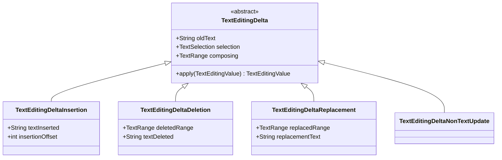
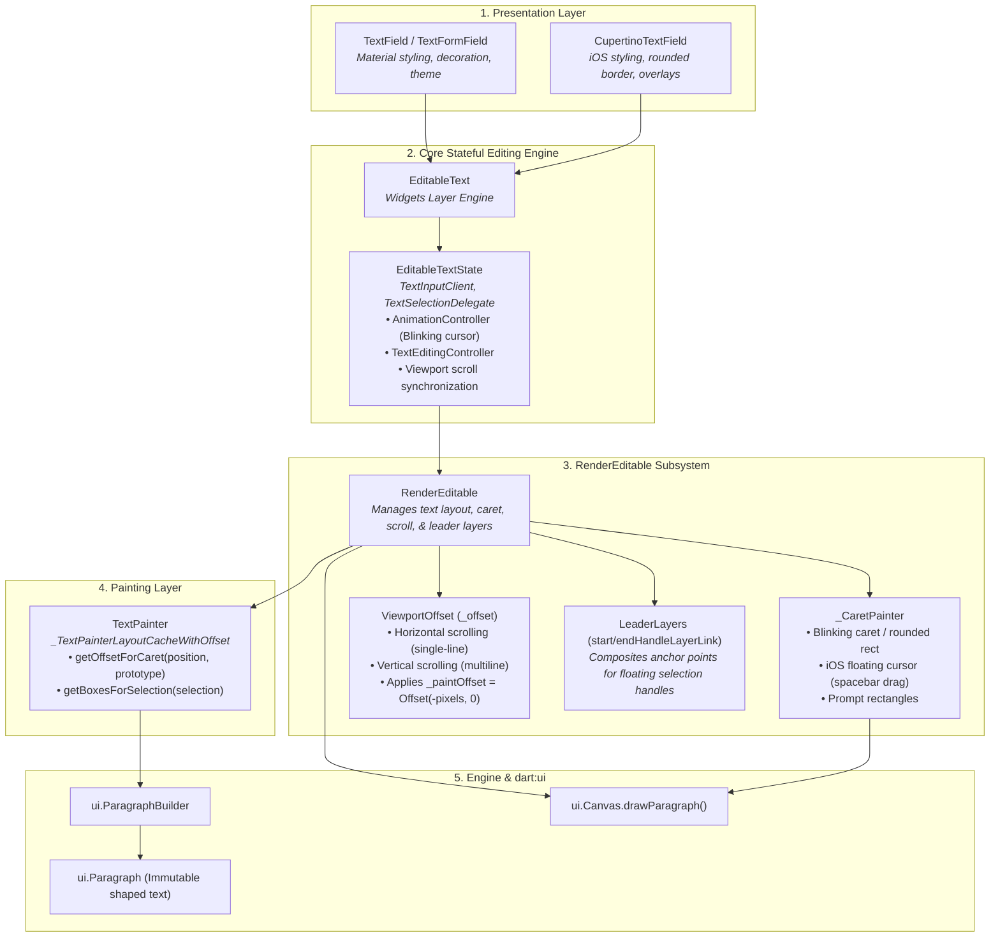
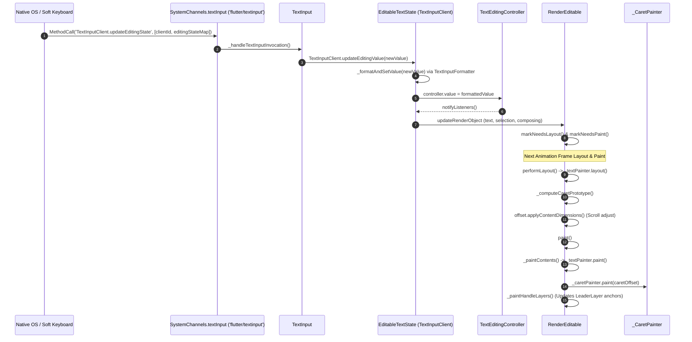

# Flutter Text Architecture: Editable Text Pipeline & Platform IME Bridge

This document provides a deep, comprehensive architectural reference for the editable text pipeline, `RenderEditable` subsystem, platform IME communication protocols, editing shortcuts, and internal selection overlays in Flutter.

---

## Table of Contents
- [Component & Class Index](#component--class-index)
1. [Editable Widget & State Machine](#1-editable-widget--state-machine)
   - [Presentation Layer (`TextField`, `CupertinoTextField`)](#presentation-layer-textfield-cupertinotextfield)
   - [Core Editing Engine (`EditableText`, `EditableTextState`)](#core-editing-engine-editabletext-editabletextstate)
   - [`TextSelectionGestureDetector` & Pointer Routing](#textselectiongesturedetector--pointer-routing)
   - [`TextEditingController` & Value Synchronization](#texteditingcontroller--value-synchronization)
2. [Render Object, Caret & Viewport (`RenderEditable`)](#2-render-object-caret--viewport-rendereditable)
   - [`RenderEditable` Layout & Geometry](#rendereditable-layout--geometry)
   - [`_CaretPainter` & Caret Rendering](#_caretpainter--caret-rendering)
   - [`ViewportOffset` & `Scrollable` Integration (Single-Line vs. Multiline Scrolling)](#viewportoffset--scrollable-integration-single-line-vs-multiline-scrolling)
   - [Selection Handle Compositing (`LeaderLayer` Anchors)](#selection-handle-compositing-leaderlayer-anchors)
   - [Vertical Caret Navigation (`VerticalCaretMovementRun`)](#vertical-caret-navigation-verticalcaretmovementrun)
3. [Services & Platform IME Bridge](#3-services--platform-ime-bridge)
   - [System Channel Protocol (`'flutter/textinput'`)](#system-channel-protocol-fluttertextinput)
   - [`TextInputClient` (The Foundational Default Client)](#textinputclient-the-foundational-default-client)
   - [`DeltaTextInputClient` & Granular `TextEditingDelta`s](#deltatextinputclient--granular-texteditingdeltas)
   - [Ancillary Services (Formatters, Spell Check, Live Text, Process Text)](#ancillary-services-formatters-spell-check-live-text-process-text)
   - [Engine Platform `TextInputPlugin` Locations & Native Backing Views](#engine-platform-textinputplugin-locations--native-backing-views)
4. [Shortcuts & Actions Subsystem](#4-shortcuts--actions-subsystem)
   - [`DefaultTextEditingShortcuts` & Key Mapping](#defaulttexteditingshortcuts--key-mapping)
   - [`TextEditingIntents` & Action Execution](#texteditingintents--action-execution)
   - [macOS Selectors & Intent Mapping](#macos-selectors--intent-mapping)
   - [Disabling Shortcuts & Native Platform Control (Web, macOS & iOS)](#disabling-shortcuts--native-platform-control-web-macos--ios)
5. [Selection Overlays & Floating Controls](#5-selection-overlays--floating-controls)
   - [`TextSelectionOverlay` Coordination](#textselectionoverlay-coordination)
   - [Native System Context Menus & Platform Behaviors](#native-system-context-menus--platform-behaviors)
   - [Reference to Shared Overlays](#reference-to-shared-overlays)
6. [Architectural Isolation Invariant](#6-architectural-isolation-invariant)
   - [Why `RenderEditable` Is Isolated from `SelectionArea`](#why-rendereditable-is-isolated-from-selectionarea)
7. [Architecture & Pipeline Diagrams](#7-architecture--pipeline-diagrams)
   - [Diagram 1: Core Editable Text & Caret/Viewport Pipeline](#diagram-1-core-editable-text--caretviewport-pipeline)
   - [Diagram 2: IME & State Processing Pipeline](#diagram-2-ime--state-processing-pipeline)

---

## Component & Class Index

| Component / Symbol | Source File / Location | Concise Summary |
| :--- | :--- | :--- |
| [`TextField`](file:///Users/roliv/flutter/packages/flutter/lib/src/material/text_field.dart) | [`packages/flutter/lib/src/material/text_field.dart`](file:///Users/roliv/flutter/packages/flutter/lib/src/material/text_field.dart) | Material text input wrapper (legacy/frozen here; actively developed in `material_ui` under `flutter/packages`). |
| [`CupertinoTextField`](file:///Users/roliv/flutter/packages/flutter/lib/src/cupertino/text_field.dart) | [`packages/flutter/lib/src/cupertino/text_field.dart`](file:///Users/roliv/flutter/packages/flutter/lib/src/cupertino/text_field.dart) | Cupertino text entry wrapper (legacy/frozen here; actively developed in `cupertino_ui` under `flutter/packages`). |
| [`EditableText`](file:///Users/roliv/flutter/packages/flutter/lib/src/widgets/editable_text.dart) | [`packages/flutter/lib/src/widgets/editable_text.dart`](file:///Users/roliv/flutter/packages/flutter/lib/src/widgets/editable_text.dart) | Core stateful text editing widget in `flutter/flutter` managing the cursor loop, IME connections, and shortcuts. |
| [`EditableTextState`](file:///Users/roliv/flutter/packages/flutter/lib/src/widgets/editable_text.dart) | [`packages/flutter/lib/src/widgets/editable_text.dart`](file:///Users/roliv/flutter/packages/flutter/lib/src/widgets/editable_text.dart) | State engine implementing `TextInputClient`, `TextSelectionDelegate`, `AutofillClient`, `WidgetsBindingObserver`, and `TickerProviderStateMixin`. |
| [`TextSelectionGestureDetector`](file:///Users/roliv/flutter/packages/flutter/lib/src/widgets/text_selection.dart) | [`packages/flutter/lib/src/widgets/text_selection.dart`](file:///Users/roliv/flutter/packages/flutter/lib/src/widgets/text_selection.dart) | Gesture detector wrapper orchestrating tap, double-tap, triple-tap, and drag selection on editable text. |
| [`TextEditingController`](file:///Users/roliv/flutter/packages/flutter/lib/src/widgets/editable_text.dart) | [`packages/flutter/lib/src/widgets/editable_text.dart`](file:///Users/roliv/flutter/packages/flutter/lib/src/widgets/editable_text.dart) | Controller holding the canonical `TextEditingValue` and generating styled `InlineSpan` trees. |
| [`TextEditingValue`](file:///Users/roliv/flutter/packages/flutter/lib/src/services/text_input.dart) | [`packages/flutter/lib/src/services/text_input.dart`](file:///Users/roliv/flutter/packages/flutter/lib/src/services/text_input.dart) | Immutable snapshot of text string, selection range, and active IME composing range. |
| [`RenderEditable`](file:///Users/roliv/flutter/packages/flutter/lib/src/rendering/editable.dart) | [`packages/flutter/lib/src/rendering/editable.dart`](file:///Users/roliv/flutter/packages/flutter/lib/src/rendering/editable.dart) | Render object that lays out editable text, renders carets, manages scrolling offsets, and pushes handle layer links. |
| `_CaretPainter` | [`packages/flutter/lib/src/rendering/editable.dart`](file:///Users/roliv/flutter/packages/flutter/lib/src/rendering/editable.dart) | Painter rendering blinking carets, iOS floating cursors, and autocorrect/spell-check prompt rects. |
| [`ViewportOffset`](file:///Users/roliv/flutter/packages/flutter/lib/src/rendering/viewport_offset.dart) | [`packages/flutter/lib/src/rendering/viewport_offset.dart`](file:///Users/roliv/flutter/packages/flutter/lib/src/rendering/viewport_offset.dart) | Scrolling offset model driving horizontal (single-line) or vertical (multiline) text scrolling. |
| [`VerticalCaretMovementRun`](file:///Users/roliv/flutter/packages/flutter/lib/src/rendering/editable.dart) | [`packages/flutter/lib/src/rendering/editable.dart`](file:///Users/roliv/flutter/packages/flutter/lib/src/rendering/editable.dart) | Preserves horizontal pixel coordinate column anchors across consecutive up/down arrow movements. |
| [`TextInput`](file:///Users/roliv/flutter/packages/flutter/lib/src/services/text_input.dart) | [`packages/flutter/lib/src/services/text_input.dart`](file:///Users/roliv/flutter/packages/flutter/lib/src/services/text_input.dart) | Static channel interface managing attachment and communication with the platform text input plugin. |
| [`TextInputConfiguration`](file:///Users/roliv/flutter/packages/flutter/lib/src/services/text_input.dart) | [`packages/flutter/lib/src/services/text_input.dart`](file:///Users/roliv/flutter/packages/flutter/lib/src/services/text_input.dart) | Configuration payload specifying keyboard type, action button, autocorrect, autofill, and delta mode. |
| [`TextInputConnection`](file:///Users/roliv/flutter/packages/flutter/lib/src/services/text_input.dart) | [`packages/flutter/lib/src/services/text_input.dart`](file:///Users/roliv/flutter/packages/flutter/lib/src/services/text_input.dart) | Active connection handle through which the framework sends state and configuration updates to the OS. |
| [`TextInputClient`](file:///Users/roliv/flutter/packages/flutter/lib/src/services/text_input.dart) | [`packages/flutter/lib/src/services/text_input.dart`](file:///Users/roliv/flutter/packages/flutter/lib/src/services/text_input.dart) | Base client interface receiving editing state replacements and action invocations from the platform IME. |
| [`DeltaTextInputClient`](file:///Users/roliv/flutter/packages/flutter/lib/src/services/text_input.dart) | [`packages/flutter/lib/src/services/text_input.dart`](file:///Users/roliv/flutter/packages/flutter/lib/src/services/text_input.dart) | Granular client interface receiving diff streams (`TextEditingDelta`) instead of full state replacements. |
| [`TextEditingDelta`](file:///Users/roliv/flutter/packages/flutter/lib/src/services/text_editing_delta.dart) | [`packages/flutter/lib/src/services/text_editing_delta.dart`](file:///Users/roliv/flutter/packages/flutter/lib/src/services/text_editing_delta.dart) | Granular diff model (`Insertion`, `Deletion`, `Replacement`, `NonTextUpdate`) sent by modern platform IMEs. |
| [`TextInputFormatter`](file:///Users/roliv/flutter/packages/flutter/lib/src/services/text_formatter.dart) | [`packages/flutter/lib/src/services/text_formatter.dart`](file:///Users/roliv/flutter/packages/flutter/lib/src/services/text_formatter.dart) | Mutation filter intercepting and modifying text values before updating `TextEditingController`. |
| [`SpellCheckService`](file:///Users/roliv/flutter/packages/flutter/lib/src/services/spell_check.dart) | [`packages/flutter/lib/src/services/spell_check.dart`](file:///Users/roliv/flutter/packages/flutter/lib/src/services/spell_check.dart) | Service communicating with native OS spell checkers to generate spell-check suggestion spans. |
| `LiveText` | [`packages/flutter/lib/src/services/live_text.dart`](file:///Users/roliv/flutter/packages/flutter/lib/src/services/live_text.dart) | Bridge to iOS/macOS Live Text camera OCR input streams. |
| `ProcessTextService` | [`packages/flutter/lib/src/services/process_text.dart`](file:///Users/roliv/flutter/packages/flutter/lib/src/services/process_text.dart) | Service querying native Android/iOS contextual text processing actions (e.g. Translate, Search Web). |
| [`TextInputModel`](file:///Users/roliv/flutter/engine/src/flutter/shell/platform/common/text_input_model.h) | [`engine/src/flutter/shell/platform/common/text_input_model.h`](file:///Users/roliv/flutter/engine/src/flutter/shell/platform/common/text_input_model.h) | Shared C++ engine model managing text state, selection bounds, and composing ranges for desktop embedders. |
| `TextInputPlugin` (Android) | [`engine/src/flutter/shell/platform/android/.../TextInputPlugin.java`](file:///Users/roliv/flutter/engine/src/flutter/shell/platform/android/io/flutter/plugin/editing/TextInputPlugin.java) | Native Android Java bridge managing `InputConnection` and virtual keyboard communication. |
| `FlutterTextInputPlugin` (iOS/macOS) | [`engine/src/flutter/shell/platform/darwin/.../FlutterTextInputPlugin.mm`](file:///Users/roliv/flutter/engine/src/flutter/shell/platform/darwin/ios/framework/Source/FlutterTextInputPlugin.mm) | Native Apple Objective-C++ plugin implementing `UITextInput` / `NSTextInputClient` responders. |
| `TextInputPlugin` (Windows) | [`engine/src/flutter/shell/platform/windows/text_input_plugin.cc`](file:///Users/roliv/flutter/engine/src/flutter/shell/platform/windows/text_input_plugin.cc) | Native Windows C++ plugin managing Imm32 and TSF (Text Services Framework) input methods. |
| `FlTextInputHandler` (Linux) | [`engine/src/flutter/shell/platform/linux/fl_text_input_handler.cc`](file:///Users/roliv/flutter/engine/src/flutter/shell/platform/linux/fl_text_input_handler.cc) | Native Linux C++ handler managing GTK `GtkIMContext` (IBus / Fcitx) input method protocols. |
| `HybridTextEditing` (Web) | [`engine/src/flutter/lib/web_ui/lib/src/engine/text_editing/text_editing.dart`](file:///Users/roliv/flutter/engine/src/flutter/lib/web_ui/lib/src/engine/text_editing/text_editing.dart) | Web engine subsystem synchronizing invisible HTML `<input>`/`<textarea>` DOM elements with Flutter text state. |
| [`DefaultTextEditingShortcuts`](file:///Users/roliv/flutter/packages/flutter/lib/src/widgets/default_text_editing_shortcuts.dart) | [`packages/flutter/lib/src/widgets/default_text_editing_shortcuts.dart`](file:///Users/roliv/flutter/packages/flutter/lib/src/widgets/default_text_editing_shortcuts.dart) | Maps platform physical keystrokes to text editing intents, and selectively disables shortcuts for native delegation. |
| [`TextEditingIntents`](file:///Users/roliv/flutter/packages/flutter/lib/src/widgets/text_editing_intents.dart) | [`packages/flutter/lib/src/widgets/text_editing_intents.dart`](file:///Users/roliv/flutter/packages/flutter/lib/src/widgets/text_editing_intents.dart) | Granular intent subclasses representing discrete cursor movements, deletions, and selections. |
| [`SystemContextMenu`](file:///Users/roliv/flutter/packages/flutter/lib/src/services/text_input.dart) & [`SystemContextMenuController`](file:///Users/roliv/flutter/packages/flutter/lib/src/services/text_input.dart) | [`packages/flutter/lib/src/services/text_input.dart`](file:///Users/roliv/flutter/packages/flutter/lib/src/services/text_input.dart) | Triggers Apple's native `UIEditMenuInteraction` system context menu on iOS 16+ for secure paste support. |

---

## 1. Editable Widget & State Machine

The editable text subsystem manages user input, software/hardware keyboards, cursor blinking, text selection, and viewport scrolling. In `flutter/flutter`, the active core engine is [`EditableText`](file:///Users/roliv/flutter/packages/flutter/lib/src/widgets/editable_text.dart) and [`RenderEditable`](file:///Users/roliv/flutter/packages/flutter/lib/src/rendering/editable.dart).

### Design-System Wrappers (`TextField`, `CupertinoTextField`)

> [!NOTE]
> `TextField` and `CupertinoTextField` in `packages/flutter` are frozen. Active development of design-system text fields takes place in **`material_ui`** and **`cupertino_ui`** under the **`flutter/packages`** repository. Both wrap the foundational `EditableText` engine:

1. **[`TextField`](file:///Users/roliv/flutter/packages/flutter/lib/src/material/text_field.dart)**:
   - Material design text entry widget.
   - Applies `InputDecoration` (labels, helper text, error text, prefix/suffix icons, Material borders).
   - Configures theme tokens, cursor color, selection handles, and toolbars.
2. **[`CupertinoTextField`](file:///Users/roliv/flutter/packages/flutter/lib/src/cupertino/text_field.dart)**:
   - iOS-styled text entry widget with rounded borders, prefix/suffix widgets, clear button mode, and iOS cursor blinking simulations.
   - Configures Cupertino selection handles and toolbars.

---

### Core Editing Engine (`EditableText`, `EditableTextState`)

[`EditableText`](file:///Users/roliv/flutter/packages/flutter/lib/src/widgets/editable_text.dart) is the central stateful engine for text editing in Flutter.

#### Interfaces & Mixins Implemented by `EditableTextState`:
- **`TextInputClient`**: Receives editing commands, text value snapshots, action button triggers, floating cursor updates, and platform selectors from the IME.
- **`TextSelectionDelegate`**: Provides selection manipulation callbacks (e.g. `cutSelection`, `pasteText`, `selectAll`).
- **`AutofillClient`**: Handles platform autofill requests and credentials.
- **`WidgetsBindingObserver`**: Monitors application lifecycle and metrics changes (e.g. keyboard appearance/resizing).
- **`TickerProviderStateMixin`**: Ticks the cursor blinking animation controller.

#### Key State Machine Responsibilities:
- **Blinking Cursor Loop**: Controlled by an `AnimationController` and `_cursorTimer`. On iOS, uses discrete keyframe simulation curves (`_DiscreteKeyFrameSimulation.iOSBlinkingCaret`) rather than smooth linear fades.
- **Keyboard Shortcut Routing**: Wraps the render tree with `Actions` responding to keyboard shortcut intents defined in [`DefaultTextEditingShortcuts`](file:///Users/roliv/flutter/packages/flutter/lib/src/widgets/default_text_editing_shortcuts.dart).
- **Scroll Synchronization**: Coordinates `ScrollController` with `RenderEditable` so newly typed characters or cursor movements scroll automatically into view (`_scheduleShowCaretOnScreen`).

---

### `TextSelectionGestureDetector` & Pointer Routing

[`TextSelectionGestureDetector`](file:///Users/roliv/flutter/packages/flutter/lib/src/widgets/text_selection.dart) can wrap `EditableText` (e.g. within [`TextField`](file:///Users/roliv/flutter/packages/flutter/lib/src/material/text_field.dart) and [`CupertinoTextField`](file:///Users/roliv/flutter/packages/flutter/lib/src/cupertino/text_field.dart)) to provide gesture detection across touch, mouse, and stylus devices:

- **Gesture Detection**: Orchestrates tap-and-drag recognizers ([`TapAndHorizontalDragGestureRecognizer`](file:///Users/roliv/flutter/packages/flutter/lib/src/gestures/tap_and_drag.dart), [`TapAndPanGestureRecognizer`](file:///Users/roliv/flutter/packages/flutter/lib/src/gestures/tap_and_drag.dart), [`LongPressGestureRecognizer`](file:///Users/roliv/flutter/packages/flutter/lib/src/gestures/long_press.dart)) to handle single-tap caret placement, double-tap word selection, triple-tap line selection, and continuous drag selection.
- **`rendererIgnoresPointer: true`**:
  - `RenderEditable` provides a property `rendererIgnoresPointer` (defaults to `false`).
  - When wrapped by `TextSelectionGestureDetector`, `EditableText` sets `RenderEditable.rendererIgnoresPointer = true`.
  - This ensures pointer hit-tests pass through `RenderEditable`'s own hit-testing up to the outer `TextSelectionGestureDetector` recognizers, preventing `RenderEditable` from competing with or prematurely intercepting pointer events in the gesture arena.

---

### `TextEditingController` & Value Synchronization

[`TextEditingController`](file:///Users/roliv/flutter/packages/flutter/lib/src/widgets/editable_text.dart) holds the canonical [`TextEditingValue`](file:///Users/roliv/flutter/packages/flutter/lib/src/services/text_input.dart):
- `text`: Current UTF-16 string content.
- `selection`: Current `TextSelection` (`baseOffset`, `extentOffset`, `affinity`, `isDirectional`).
- `composing`: Current `TextRange` being actively composed by an IME keyboard.

#### `buildTextSpan` & Rich Formatting
- `TextEditingController.buildTextSpan({required BuildContext context, TextStyle? style, required bool withComposing})`:
  - Builds an [`InlineSpan`](file:///Users/roliv/flutter/packages/flutter/lib/src/painting/inline_span.dart) tree representing the formatted text.
  - By default, returns a [`TextSpan`](file:///Users/roliv/flutter/packages/flutter/lib/src/painting/text_span.dart) applying the ambient composing style (e.g. underline for uncommitted IME text).
  - Can be overridden in custom subclasses to parse patterns and return rich multi-span trees (syntax highlighting, user mention chips, hashtag formatting, or colored search matches).
  - This `InlineSpan` tree is passed down to `EditableText` and assigned directly to `RenderEditable.text`.

---

## 2. Render Object, Caret & Viewport (`RenderEditable`)

[`RenderEditable`](file:///Users/roliv/flutter/packages/flutter/lib/src/rendering/editable.dart) is the dedicated render object that lays out editable text, renders carets, manages viewport scrolling offsets, and pushes composited leader layers for selection handles.

### `RenderEditable` Layout & Geometry

1. **`InlineSpan` Tree Consumption (`RenderEditable.text` vs. `plainText`)**:
   - `RenderEditable` accepts an [`InlineSpan`](file:///Users/roliv/flutter/packages/flutter/lib/src/painting/inline_span.dart) tree via its `text` property, which it assigns directly to its internal `TextPainter.text`:
     - **`text` (Getter/Setter)**: Returns or sets the styled `InlineSpan?` tree. Setting a new span invalidates line-break caching, layout (`markNeedsLayout()`), and accessibility semantics (`markNeedsSemanticsUpdate()`).
     - **`plainText`**: Returns a plain `String` version of the text (accounting for obscured characters when `obscureText: true`). Used by system IME channels, clipboard, and accessibility.
   - This design allows rich formatting, syntax highlighting spans, and custom inline text spans within editable text fields while maintaining high performance via `TextPainter` layout caching. For complete architectural details on `InlineSpan`, `TextSpan`, visitor traversals, and diffing, see the [InlineSpan Tree & Structural Hierarchy Reference](file:///Users/roliv/flutter/.agents/skills/flutter-text-domain-expert/references/common_text_primitives.md#2-inlinespan-tree--structural-hierarchy).
2. **Layout Pass (`performLayout`)**:
   - Computes caret prototype geometry (`_computeCaretPrototype()`).
   - Sets layout width constraints and calls `_textPainter.layout(minWidth, maxWidth)`.
   - Updates scroll boundaries on the associated `ViewportOffset` via `offset.applyContentDimensions()`.
   - Sizes itself to fill incoming box constraints or fit content.

---

### `_CaretPainter` & Caret Rendering

`RenderEditable` delegates cursor rendering to an internal `_CaretPainter`:
1. **Standard Blinking Caret**:
   - Queries `_textPainter.getOffsetForCaret(position, caretPrototype)` to resolve the precise local 2D caret offset.
   - Paints a rounded rectangle or vertical line using current `cursorColor`, `cursorWidth`, and `cursorRadius`.
2. **iOS Floating Cursor (Spacebar Long-Press Drag)**:
   - When the user performs a spacebar drag on iOS, the soft keyboard sends floating cursor coordinate deltas.
   - `RenderEditable` paints a magnified, translucent floating cursor pill via `_FloatingCursorPainter`, computing bounded local offsets with `calculateBoundedFloatingCursorOffset()`.
3. **Prompt Rectangles**:
   - Renders red spell-check underlines or blue autocorrect candidate highlight rectangles (`showAutocorrectPromptRect`, `promptRectRange`).

---

### `ViewportOffset` & `Scrollable` Integration (Single-Line vs. Multiline Scrolling)

`EditableText` builds a child `Scrollable` widget (`_EditableTextScrollable`) to manage scrolling physics, gestures, and controllers. It supplies the resulting [`ViewportOffset`](file:///Users/roliv/flutter/packages/flutter/lib/src/rendering/viewport_offset.dart) (`_offset`) directly to `RenderEditable`:

```
+-----------------------------------------------------------------------------+
| Single-Line Mode (maxLines == 1):                                           |
|   _paintOffset = Offset(-offset.pixels, 0.0)                                |
|   Horizontal scrolling when text width exceeds field width.                 |
+-----------------------------------------------------------------------------+
| Multiline Mode (maxLines > 1):                                              |
|   _paintOffset = Offset(0.0, -offset.pixels)                                |
|   Vertical scrolling when text height exceeds field height.                 |
+-----------------------------------------------------------------------------+
```
- **Scroll Content Dimensions**: During `performLayout()`, `RenderEditable` calls `offset.applyContentDimensions()` to inform the parent `Scrollable` of total text dimensions vs viewport size.
- **Paint Translation & Clipping**: During painting, `RenderEditable` clips to its bounds (if scrolling is active) and translates the canvas by `_paintOffset`.
- **Coordinate Conversion**: When converting touch/mouse coordinates to text positions (`getPositionForPoint`), `RenderEditable` subtracts `_paintOffset` before querying `_textPainter`.

---

### Selection Handle Compositing (`LeaderLayer` Anchors)

Floating selection handles must float in the top-level application `Overlay` to avoid container clipping, yet they must track scrolling text at 60/120 FPS without rebuilding widgets.

- `RenderEditable` exposes two [`LayerLink`](file:///Users/roliv/flutter/packages/flutter/lib/src/rendering/layer.dart) anchors: `startHandleLayerLink` and `endHandleLayerLink`.
- In `_paintHandleLayers()`, `RenderEditable` pushes a [`LeaderLayer`](file:///Users/roliv/flutter/packages/flutter/lib/src/rendering/layer.dart) at the local 2D coordinates of the selection start and end glyph positions.
- Selection handles in [`TextSelectionOverlay`](file:///Users/roliv/flutter/packages/flutter/lib/src/widgets/text_selection.dart) wrap themselves in [`FollowerLayer`](file:///Users/roliv/flutter/packages/flutter/lib/src/rendering/layer.dart) linked to these anchors.

---

### Vertical Caret Navigation (`VerticalCaretMovementRun`)

When navigating multiline text with `UpArrow` / `DownArrow`:
- Lines often have varying lengths. Moving up from a long line to a short line clamps the cursor horizontally, but moving up again to another long line should restore the original horizontal column position.
- `RenderEditable` uses [`VerticalCaretMovementRun`](file:///Users/roliv/flutter/packages/flutter/lib/src/rendering/editable.dart) to preserve the original horizontal pixel anchor across successive vertical caret steps.

---

## 3. Services & Platform IME Bridge

The Services layer establishes a bidirectional platform channel bridge between the Flutter framework and native operating system IMEs (soft keyboards, hardware keyboards, handwriting recognizers).

```
+-----------------------------------------------------------------------------+
|                         TextInput SystemChannel                             |
|                        ('flutter/textinput')                                |
+-----------------------------------------------------------------------------+
        |                                                             ^
        | Method Calls from OS                                        | Client Invocations
        v                                                             |
  TextInput._handleTextInputInvocation()                    TextInputConnection
        |                                                     .setEditingState()
        +---> TextInputClient.updateEditingState()            .show() / .hide()
        +---> DeltaTextInputClient.updateEditingDeltas()      .setEditableSizeAndTransform()
        +---> TextInputClient.performAction()                 .setCaretRect()
        +---> TextInputClient.updateFloatingCursor()
```

### System Channel Protocol (`'flutter/textinput'`)

- **Channel**: `SystemChannels.textInput` (`MethodChannel('flutter/textinput')`).
- **[`TextInputConfiguration`](file:///Users/roliv/flutter/packages/flutter/lib/src/services/text_input.dart)**: Configures input type (`TextInputType`), action button (`TextInputAction`), autocorrect, autofill, smart punctuation, and `enableDeltaModel`.
- **[`TextInputConnection`](file:///Users/roliv/flutter/packages/flutter/lib/src/services/text_input.dart)**: Active connection handle returned by `TextInput.attach()`.

---

### `TextInputClient` (The Foundational Default Client)

[`TextInputClient`](file:///Users/roliv/flutter/packages/flutter/lib/src/services/text_input.dart) is the fundamental interface implemented by `EditableTextState`:
- **`updateEditingValue(TextEditingValue value)`**: Receives full state snapshots from the platform whenever the user types or alters selection.
- **`performAction(TextInputAction action)`**: Invoked when the user presses keyboard action buttons (e.g. `Done`, `Search`, `Go`, `Next`).
- **`performPrivateCommand(String action, Map<String, dynamic> data)`**: Receives vendor-specific keyboard extensions (e.g. Samsung / GBoard custom commands).
- **`connectionClosed()`**: Cleanup callback when the platform dismisses the input session.
- **`showAutocorrectPromptRect(int start, int end)`**: Displays platform autocorrect indicator bubbles.
- **`updateFloatingCursor(RawFloatingCursorPoint point)`**: Receives iOS floating cursor position updates.

---

### `DeltaTextInputClient` & Granular `TextEditingDelta`s

When `TextInputConfiguration.enableDeltaModel: true`, the platform sends granular diff streams instead of full state replacements to [`DeltaTextInputClient`](file:///Users/roliv/flutter/packages/flutter/lib/src/services/text_input.dart) via `updateEditingValueWithDeltas(List<TextEditingDelta> textEditingDeltas)`:



1. **[`TextEditingDeltaInsertion`](file:///Users/roliv/flutter/packages/flutter/lib/src/services/text_editing_delta.dart)**: Text was inserted at `insertionOffset`.
2. **[`TextEditingDeltaDeletion`](file:///Users/roliv/flutter/packages/flutter/lib/src/services/text_editing_delta.dart)**: Text within `deletedRange` was removed.
3. **[`TextEditingDeltaReplacement`](file:///Users/roliv/flutter/packages/flutter/lib/src/services/text_editing_delta.dart)**: Text within `replacedRange` was replaced with `replacementText`.
4. **[`TextEditingDeltaNonTextUpdate`](file:///Users/roliv/flutter/packages/flutter/lib/src/services/text_editing_delta.dart)**: Selection or composing range changed without altering text.

---

### Ancillary Services (Formatters, Spell Check, Live Text, Process Text)

- **[`TextInputFormatter`](file:///Users/roliv/flutter/packages/flutter/lib/src/services/text_formatter.dart)**: Sits between IME input and `TextEditingController` to filter/format characters (e.g. `FilteringTextInputFormatter.digitsOnly`, `LengthLimitingTextInputFormatter`).
  > [!WARNING]
  > Custom formatters must preserve `TextEditingValue.composing` ranges during active IME composition; truncating or shifting text inside the composing region will cause platform keyboard desynchronization.
- **[`SpellCheckService`](file:///Users/roliv/flutter/packages/flutter/lib/src/services/spell_check.dart)**: Queries native OS spell-check services and generates suggestion spans.
- **`LiveText` ([`services/live_text.dart`](file:///Users/roliv/flutter/packages/flutter/lib/src/services/live_text.dart))**: Interfaces with iOS/macOS Live Text camera OCR input streams.
- **`ProcessTextService` ([`services/process_text.dart`](file:///Users/roliv/flutter/packages/flutter/lib/src/services/process_text.dart))**: Queries native Android/iOS contextual text processing actions (e.g. Translate, Search Web).

---

### Engine Platform `TextInputPlugin` Locations & Native Backing Views

When diagnosing low-level IME communication, composing range glitches, or platform-specific keyboard anomalies, framework engineers must inspect the native platform plugins inside the Flutter Engine:

| Platform | Native Source File in Engine | Key Classes & Responsibilities |
| :--- | :--- | :--- |
| **Shared Desktop Embedder** | [`engine/src/flutter/shell/platform/common/text_input_model.h`](file:///Users/roliv/flutter/engine/src/flutter/shell/platform/common/text_input_model.h) & `text_input_model.cc` | `TextInputModel`. Shared C++ model managing text state, selection bounds, UTF-16 conversions, and IME composing ranges used across desktop embedders (Windows, Linux, macOS). |
| **Android** | [`engine/src/flutter/shell/platform/android/io/flutter/plugin/editing/TextInputPlugin.java`](file:///Users/roliv/flutter/engine/src/flutter/shell/platform/android/io/flutter/plugin/editing/TextInputPlugin.java) | `TextInputPlugin`, `InputConnectionAdaptor`, `ListenableEditingState`. Implements Android `InputConnection` protocol for software keyboard communication. |
| **iOS** | [`engine/src/flutter/shell/platform/darwin/ios/framework/Source/FlutterTextInputPlugin.mm`](file:///Users/roliv/flutter/engine/src/flutter/shell/platform/darwin/ios/framework/Source/FlutterTextInputPlugin.mm) | `FlutterTextInputPlugin`, `FlutterTextInputView`, `FlutterTextInputDelegate`. Implements Apple's `UITextInput` protocol responder. |
| **macOS** | [`engine/src/flutter/shell/platform/darwin/macos/framework/Source/FlutterTextInputPlugin.mm`](file:///Users/roliv/flutter/engine/src/flutter/shell/platform/darwin/macos/framework/Source/FlutterTextInputPlugin.mm) | `FlutterTextInputPlugin`, `FlutterTextInputSemanticsObject`. Implements AppKit's `NSTextInputClient` protocol. |
| **Windows** | [`engine/src/flutter/shell/platform/windows/text_input_plugin.cc`](file:///Users/roliv/flutter/engine/src/flutter/shell/platform/windows/text_input_plugin.cc) & [`text_input_manager.cc`](file:///Users/roliv/flutter/engine/src/flutter/shell/platform/windows/text_input_manager.cc) | `TextInputPlugin`, `TextInputManager`. Implements Win32 Imm32 & TSF (Text Services Framework) integration using `TextInputModel`. |
| **Linux** | [`engine/src/flutter/shell/platform/linux/fl_text_input_channel.cc`](file:///Users/roliv/flutter/engine/src/flutter/shell/platform/linux/fl_text_input_channel.cc) & [`fl_text_input_handler.cc`](file:///Users/roliv/flutter/engine/src/flutter/shell/platform/linux/fl_text_input_handler.cc) | `FlTextInputHandler`, `FlTextInputChannel`. Handles GTK `GtkIMContext` (IBus / Fcitx) protocols using `TextInputModel`. |
| **Web** | [`engine/src/flutter/lib/web_ui/lib/src/engine/text_editing/text_editing.dart`](file:///Users/roliv/flutter/engine/src/flutter/lib/web_ui/lib/src/engine/text_editing/text_editing.dart) | `HybridTextEditing`, `DefaultTextEditingStrategy`. Manages invisible HTML `<input>` / `<textarea>` DOM elements. |

#### Invisible Native Input Elements & Synchronization:
- **Flutter Web (`HybridTextEditing`)**:
  - An invisible HTML `<input>` or `<textarea>` DOM element (styled with CSS class `.flt-text-editing`) is dynamically positioned over the focused `EditableText`.
  - This hidden DOM element receives browser-native keyboard focus, triggers the soft keyboard on mobile web browsers, handles browser autofill suggestions, and intercepts native IME composition events.
  - As the user types or interacts with the browser, the web engine synchronizes value and selection state bidirectionally between the DOM element and Flutter's `TextEditingValue`.
- **iOS (`FlutterTextInputView`)**:
  - iOS creates a backing `UIView` (`FlutterTextInputView`) conforming to the `UITextInput` protocol that becomes the first responder.
  - While Flutter renders its own text canvas and caret, iOS requires a native `UITextInput` responder to support native system features: Siri dictation, Apple Pencil Scribble handwriting, autocorrect prompt bubbles, floating cursor gesture deltas, and marked text composition.

---

## 4. Shortcuts & Actions Subsystem

Flutter maps physical keystrokes to high-level text editing operations through the `Shortcuts` and `Actions` architecture.

### `DefaultTextEditingShortcuts` & Key Mapping

[`DefaultTextEditingShortcuts`](file:///Users/roliv/flutter/packages/flutter/lib/src/widgets/default_text_editing_shortcuts.dart) defines platform-specific key combinations:
- **macOS**: Emacs keybindings (`Ctrl+A` line start, `Ctrl+E` line end, `Ctrl+K` kill to line end), `Cmd+Left/Right` line navigation, `Alt+Left/Right` word navigation.
- **Windows / Linux**: `Home`/`End` line navigation, `Ctrl+Left/Right` word navigation, `Ctrl+Backspace`/`Ctrl+Delete` word deletion.

---

### `TextEditingIntents` & Action Execution

Shortcuts trigger [`Intent`](file:///Users/roliv/flutter/packages/flutter/lib/src/widgets/actions.dart) instances defined in [`widgets/text_editing_intents.dart`](file:///Users/roliv/flutter/packages/flutter/lib/src/widgets/text_editing_intents.dart):
- `DeleteCharacterIntent(forward: bool)`
- `DeleteToNextWordBoundaryIntent(forward: bool)`
- `DeleteToLineBreakIntent(forward: bool)`
- `ExtendSelectionByCharacterIntent(forward: bool, collapseSelection: bool)`
- `ExtendSelectionToNextWordBoundaryIntent(forward: bool, collapseSelection: bool)`
- `ExtendSelectionToLineBreakIntent(forward: bool, collapseSelection: bool)`
- `ExtendSelectionToDocumentBoundaryIntent(forward: bool, collapseSelection: bool)`
- `TransposeCharactersIntent()`

`EditableTextState` maps these intents to concrete actions that query [Logical Text Boundaries](file:///Users/roliv/flutter/.agents/skills/flutter-text-domain-expert/references/common_text_primitives.md#5-logical-text-boundaries--iterators) (`CharacterBoundary`, `WordBoundary`, `LineBoundary`, `ParagraphBoundary`, `DocumentBoundary`) to compute new selection ranges and mutate text.

---

### macOS Selectors & Intent Mapping

On macOS, when users trigger keyboard shortcuts or AppKit text commands (e.g. `Cmd+Z`, `Ctrl+A`, `Opt+Backspace`), the platform communicates selector strings to the Flutter Engine, which invokes `TextInputClient.performSelectors` over the method channel:

- **Framework Handling (`EditableTextState.performSelector`)**:
  - Receives selector string (e.g. `insertNewline:`, `deleteBackward:`, `moveLeft:`, `moveToBeginningOfParagraph:`, `deleteToBeginningOfLine:`, `pageDown:`).
  - Queries `intentForMacOSSelector(selectorName)` from [`widgets/default_text_editing_shortcuts.dart`](file:///Users/roliv/flutter/packages/flutter/lib/src/widgets/default_text_editing_shortcuts.dart).
  - If a matching `Intent` is found, invokes `Actions.invoke(primaryContext, intent)` to execute the corresponding framework action.

---

### Disabling Shortcuts & Native Platform Control (Web, macOS & iOS)

To ensure high platform fidelity and prevent double-handling of hotkeys, [`DefaultTextEditingShortcuts`](file:///Users/roliv/flutter/packages/flutter/lib/src/widgets/default_text_editing_shortcuts.dart) selectively **disables** framework-level shortcuts via `_getDisablingShortcut()`, mapping them to `DoNothingAndStopPropagationTextIntent()`:

1. **Flutter Web (`_webDisablingTextShortcuts`)**:
   - In browser environments, a vast array of standard text editing shortcuts (arrow keys, word navigation, backspace, delete, `Cmd+A` / `Ctrl+A`, copy, paste) are intentionally intercepted by `DoNothingAndStopPropagationTextIntent()`.
   - This bypasses framework shortcut actions and delegates control entirely to the native browser / HTML DOM `<input>` element, ensuring native browser behavior (e.g. browser undo/redo history, browser text selection, input method composition).
2. **macOS vs. iOS Disabling Comparison**:
   - **macOS (`_macDisablingTextShortcuts`)**: Disables a much broader set of navigation, selection, and editing keys (home, end, pageUp/pageDown, tab, shift+tab, arrow keys combined with alt/meta/shift, backspace, delete). AppKit evaluates these keys at the OS level and sends corresponding selector strings via `TextInputClient.performSelectors`.
   - **iOS (`_iOSDisablingTextShortcuts`)**: Disables a much narrower subset—primarily backspace and delete key combinations—handing deletion back to the native IME so it can correctly manage composing regions and autocorrect suggestions.

---

## 5. Selection Overlays & Floating Controls

### `TextSelectionOverlay` Coordination

[`TextSelectionOverlay`](file:///Users/roliv/flutter/packages/flutter/lib/src/widgets/text_selection.dart) manages floating selection handles, context menus, and magnifiers specifically for `EditableTextState`:
- **`showHandles()` / `hideHandles()`**: Manages insertion and removal of handle overlay entries.
- **`showToolbar()` / `hideToolbar()`**: Positions context menu toolbars above or below the selection rect using `ContextMenuController`.
- **`showMagnifier()` / `hideMagnifier()`**: Coordinates `MagnifierController` during touch drags.
- **Layer Links**: Directly connects handle follower layers to `RenderEditable.startHandleLayerLink` and `RenderEditable.endHandleLayerLink`.

---

### Native System Context Menus & Platform Behaviors

1. **iOS 16.0+ `SystemContextMenu` / `SystemContextMenuController`**:
   - On iOS 16.0+, [`SystemContextMenu`](file:///Users/roliv/flutter/packages/flutter/lib/src/services/text_input.dart) and [`SystemContextMenuController`](file:///Users/roliv/flutter/packages/flutter/lib/src/services/text_input.dart) display Apple's native `UIEditMenuInteraction` system context menu rather than Flutter's custom Cupertino-rendered toolbar widget.
   - **Secure Pasteboard Support**: Invoking native paste through UIKit avoids triggering iOS's invasive system permission prompt (*"App would like to paste from..."*).
   - **Platform Feature Parity**: Automatically provides system actions (e.g. *Look Up*, *Translate*, *Share*, *Search Web*) matching the iOS 16+ aesthetic.
   - Activated automatically via `SystemContextMenu.isSupportedByField(editableTextState)` in [`TextField`](file:///Users/roliv/flutter/packages/flutter/lib/src/material/text_field.dart) and [`CupertinoTextField`](file:///Users/roliv/flutter/packages/flutter/lib/src/cupertino/text_field.dart).
2. **Web Native Context Menus**:
   - On Flutter Web, [`BrowserContextMenu`](file:///Users/roliv/flutter/packages/flutter/lib/src/services/browser_context_menu.dart) is prioritized when enabled, displaying the browser's authentic right-click context menu (Cut, Copy, Paste, Inspect) over Flutter-rendered overlay toolbars.
3. **Context Menu Fading on Scroll (iOS & Android Only)**:
   - During active scrolling in parent viewports, floating context menus fade out or hide automatically (`TextSelectionOverlay.hideToolbar()`) on **iOS and Android** to prevent floating menus from occluding moving content or tearing away from their anchor points.
   - Desktop platforms (macOS, Windows, Linux) and Web do **not** fade menus on scroll (on desktop/web, menus stay anchored or dismiss on click/scroll without fading).

---

### Reference to Shared Overlays

For details regarding handle controls (`MaterialTextSelectionHandleControls`, `CupertinoTextSelectionHandleControls`), toolbars (`AdaptiveTextSelectionToolbar`, `CupertinoTextSelectionToolbar`), and magnifiers (`TextMagnifier`, `CupertinoTextMagnifier`), see the [Common Text Primitives Reference](file:///Users/roliv/flutter/.agents/skills/flutter-text-domain-expert/references/common_text_primitives.md#7-shared-selection-overlays-toolbars-handles--magnifiers).

---

## 6. Architectural Isolation Invariant

> [!IMPORTANT]
> **Why `RenderEditable` Is Isolated from `SelectionArea` / `SelectableRegion`**:
> 
> 1. **Self-Contained State Machine**: `EditableText` / `RenderEditable` owns its own `TextEditingController`, caret blinking animation, keyboard shortcut bindings, viewport scrolling offset, and IME platform channel connections.
> 2. **No `Selectable` Registration**: `RenderEditable` does **not** implement `Selectable` and does **not** register with `SelectionRegistrar`.
> 3. **Avoidance of Split State**: If `RenderEditable` were part of the unified `SelectionArea` tree, external selection events would conflict with active IME composition sessions, soft keyboard selection changes, and internal viewport scrolling.
> 4. **Encapsulation**: Wrapping a `TextField` inside a `SelectionArea` has no effect on the `TextField`; it continues to manage its own selection and context menu independently.

---

## 7. Architecture & Pipeline Diagrams

### Diagram 1: Core Editable Text & Caret/Viewport Pipeline



---

### Diagram 2: IME & State Processing Pipeline


