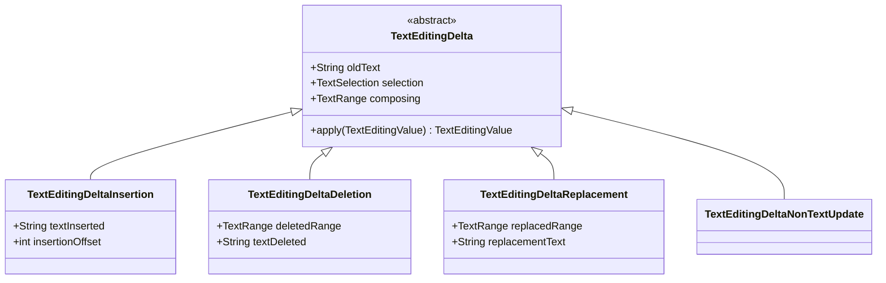
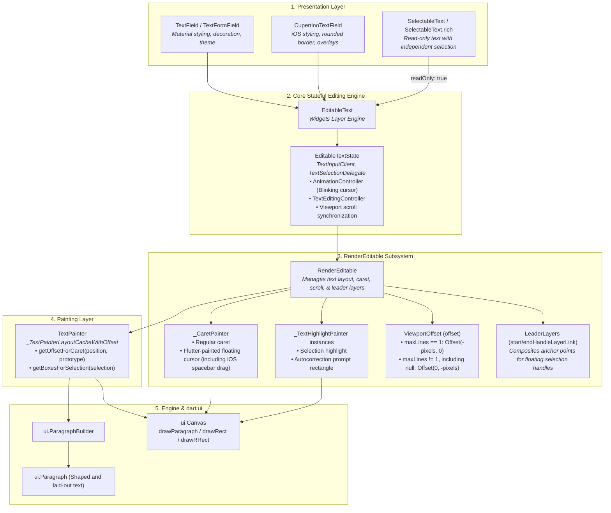

# Flutter Text Architecture: Editable Text Pipeline & Platform IME Bridge

This document provides a deep, comprehensive architectural reference for the editable text pipeline, `RenderEditable` subsystem, platform IME communication protocols, editing shortcuts, and internal selection overlays in Flutter.

---

## Table of Contents
- [Component & Class Index](#component--class-index)
1. [Editable Widget & State Machine](#1-editable-widget--state-machine)
   - [Design-System Wrappers (`TextField`, `CupertinoTextField`)](#design-system-wrappers-textfield-cupertinotextfield)
   - [`SelectableText` & Read-Only `EditableText`](#selectabletext--read-only-editabletext)
   - [Core Editing Engine (`EditableText`, `EditableTextState`)](#core-editing-engine-editabletext-editabletextstate)
   - [`TextSelectionGestureDetector` & Pointer Routing](#textselectiongesturedetector--pointer-routing)
   - [`TextEditingController` & Value Synchronization](#texteditingcontroller--value-synchronization)
2. [Render Object, Caret & Viewport (`RenderEditable`)](#2-render-object-caret--viewport-rendereditable)
   - [`RenderEditable` Layout & Geometry](#rendereditable-layout--geometry)
   - [`_CaretPainter` & Caret Rendering](#_caretpainter--caret-rendering)
   - [`ViewportOffset` & `Scrollable` Integration (Single-Line vs. Multiline Scrolling)](#viewportoffset--scrollable-integration-single-line-vs-multiline-scrolling)
   - [Selection Handle Compositing (`LeaderLayer` Anchors)](#selection-handle-compositing-leaderlayer-anchors)
   - [Vertical Caret Navigation (`VerticalCaretMovementRun`)](#vertical-caret-navigation-verticalcaretmovementrun)
3. [Services & Platform IME Bridge](#3-services--platform-ime-bridge)
   - [System Channel Protocol (`'flutter/textinput'`)](#system-channel-protocol-fluttertextinput)
   - [`TextInputClient` (The Foundational Default Client)](#textinputclient-the-foundational-default-client)
   - [`DeltaTextInputClient` & Granular `TextEditingDelta`s](#deltatextinputclient--granular-texteditingdeltas)
   - [Ancillary Services (Formatters, Spell Check, Live Text, Process Text)](#ancillary-services-formatters-spell-check-live-text-process-text)
   - [Engine Platform `TextInputPlugin` Locations & Native Backing Views](#engine-platform-textinputplugin-locations--native-backing-views)
4. [Shortcuts & Actions Subsystem](#4-shortcuts--actions-subsystem)
   - [`DefaultTextEditingShortcuts` & Key Mapping](#defaulttexteditingshortcuts--key-mapping)
   - [`TextEditingIntents` & Action Execution](#texteditingintents--action-execution)
   - [macOS Selectors & Intent Mapping](#macos-selectors--intent-mapping)
   - [Disabling Shortcuts & Native Platform Control (Web, macOS & iOS)](#disabling-shortcuts--native-platform-control-web-macos--ios)
5. [Selection Overlays & Floating Controls](#5-selection-overlays--floating-controls)
   - [`TextSelectionOverlay` Coordination](#textselectionoverlay-coordination)
   - [Native System Context Menus & Platform Behaviors](#native-system-context-menus--platform-behaviors)
   - [Reference to Shared Overlays](#reference-to-shared-overlays)
6. [Architectural Isolation Invariant](#6-architectural-isolation-invariant)
   - [Why `RenderEditable` Is Isolated from `SelectionArea` / `SelectableRegion`](#why-rendereditable-is-isolated-from-selectionarea--selectableregion)
7. [Architecture & Pipeline Diagrams](#7-architecture--pipeline-diagrams)
   - [Diagram 1: Core Editable Text & Caret/Viewport Pipeline](#diagram-1-core-editable-text--caretviewport-pipeline)
   - [Diagram 2: IME & State Processing Pipeline](#diagram-2-ime--state-processing-pipeline)

---

## Component & Class Index

| Component / Symbol | Source File / Location | Concise Summary |
| :--- | :--- | :--- |
| [`TextField`](../../../../packages/flutter/lib/src/material/text_field.dart) | [`packages/flutter/lib/src/material/text_field.dart`](../../../../packages/flutter/lib/src/material/text_field.dart) | Material text input wrapper (legacy/frozen here; actively developed in `material_ui` under `flutter/packages`). |
| [`CupertinoTextField`](../../../../packages/flutter/lib/src/cupertino/text_field.dart) | [`packages/flutter/lib/src/cupertino/text_field.dart`](../../../../packages/flutter/lib/src/cupertino/text_field.dart) | Cupertino text entry wrapper (legacy/frozen here; actively developed in `cupertino_ui` under `flutter/packages`). |
| [`SelectableText`](../../../../packages/flutter/lib/src/material/selectable_text.dart) | [`packages/flutter/lib/src/material/selectable_text.dart`](../../../../packages/flutter/lib/src/material/selectable_text.dart) | Read-only `EditableText` wrapper using `RenderEditable` and the editable selection stack, independently of unified selection. |
| [`EditableText`](../../../../packages/flutter/lib/src/widgets/editable_text.dart) | [`packages/flutter/lib/src/widgets/editable_text.dart`](../../../../packages/flutter/lib/src/widgets/editable_text.dart) | Core stateful text editing widget in `flutter/flutter` managing the cursor loop, IME connections, and shortcuts. |
| [`EditableTextState`](../../../../packages/flutter/lib/src/widgets/editable_text.dart) | [`packages/flutter/lib/src/widgets/editable_text.dart`](../../../../packages/flutter/lib/src/widgets/editable_text.dart) | State engine with `TextInputClient`, `TextSelectionDelegate`, `WidgetsBindingObserver`, `TickerProviderStateMixin`, and `AutomaticKeepAliveClientMixin`; implements `AutofillClient`. |
| [`TextSelectionGestureDetector`](../../../../packages/flutter/lib/src/widgets/text_selection.dart) | [`packages/flutter/lib/src/widgets/text_selection.dart`](../../../../packages/flutter/lib/src/widgets/text_selection.dart) | Gesture detector wrapper orchestrating tap, double-tap, triple-tap, and drag selection on editable text. |
| [`TextEditingController`](../../../../packages/flutter/lib/src/widgets/editable_text.dart) | [`packages/flutter/lib/src/widgets/editable_text.dart`](../../../../packages/flutter/lib/src/widgets/editable_text.dart) | Controller holding the canonical `TextEditingValue` and providing the default `TextSpan` builder used by `EditableTextState`. |
| [`TextEditingValue`](../../../../packages/flutter/lib/src/services/text_input.dart) | [`packages/flutter/lib/src/services/text_input.dart`](../../../../packages/flutter/lib/src/services/text_input.dart) | Immutable snapshot of text string, selection range, and active IME composing range. |
| [`RenderEditable`](../../../../packages/flutter/lib/src/rendering/editable.dart) | [`packages/flutter/lib/src/rendering/editable.dart`](../../../../packages/flutter/lib/src/rendering/editable.dart) | Render object that lays out editable text, renders carets, manages scrolling offsets, and pushes handle layer links. |
| `_CaretPainter` | [`packages/flutter/lib/src/rendering/editable.dart`](../../../../packages/flutter/lib/src/rendering/editable.dart) | Flutter painter for the regular caret and floating cursor, including iOS keyboard floating-cursor movement. |
| `_TextHighlightPainter` | [`packages/flutter/lib/src/rendering/editable.dart`](../../../../packages/flutter/lib/src/rendering/editable.dart) | Separate painter instances draw selection highlights and autocorrection prompt rectangles; spell-check styling is built into text spans. |
| [`ViewportOffset`](../../../../packages/flutter/lib/src/rendering/viewport_offset.dart) | [`packages/flutter/lib/src/rendering/viewport_offset.dart`](../../../../packages/flutter/lib/src/rendering/viewport_offset.dart) | Scrolling offset model driving horizontal (single-line) or vertical (multiline) text scrolling. |
| [`VerticalCaretMovementRun`](../../../../packages/flutter/lib/src/rendering/editable.dart) | [`packages/flutter/lib/src/rendering/editable.dart`](../../../../packages/flutter/lib/src/rendering/editable.dart) | Preserves horizontal pixel coordinate column anchors across consecutive up/down arrow movements. |
| [`TextInput`](../../../../packages/flutter/lib/src/services/text_input.dart) | [`packages/flutter/lib/src/services/text_input.dart`](../../../../packages/flutter/lib/src/services/text_input.dart) | Static channel interface managing attachment and communication with the platform text input plugin. |
| [`TextInputConfiguration`](../../../../packages/flutter/lib/src/services/text_input.dart) | [`packages/flutter/lib/src/services/text_input.dart`](../../../../packages/flutter/lib/src/services/text_input.dart) | Configuration payload specifying keyboard type, action button, autocorrect, autofill, and delta mode. |
| [`TextInputConnection`](../../../../packages/flutter/lib/src/services/text_input.dart) | [`packages/flutter/lib/src/services/text_input.dart`](../../../../packages/flutter/lib/src/services/text_input.dart) | Active connection handle through which the framework sends state and configuration updates to the OS. |
| [`TextInputClient`](../../../../packages/flutter/lib/src/services/text_input.dart) | [`packages/flutter/lib/src/services/text_input.dart`](../../../../packages/flutter/lib/src/services/text_input.dart) | Base client interface receiving editing state replacements and action invocations from the platform IME. |
| [`DeltaTextInputClient`](../../../../packages/flutter/lib/src/services/text_input.dart) | [`packages/flutter/lib/src/services/text_input.dart`](../../../../packages/flutter/lib/src/services/text_input.dart) | Granular client interface receiving diff streams (`TextEditingDelta`) instead of full state replacements. |
| [`TextEditingDelta`](../../../../packages/flutter/lib/src/services/text_editing_delta.dart) | [`packages/flutter/lib/src/services/text_editing_delta.dart`](../../../../packages/flutter/lib/src/services/text_editing_delta.dart) | Granular diff model (`Insertion`, `Deletion`, `Replacement`, `NonTextUpdate`) sent by modern platform IMEs. |
| [`TextInputFormatter`](../../../../packages/flutter/lib/src/services/text_formatter.dart) | [`packages/flutter/lib/src/services/text_formatter.dart`](../../../../packages/flutter/lib/src/services/text_formatter.dart) | Mutation filter intercepting and modifying text values before updating `TextEditingController`. |
| [`SpellCheckService`](../../../../packages/flutter/lib/src/services/spell_check.dart) | [`packages/flutter/lib/src/services/spell_check.dart`](../../../../packages/flutter/lib/src/services/spell_check.dart) | Service communicating with native OS spell checkers to generate spell-check suggestion spans. |
| `LiveText` | [`packages/flutter/lib/src/services/live_text.dart`](../../../../packages/flutter/lib/src/services/live_text.dart) | Bridge to iOS Live Text camera OCR input. |
| `ProcessTextService` | [`packages/flutter/lib/src/services/process_text.dart`](../../../../packages/flutter/lib/src/services/process_text.dart) | Service whose default implementation queries and invokes Android `ACTION_PROCESS_TEXT` activities. |
| [`TextInputModel`](../../../../engine/src/flutter/shell/platform/common/text_input_model.h) | [`engine/src/flutter/shell/platform/common/text_input_model.h`](../../../../engine/src/flutter/shell/platform/common/text_input_model.h) | Shared C++ engine model managing text state, selection bounds, and composing ranges for desktop embedders. |
| `TextInputPlugin` (Android) | [`engine/src/flutter/shell/platform/android/.../TextInputPlugin.java`](../../../../engine/src/flutter/shell/platform/android/io/flutter/plugin/editing/TextInputPlugin.java) | Native Android Java bridge managing `InputConnection` and virtual keyboard communication. |
| `FlutterTextInputPlugin` (iOS/macOS) | [`engine/src/flutter/shell/platform/darwin/.../FlutterTextInputPlugin.mm`](../../../../engine/src/flutter/shell/platform/darwin/ios/framework/Source/FlutterTextInputPlugin.mm) | Native Apple Objective-C++ plugin implementing `UITextInput` / `NSTextInputClient` responders. |
| `TextInputPlugin` (Windows) | [`engine/src/flutter/shell/platform/windows/text_input_plugin.cc`](../../../../engine/src/flutter/shell/platform/windows/text_input_plugin.cc) | Native Windows C++ plugin using `TextInputModel` and Win32 IMM32 input-method integration. |
| `FlTextInputHandler` (Linux) | [`engine/src/flutter/shell/platform/linux/fl_text_input_handler.cc`](../../../../engine/src/flutter/shell/platform/linux/fl_text_input_handler.cc) | Native Linux C++ handler managing GTK `GtkIMContext` (IBus / Fcitx) input method protocols. |
| `HybridTextEditing` (Web) | [`engine/src/flutter/lib/web_ui/lib/src/engine/text_editing/text_editing.dart`](../../../../engine/src/flutter/lib/web_ui/lib/src/engine/text_editing/text_editing.dart) | Web engine subsystem synchronizing an `<input>` or `<textarea>` with Flutter editing state. |
| [`DefaultTextEditingShortcuts`](../../../../packages/flutter/lib/src/widgets/default_text_editing_shortcuts.dart) | [`packages/flutter/lib/src/widgets/default_text_editing_shortcuts.dart`](../../../../packages/flutter/lib/src/widgets/default_text_editing_shortcuts.dart) | Maps platform physical keystrokes to text editing intents, and selectively disables shortcuts for native delegation. |
| [`TextEditingIntents`](../../../../packages/flutter/lib/src/widgets/text_editing_intents.dart) | [`packages/flutter/lib/src/widgets/text_editing_intents.dart`](../../../../packages/flutter/lib/src/widgets/text_editing_intents.dart) | Granular intent subclasses representing discrete cursor movements, deletions, and selections. |
| [`SystemContextMenu`](../../../../packages/flutter/lib/src/widgets/system_context_menu.dart) | [`packages/flutter/lib/src/widgets/system_context_menu.dart`](../../../../packages/flutter/lib/src/widgets/system_context_menu.dart) | Widget displaying the native iOS 16+ context menu for a supported field. |
| [`SystemContextMenuController`](../../../../packages/flutter/lib/src/services/text_input.dart) | [`packages/flutter/lib/src/services/text_input.dart`](../../../../packages/flutter/lib/src/services/text_input.dart) | Service-layer controller for showing and hiding the native context menu via `SystemChannels.platform`. Showing a menu requires an active text-input connection. |

---

## 1. Editable Widget & State Machine

The editable text subsystem manages user input, software/hardware keyboards, cursor blinking, text selection, and viewport scrolling. In `flutter/flutter`, the active core engine is [`EditableText`](../../../../packages/flutter/lib/src/widgets/editable_text.dart) and [`RenderEditable`](../../../../packages/flutter/lib/src/rendering/editable.dart).

### Design-System Wrappers (`TextField`, `CupertinoTextField`)

> [!NOTE]
> `TextField` and `CupertinoTextField` in `packages/flutter` are frozen. Active development of design-system text fields takes place in **`material_ui`** and **`cupertino_ui`** under the **`flutter/packages`** repository. Both wrap the foundational `EditableText` engine:

1. **[`TextField`](../../../../packages/flutter/lib/src/material/text_field.dart)**:
   - Material design text entry widget.
   - Applies `InputDecoration` (labels, helper text, error text, prefix/suffix icons, Material borders).
   - Configures theme tokens, cursor color, selection handles, and toolbars.
2. **[`CupertinoTextField`](../../../../packages/flutter/lib/src/cupertino/text_field.dart)**:
   - iOS-styled text entry widget with rounded borders, prefix/suffix widgets, clear button mode, and iOS cursor blinking simulations.
   - Configures Cupertino selection handles and toolbars.

---

### `SelectableText` & Read-Only `EditableText`

[`SelectableText`](../../../../packages/flutter/lib/src/material/selectable_text.dart), including `SelectableText.rich`, builds `EditableText(readOnly: true)`. It supplies a text controller and uses `_SelectableTextSelectionGestureDetectorBuilder` with `rendererIgnoresPointer: true` for pointer selection. Its layout, selection, and floating controls therefore follow this reference's `RenderEditable` / `EditableTextState` / `TextSelectionOverlay` pipeline.

Setting `EditableText.readOnly` prevents user text changes while retaining selection. It does not turn `RenderEditable` into a `Selectable` or register it with `SelectionRegistrar`. `SelectableText` and read-only text fields remain outside the unified `SelectionArea` / `SelectableRegion` selection tree, even when placed inside it.

---

### Core Editing Engine (`EditableText`, `EditableTextState`)

[`EditableText`](../../../../packages/flutter/lib/src/widgets/editable_text.dart) is the central stateful engine for text editing in Flutter.

#### Interfaces & Mixins Implemented by `EditableTextState`:
- **`TextInputClient`**: Receives editing commands, text value snapshots, action button triggers, floating cursor updates, and platform selectors from the IME.
- **`TextSelectionDelegate`**: Provides selection manipulation callbacks (e.g. `cutSelection`, `pasteText`, `selectAll`).
- **`AutofillClient`**: Handles platform autofill requests and credentials.
- **`WidgetsBindingObserver`**: Monitors metrics changes (e.g. keyboard appearance/resizing) through `didChangeMetrics`. Application resume handling uses a separate `AppLifecycleListener(onResume: _onResume)`.
- **`TickerProviderStateMixin`**: Ticks the cursor blinking animation controller.
- **`AutomaticKeepAliveClientMixin<EditableText>`**: Requests keep-alive while `widget.focusNode.hasFocus`, preserving a focused field in lazy lists.

#### Key State Machine Responsibilities:
- **Blinking Cursor Loop**: Controlled by an `AnimationController` and `_cursorTimer`. When `cursorOpacityAnimates` is `true`, uses `_DiscreteKeyFrameSimulation.iOSBlinkingCaret`; otherwise, a periodic timer toggles cursor opacity. `EditableText` defaults this flag to `false`. The design-system wrappers supply their own defaults: `TextField` enables it by default on iOS, and `CupertinoTextField` defaults it to `true`.
- **Keyboard Shortcut Routing**: Wraps the render tree with `Actions` responding to keyboard shortcut intents defined in [`DefaultTextEditingShortcuts`](../../../../packages/flutter/lib/src/widgets/default_text_editing_shortcuts.dart).
- **Scroll Synchronization**: Coordinates `ScrollController` with `RenderEditable` so newly typed characters or cursor movements scroll automatically into view (`_scheduleShowCaretOnScreen`).

---

### `TextSelectionGestureDetector` & Pointer Routing

[`TextSelectionGestureDetector`](../../../../packages/flutter/lib/src/widgets/text_selection.dart) can wrap `EditableText` (e.g. within [`TextField`](../../../../packages/flutter/lib/src/material/text_field.dart) and [`CupertinoTextField`](../../../../packages/flutter/lib/src/cupertino/text_field.dart)) to provide gesture detection across touch, mouse, and stylus devices:

- **Gesture Detection**: Orchestrates tap-and-drag recognizers ([`TapAndHorizontalDragGestureRecognizer`](../../../../packages/flutter/lib/src/gestures/tap_and_drag.dart), [`TapAndPanGestureRecognizer`](../../../../packages/flutter/lib/src/gestures/tap_and_drag.dart), [`LongPressGestureRecognizer`](../../../../packages/flutter/lib/src/gestures/long_press.dart)) for caret placement, word selection, multi-taps, and continuous drag selection. `TextSelectionGestureDetectorBuilder.onTripleTapDown` selects all when `maxLines == 1`; in multiline fields it selects a paragraph on Android, Fuchsia, iOS, macOS, and Windows, and a line on Linux.
- **`rendererIgnoresPointer: true`**:
  - The caller sets `EditableText.rendererIgnoresPointer`; `TextField` and `CupertinoTextField` explicitly set it to `true` when providing their gesture handling. Its default is `false`.
  - `EditableText` forwards the value to `RenderEditable.ignorePointer`. This stops `RenderEditable.handleEvent` from adding pointer-down events to its own tap and long-press recognizers.
  - `RenderEditable.hitTestSelf` still returns `true`, and span/inline-child hit testing remains active. The property controls the render object's gesture recognizers, not hit-test participation.

---

### `TextEditingController` & Value Synchronization

[`TextEditingController`](../../../../packages/flutter/lib/src/widgets/editable_text.dart) holds the canonical [`TextEditingValue`](../../../../packages/flutter/lib/src/services/text_input.dart):
- `text`: Current UTF-16 string content.
- `selection`: Current `TextSelection` (`baseOffset`, `extentOffset`, `affinity`, `isDirectional`).
- `composing`: Current `TextRange` being actively composed by an IME keyboard.

#### `buildTextSpan` & Rich Formatting
- `TextEditingController.buildTextSpan({required BuildContext context, TextStyle? style, required bool withComposing})`:
  - Returns a [`TextSpan`](../../../../packages/flutter/lib/src/painting/text_span.dart) tree representing the formatted text, with [`InlineSpan`](../../../../packages/flutter/lib/src/painting/inline_span.dart) children as needed.
  - By default, merges an underline into the supplied style for a valid composing range when `withComposing` is true.
  - Can be overridden in custom subclasses to parse patterns and return rich multi-span trees (syntax highlighting, user mention chips, hashtag formatting, or colored search matches).
- `EditableTextState.buildTextSpan()` chooses the rendered tree. It builds separate spans for obscured text, Scribble placeholders, and spell-check results; otherwise it calls the controller's builder. The resulting tree becomes `RenderEditable.text` through `_Editable`.

---

## 2. Render Object, Caret & Viewport (`RenderEditable`)

[`RenderEditable`](../../../../packages/flutter/lib/src/rendering/editable.dart) is the dedicated render object that lays out editable text, renders carets, manages viewport scrolling offsets, and pushes composited leader layers for selection handles.

### `RenderEditable` Layout & Geometry

1. **`InlineSpan` Tree Consumption (`RenderEditable.text` vs. `plainText`)**:
   - `RenderEditable` accepts an [`InlineSpan`](../../../../packages/flutter/lib/src/painting/inline_span.dart) tree via its `text` property, which it assigns directly to its internal `TextPainter.text`:
     - **`text` (Getter/Setter)**: Returns or sets the styled `InlineSpan?` tree. Setting a new span invalidates line-break caching, layout (`markNeedsLayout()`), and accessibility semantics (`markNeedsSemanticsUpdate()`).
     - **`plainText`**: Returns the `TextPainter`'s plain text for rendering/layout and semantics, including obscuring characters supplied by `EditableTextState`. IME synchronization uses `widget.controller.value`, and clipboard operations use `textEditingValue.text`; copy and cut are disabled for obscured fields.
   - This design allows rich formatting, syntax highlighting spans, and custom inline text spans within editable text fields while maintaining high performance via `TextPainter` layout caching. For complete architectural details on `InlineSpan`, `TextSpan`, visitor traversals, and diffing, see the [InlineSpan Tree & Structural Hierarchy Reference](common_text_primitives.md#2-inlinespan-tree--structural-hierarchy).
2. **Layout Pass (`performLayout`)**:
   - Lays out inline children, sets placeholder dimensions, adjusts width constraints, and calls `_textPainter.layout(minWidth: ..., maxWidth: ...)`.
   - Positions inline children and computes caret prototype geometry (`_computeCaretPrototype()`).
   - Sizes itself to fill incoming box constraints or fit content, then lays out the foreground/background painter children.
   - Updates the associated `ViewportOffset` with `applyViewportDimension()` and `applyContentDimensions()`.

---

### `_CaretPainter` & Caret Rendering

`RenderEditable` delegates cursor rendering to an internal `_CaretPainter`:
1. **Standard Blinking Caret**:
   - Calls `RenderEditable.getLocalRectForCaret`, which uses `_textPainter.getOffsetForCaret(position, caretPrototype)` to resolve the caret geometry.
   - Paints a rectangle or rounded rectangle using the current cursor color, width, and radius.
2. **iOS Floating Cursor (Spacebar Long-Press Drag)**:
   - UIKit calls `FlutterTextInputView.beginFloatingCursorAtPoint`, `updateFloatingCursorAtPoint`, and `endFloatingCursor`. The [iOS embedder](../../../../engine/src/flutter/shell/platform/darwin/ios/framework/Source/FlutterTextInputPlugin.mm) sends start/update/end events with movement relative to the starting point through `TextInputClient.updateFloatingCursor` on `flutter/textinput`.
   - `EditableTextState.updateFloatingCursor` computes bounded local positions with `RenderEditable.calculateBoundedFloatingCursorOffset()` and calls `setFloatingCursor()`. `_CaretPainter` draws the enlarged rounded rectangle on Flutter's canvas at 0.75 opacity. `EditableTextState` animates its return to the regular caret when the gesture ends. The same implementation also supports in-field long-press cursor movement.
   - In the reverse direction, Flutter sends editable size/transform and per-grapheme selection rectangles for UIKit's caret/position queries. UIKit uses these for two-finger selection and sends selection changes through the editing-state channel. One-finger movement commits the final selection after the Flutter animation; existing noncollapsed selections are preserved.
3. **Autocorrection Highlights & Spell-Check Styling**:
   - A separate `_TextHighlightPainter`, `_autocorrectHighlightPainter`, draws Flutter's autocorrection prompt rectangle. `EditableTextState.showAutocorrectionPromptRect` supplies the range through `_Editable.promptRectRange` to `RenderEditable.setPromptRectRange()`.
   - Spell-check suggestions are styled spans built by `EditableTextState.buildTextSpan()` and painted as text. Selection highlighting uses another `_TextHighlightPainter` instance.

---

### `ViewportOffset` & `Scrollable` Integration (Single-Line vs. Multiline Scrolling)

`EditableTextState.build` constructs a [`Scrollable`](../../../../packages/flutter/lib/src/widgets/scrollable.dart) with the field's controller and scroll configuration. Its viewport builder supplies the resulting [`ViewportOffset`](../../../../packages/flutter/lib/src/rendering/viewport_offset.dart) directly to `RenderEditable.offset`:

```
+-----------------------------------------------------------------------------+
| Single-Line Mode (maxLines == 1):                                           |
|   _paintOffset = Offset(-offset.pixels, 0.0)                                |
|   Horizontal scrolling when text width exceeds field width.                 |
+-----------------------------------------------------------------------------+
| Multiline Mode (maxLines != 1, including null):                              |
|   _paintOffset = Offset(0.0, -offset.pixels)                                |
|   Vertical scrolling when text height exceeds field height.                 |
+-----------------------------------------------------------------------------+
```
- **Scroll Content Dimensions**: During `performLayout()`, `RenderEditable` calls `offset.applyContentDimensions()` to inform the parent `Scrollable` of total text dimensions vs viewport size.
- **Paint Translation & Clipping**: `RenderEditable` clips when it has visual overflow and `clipBehavior != Clip.none`. Text and inline children paint at the incoming offset plus `_paintOffset`; foreground/background painters use viewport coordinates.
- **Coordinate Conversion**: When converting touch/mouse coordinates to text positions (`getPositionForPoint`), `RenderEditable` subtracts `_paintOffset` before querying `_textPainter`.

---

### Selection Handle Compositing (`LeaderLayer` Anchors)

Floating selection handles live in the root application `Overlay` to avoid container clipping. Linked `LeaderLayer` and `FollowerLayer` objects keep them aligned with scrolling text. The follower transform can update without widget rebuilds, although scrolling can also trigger overlay rebuilds through `TextSelectionOverlay.updateForScroll()`.

- `RenderEditable` exposes two [`LayerLink`](../../../../packages/flutter/lib/src/rendering/layer.dart) anchors: `startHandleLayerLink` and `endHandleLayerLink`.
- In `_paintHandleLayers()`, `RenderEditable` pushes a [`LeaderLayer`](../../../../packages/flutter/lib/src/rendering/layer.dart) at the local 2D coordinates of the selection start and end glyph positions.
- Selection handles in [`TextSelectionOverlay`](../../../../packages/flutter/lib/src/widgets/text_selection.dart) wrap themselves in [`FollowerLayer`](../../../../packages/flutter/lib/src/rendering/layer.dart) linked to these anchors.

---

### Vertical Caret Navigation (`VerticalCaretMovementRun`)

When navigating multiline text with `UpArrow` / `DownArrow`:
- Lines often have varying lengths. Moving up from a long line to a short line clamps the cursor horizontally, but moving up again to another long line should restore the original horizontal column position.
- `RenderEditable` uses [`VerticalCaretMovementRun`](../../../../packages/flutter/lib/src/rendering/editable.dart) to preserve the original horizontal pixel anchor across successive vertical caret steps.

---

## 3. Services & Platform IME Bridge

The Services layer establishes a bidirectional platform channel bridge between the Flutter framework and native operating system IMEs (soft keyboards, hardware keyboards, handwriting recognizers).

| Direction | Channel message | Dart API |
| :--- | :--- | :--- |
| Platform → framework | `TextInputClient.updateEditingState` | `TextInputClient.updateEditingValue()` |
| Platform → framework | `TextInputClient.updateEditingStateWithDeltas` | `DeltaTextInputClient.updateEditingValueWithDeltas()` |
| Platform → framework | `TextInputClient.performAction` | `TextInputClient.performAction()` |
| Platform → framework | `TextInputClient.updateFloatingCursor` | `TextInputClient.updateFloatingCursor()` |
| Framework → platform | `TextInput.setEditingState` | `TextInputConnection.setEditingState()` |
| Framework → platform | `TextInput.show` | `TextInputConnection.show()` |
| Framework → platform | `TextInput.clearClient`; `TextInput.hide` if no replacement client attaches before the scheduled hide | `TextInputConnection.close()` |
| Framework → platform | `TextInput.setEditableSizeAndTransform`; `TextInput.setSelectionRects`; `TextInput.setCaretRect` | Corresponding `TextInputConnection` geometry methods; support varies by platform. |

Incoming messages pass through `TextInput._handleTextInputInvocation()`. The wire identifiers and Dart client method names are distinct.

### System Channel Protocol (`'flutter/textinput'`)

- **Channel**: `SystemChannels.textInput`, declared as `MethodChannel` and constructed as `OptionalMethodChannel('flutter/textinput', JSONMethodCodec())`.
- **[`TextInputConfiguration`](../../../../packages/flutter/lib/src/services/text_input.dart)**: Configures input type (`TextInputType`), action button (`TextInputAction`), autocorrect, autofill, smart punctuation, and `enableDeltaModel`.
- **[`TextInputConnection`](../../../../packages/flutter/lib/src/services/text_input.dart)**: Active connection handle returned by `TextInput.attach()`.

---

### `TextInputClient` (The Foundational Default Client)

[`TextInputClient`](../../../../packages/flutter/lib/src/services/text_input.dart) is the fundamental interface implemented by `EditableTextState`:
- **`updateEditingValue(TextEditingValue value)`**: Receives full state snapshots from the platform whenever the user types or alters selection.
- **`performAction(TextInputAction action)`**: Invoked when the user presses keyboard action buttons (e.g. `Done`, `Search`, `Go`, `Next`).
- **`performPrivateCommand(String action, Map<String, dynamic> data)`**: Receives vendor-specific keyboard extensions (e.g. Samsung / GBoard custom commands).
- **`connectionClosed()`**: Cleanup callback when the platform dismisses the input session.
- **`showAutocorrectionPromptRect(int start, int end)`**: Requests a Flutter highlight over the range of a pending iOS autocorrection.
- **`updateFloatingCursor(RawFloatingCursorPoint point)`**: Receives iOS floating cursor position updates.

---

### `DeltaTextInputClient` & Granular `TextEditingDelta`s

When `TextInputConfiguration.enableDeltaModel: true`, the platform sends granular diff streams instead of full state replacements to [`DeltaTextInputClient`](../../../../packages/flutter/lib/src/services/text_input.dart) via `updateEditingValueWithDeltas(List<TextEditingDelta> textEditingDeltas)`:



1. **[`TextEditingDeltaInsertion`](../../../../packages/flutter/lib/src/services/text_editing_delta.dart)**: Text was inserted at `insertionOffset`.
2. **[`TextEditingDeltaDeletion`](../../../../packages/flutter/lib/src/services/text_editing_delta.dart)**: Text within `deletedRange` was removed.
3. **[`TextEditingDeltaReplacement`](../../../../packages/flutter/lib/src/services/text_editing_delta.dart)**: Text within `replacedRange` was replaced with `replacementText`.
4. **[`TextEditingDeltaNonTextUpdate`](../../../../packages/flutter/lib/src/services/text_editing_delta.dart)**: Selection or composing range changed without altering text.

---

### Ancillary Services (Formatters, Spell Check, Live Text, Process Text)

- **[`TextInputFormatter`](../../../../packages/flutter/lib/src/services/text_formatter.dart)**: Sits between IME input and `TextEditingController` to filter/format characters (e.g. `FilteringTextInputFormatter.digitsOnly`, `LengthLimitingTextInputFormatter`).
  > [!WARNING]
  > Custom formatters should generally defer text transformations until `TextEditingValue.composing` is collapsed, as documented by `TextInputFormatter`. The built-in `LengthLimitingTextInputFormatter` with `MaxLengthEnforcement.enforced` deliberately truncates active composing text and adjusts the composing range; its documentation identifies Gboard's Latin-character composition as a case where this can be appropriate. Adjusting ranges does not by itself establish that arbitrary transformations cooperate with every IME.
- **[`SpellCheckService`](../../../../packages/flutter/lib/src/services/spell_check.dart)**: Queries native OS spell-check services and generates suggestion spans.
- **`LiveText` ([`services/live_text.dart`](../../../../packages/flutter/lib/src/services/live_text.dart))**: Queries iOS Live Text availability and starts camera OCR input in the active field.
- **`ProcessTextService` ([`services/process_text.dart`](../../../../packages/flutter/lib/src/services/process_text.dart))**: Its default implementation queries and invokes Android `ACTION_PROCESS_TEXT` activities. Discovering those activities requires the corresponding `<queries>` entry in the Android manifest.

---

### Engine Platform `TextInputPlugin` Locations & Native Backing Views

When diagnosing low-level IME communication, composing range glitches, or platform-specific keyboard anomalies, framework engineers must inspect the native platform plugins inside the Flutter Engine:

| Platform | Native Source File in Engine | Key Classes & Responsibilities |
| :--- | :--- | :--- |
| **Shared Desktop Embedder** | [`engine/src/flutter/shell/platform/common/text_input_model.h`](../../../../engine/src/flutter/shell/platform/common/text_input_model.h) & `text_input_model.cc` | `TextInputModel`. Shared C++ model managing text state, selection bounds, UTF-16 conversions, and IME composing ranges used across desktop embedders (Windows, Linux, macOS). |
| **Android** | [`engine/src/flutter/shell/platform/android/io/flutter/plugin/editing/TextInputPlugin.java`](../../../../engine/src/flutter/shell/platform/android/io/flutter/plugin/editing/TextInputPlugin.java) | `TextInputPlugin`, `InputConnectionAdaptor`, `ListenableEditingState`. Implements Android `InputConnection` protocol for software keyboard communication. |
| **iOS** | [`engine/src/flutter/shell/platform/darwin/ios/framework/Source/FlutterTextInputPlugin.mm`](../../../../engine/src/flutter/shell/platform/darwin/ios/framework/Source/FlutterTextInputPlugin.mm) | `FlutterTextInputPlugin`, `FlutterTextInputView`, `FlutterTextInputDelegate`. Implements Apple's `UITextInput` protocol responder. |
| **macOS** | [`engine/src/flutter/shell/platform/darwin/macos/framework/Source/FlutterTextInputPlugin.mm`](../../../../engine/src/flutter/shell/platform/darwin/macos/framework/Source/FlutterTextInputPlugin.mm) & [`FlutterTextInputSemanticsObject.h`](../../../../engine/src/flutter/shell/platform/darwin/macos/framework/Source/FlutterTextInputSemanticsObject.h) | `FlutterTextInputPlugin` implements AppKit's `NSTextInputClient` protocol. `flutter::FlutterTextPlatformNode` and `FlutterTextField` provide text-field accessibility support. |
| **Windows** | [`engine/src/flutter/shell/platform/windows/text_input_plugin.cc`](../../../../engine/src/flutter/shell/platform/windows/text_input_plugin.cc) & [`text_input_manager.cc`](../../../../engine/src/flutter/shell/platform/windows/text_input_manager.cc) | `TextInputPlugin`, `TextInputManager`. Implements Win32 IMM32 integration using `TextInputModel`. |
| **Linux** | [`engine/src/flutter/shell/platform/linux/fl_text_input_channel.cc`](../../../../engine/src/flutter/shell/platform/linux/fl_text_input_channel.cc) & [`fl_text_input_handler.cc`](../../../../engine/src/flutter/shell/platform/linux/fl_text_input_handler.cc) | `FlTextInputHandler`, `FlTextInputChannel`. Handles GTK `GtkIMContext` (IBus / Fcitx) protocols using `TextInputModel`. |
| **Web** | [`engine/src/flutter/lib/web_ui/lib/src/engine/text_editing/text_editing.dart`](../../../../engine/src/flutter/lib/web_ui/lib/src/engine/text_editing/text_editing.dart) | `HybridTextEditing`, `DefaultTextEditingStrategy`. Manages an `<input>` or `<textarea>` according to the editing strategy/configuration. |

#### Invisible Native Input Elements & Synchronization:
- **Flutter Web (`HybridTextEditing`)**:
  - The editing strategy uses an `<input>` or `<textarea>` with transparent text/caret, positioned over the focused `EditableText` and styled with the `.flt-text-editing` class.
  - The DOM control receives browser keyboard focus, enables mobile soft keyboards and native context-menu actions, handles autofill, and participates in IME composition.
  - The default strategy listens to DOM `input` and `selectionchange` events to synchronize editing state with Flutter, while framework editing-state and geometry messages update the DOM control.
  - Firefox overrides that listener setup: it uses `input` for text changes, `keyup` to detect cursor movement, and `select` for native Select All, without a `selectionchange` listener. Browser-menu gating, including mobile Web, is described under [Native System Context Menus & Platform Behaviors](#native-system-context-menus--platform-behaviors).
  - Static `SelectableRegion` uses a separate transparent `div` bridge for desktop browser context menus. See [`platform_selectable_region_context_menu.dart`](../../../../packages/flutter/lib/src/widgets/platform_selectable_region_context_menu.dart); its right-click text transfer is separate from this editing-state synchronization.
- **iOS (`FlutterTextInputView`)**:
  - iOS creates a backing `UIView` (`FlutterTextInputView`) conforming to the `UITextInput` protocol that becomes the first responder.
  - While Flutter renders its own text canvas and caret, iOS requires a native `UITextInput` responder to support native system features: Siri dictation, Apple Pencil Scribble handwriting, autocorrect prompt bubbles, floating cursor gesture deltas, and marked text composition.

---

## 4. Shortcuts & Actions Subsystem

Flutter maps physical keystrokes to high-level text editing operations through the `Shortcuts` and `Actions` architecture.

### `DefaultTextEditingShortcuts` & Key Mapping

[`DefaultTextEditingShortcuts`](../../../../packages/flutter/lib/src/widgets/default_text_editing_shortcuts.dart) defines platform-specific key combinations:
- **macOS**: Emacs keybindings (`Ctrl+A` line start, `Ctrl+E` line end, `Ctrl+F/B` character navigation, `Ctrl+N/P` vertical navigation), `Cmd+Left/Right` line navigation, `Alt+Left/Right` word navigation.
- **Windows / Linux**: `Home`/`End` line navigation, `Ctrl+Left/Right` word navigation, `Ctrl+Backspace`/`Ctrl+Delete` word deletion.

---

### `TextEditingIntents` & Action Execution

Shortcuts trigger [`Intent`](../../../../packages/flutter/lib/src/widgets/actions.dart) instances defined in [`widgets/text_editing_intents.dart`](../../../../packages/flutter/lib/src/widgets/text_editing_intents.dart):
- `DeleteCharacterIntent(forward: bool)`
- `DeleteToNextWordBoundaryIntent(forward: bool)`
- `DeleteToLineBreakIntent(forward: bool)`
- `ExtendSelectionByCharacterIntent(forward: bool, collapseSelection: bool)`
- `ExtendSelectionToNextWordBoundaryIntent(forward: bool, collapseSelection: bool)`
- `ExtendSelectionToLineBreakIntent(forward: bool, collapseSelection: bool)`
- `ExtendSelectionToDocumentBoundaryIntent(forward: bool, collapseSelection: bool)`
- `TransposeCharactersIntent()`

`EditableTextState` maps these intents to concrete actions that query [Logical Text Boundaries](common_text_primitives.md#5-logical-text-boundaries--iterators) (`CharacterBoundary`, `WordBoundary`, `LineBoundary`, `ParagraphBoundary`, `DocumentBoundary`) to compute new selection ranges and mutate text.

---

### macOS Selectors & Intent Mapping

On macOS, keys delegated to AppKit (e.g. arrow keys and `Opt+Backspace`) can produce selector strings that the Flutter Engine forwards through `TextInputClient.performSelectors` over the method channel. Other default shortcuts execute framework intents directly: `Cmd+Z` invokes `UndoTextIntent`, and `Ctrl+A` invokes `ExtendSelectionToLineBreakIntent`.

- **Framework Handling (`EditableTextState.performSelector`)**:
  - Receives a forwarded selector string (e.g. `deleteBackward:`, `moveLeft:`, `moveToBeginningOfParagraph:`, `deleteToBeginningOfLine:`). The macOS engine excludes `insertNewline:` from forwarding because it handles that command through text insertion or a text-input action.
  - Queries `intentForMacOSSelector(selectorName)` from [`widgets/default_text_editing_shortcuts.dart`](../../../../packages/flutter/lib/src/widgets/default_text_editing_shortcuts.dart).
  - If a matching `Intent` is found, invokes `Actions.invoke(primaryContext, intent)` to execute the corresponding framework action.

---

### Disabling Shortcuts & Native Platform Control (Web, macOS & iOS)

To ensure high platform fidelity and prevent double-handling of hotkeys, [`DefaultTextEditingShortcuts`](../../../../packages/flutter/lib/src/widgets/default_text_editing_shortcuts.dart) selectively **disables** framework-level shortcuts via `_getDisablingShortcut()`, mapping them to `DoNothingAndStopPropagationTextIntent()`:

1. **Flutter Web (`_webDisablingTextShortcuts`)**:
   - In browser environments, a vast array of standard text editing shortcuts (arrow keys, word navigation, backspace, delete, `Cmd+A` / `Ctrl+A`, copy, paste) are intentionally intercepted by `DoNothingAndStopPropagationTextIntent()`.
   - For focused `EditableText`, these mappings forward the affected keys to the browser's editing DOM control; the web engine synchronizes resulting text and selection changes. The control can be an `<input>` or `<textarea>`.
2. **macOS vs. iOS Disabling Comparison**:
   - **macOS (`_macDisablingTextShortcuts`)**: Disables a much broader set of navigation, selection, and editing keys (home, end, pageUp/pageDown, tab, shift+tab, arrow keys combined with alt/meta/shift, backspace, delete). AppKit evaluates these keys at the OS level and sends corresponding selector strings via `TextInputClient.performSelectors`.
   - **iOS (`_iOSDisablingTextShortcuts`)**: Disables a much narrower subset—primarily backspace and delete key combinations—handing deletion back to the native IME so it can correctly manage composing regions and autocorrect suggestions.

---

## 5. Selection Overlays & Floating Controls

### `TextSelectionOverlay` Coordination

[`TextSelectionOverlay`](../../../../packages/flutter/lib/src/widgets/text_selection.dart) manages floating selection handles, context menus, and magnifiers specifically for `EditableTextState`:
- **`showHandles()` / `hideHandles()`**: Manages insertion and removal of handle overlay entries.
- **`showToolbar()` / `hideToolbar()`**: Positions context menu toolbars above or below the selection rect using `ContextMenuController`.
- **`showMagnifier()` / `hideMagnifier()`**: Coordinates `MagnifierController` during touch drags.
- **Layer Links**: Directly connects handle follower layers to `RenderEditable.startHandleLayerLink` and `RenderEditable.endHandleLayerLink`.

---

### Native System Context Menus & Platform Behaviors

1. **iOS 16.0+ `SystemContextMenu` / `SystemContextMenuController`**:
   - On iOS 16.0+, [`SystemContextMenu`](../../../../packages/flutter/lib/src/widgets/system_context_menu.dart) uses [`SystemContextMenuController`](../../../../packages/flutter/lib/src/services/text_input.dart) to display Apple's native `UIEditMenuInteraction` system context menu for a supported field, rather than Flutter's custom Cupertino-rendered toolbar widget.
   - **Secure Pasteboard Support**: Invoking native paste through UIKit avoids triggering iOS's invasive system permission prompt (*"App would like to paste from..."*).
   - **Default Items**: `SystemContextMenu.getDefaultItems` maps the field's available actions to native items, including *Look Up*, *Share*, *Search Web*, and *Live Text* when enabled.
   - Activated automatically via `SystemContextMenu.isSupportedByField(editableTextState)` in [`TextField`](../../../../packages/flutter/lib/src/material/text_field.dart) and [`CupertinoTextField`](../../../../packages/flutter/lib/src/cupertino/text_field.dart).
2. **Web Native Context Menus**:
   - `EditableText` suppresses its Flutter toolbar when `kIsWeb && BrowserContextMenu.enabled`, allowing browser actions on the editing DOM control. [`BrowserContextMenu.disableContextMenu()`](../../../../packages/flutter/lib/src/services/browser_context_menu.dart) permits Flutter's toolbar instead. This editable gate includes mobile Web; the static `SelectableRegion` browser-menu bridge has separate platform gating.
3. **Context Menu Fading on Scroll**:
   - `_platformSupportsFadeOnScroll` is true when `defaultTargetPlatform` is iOS or Android. With a Flutter context menu, scrolling hides the toolbar and schedules its return when scrolling ends and the unchanged selection is visible.
   - This includes mobile Web when browser context menus are disabled. Enabled browser context menus bypass `_handleContextMenuOnScroll`.
   - Fuchsia, Linux, macOS, and Windows use `TextSelectionOverlay.updateForScroll()` for internal field scrolling without the hide-and-restore path. Parent-scroll listeners for that path are installed only on the supported iOS/Android targets.

---

### Reference to Shared Overlays

For details regarding handle controls (`MaterialTextSelectionHandleControls`, `CupertinoTextSelectionHandleControls`), toolbars (`AdaptiveTextSelectionToolbar`, `CupertinoTextSelectionToolbar`), and magnifiers (`TextMagnifier`, `CupertinoTextMagnifier`), see the [Common Text Primitives Reference](common_text_primitives.md#7-shared-selection-overlays-toolbars-handles--magnifiers).

---

## 6. Architectural Isolation Invariant

### Why `RenderEditable` Is Isolated from `SelectionArea` / `SelectableRegion`

> [!IMPORTANT]
> 1. **Self-Contained State Machine**: `EditableTextState` coordinates its supplied `TextEditingController`, caret blinking animation, keyboard shortcut bindings, viewport scrolling offset, and IME platform channel connections.
> 2. **No `Selectable` Registration**: `RenderEditable` does **not** implement `Selectable` and does **not** register with `SelectionRegistrar`.
> 3. **Read-Only Fields**: `SelectableText` and `EditableText(readOnly: true)` use this same editable selection stack. Read-only behavior does not add participation in unified selection.
> 4. **Encapsulation**: Wrapping a `TextField` or `SelectableText` inside a `SelectionArea` does not merge its selection into the surrounding selection tree; it continues to manage its own selection and context menu independently.

---

## 7. Architecture & Pipeline Diagrams

### Diagram 1: Core Editable Text & Caret/Viewport Pipeline



---

### Diagram 2: IME & State Processing Pipeline

This conceptual trace shows a text-changing IME update. Rebuild helpers and conditional invalidations are condensed; `_RenderEditableCustomPaint` children invoke the composed painters in the background or foreground according to `paintCursorAboveText`.

```mermaid
sequenceDiagram
    autonumber
    participant OS as Native OS / Soft Keyboard
    participant SC as SystemChannels.textInput ('flutter/textinput')
    participant TI as TextInput
    participant ET as EditableTextState (TextInputClient)
    participant Ctl as TextEditingController
    participant RE as RenderEditable
    participant RP as _RenderEditableCustomPaint
    participant CP as _CaretPainter

    OS->>SC: MethodCall('TextInputClient.updateEditingState', [clientId, editingStateMap])
    SC->>TI: _handleTextInputInvocation()
    TI->>ET: TextInputClient.updateEditingValue(newValue)

    ET->>ET: _formatAndSetValue(newValue, cause); apply input formatters
    ET->>Ctl: controller.value = formattedValue
    Ctl-->>ET: notifyListeners()
    ET->>ET: Rebuild; buildTextSpan() chooses rendered spans
    ET->>RE: _Editable.updateRenderObject (text, selection, configuration)
    RE->>RE: Invalidate affected layout, paint, and semantics

    Note over RE: Next Animation Frame Layout & Paint
    RE->>RE: performLayout(): inline children, _textPainter.layout(), caret prototype, size
    RE->>RP: Layout background/foreground painter children
    RE->>RE: offset.applyViewportDimension(); offset.applyContentDimensions()
    RE->>RE: paint() -> _paintContents()
    RE->>RP: Paint background child, if present
    opt Caret below text
        RP->>CP: via composite painter: paint(canvas, size, renderEditable)
    end
    RE->>RE: _textPainter.paint(); paintInlineChildren()
    RE->>RP: Paint foreground child, if present
    opt Caret above text
        RP->>CP: via composite painter: paint(canvas, size, renderEditable)
    end
    RE->>RE: _paintHandleLayers() (Updates LeaderLayer anchors)
```
