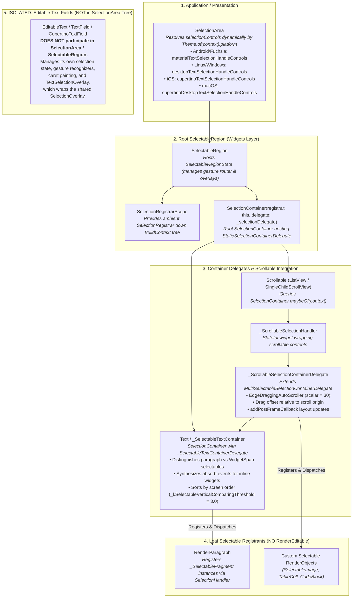

# Flutter Text Architecture: Static Text Pipeline & Unified Selection

This document provides a deep, comprehensive architectural reference for the static text rendering pipeline and the unified selection subsystem in Flutter.

---

## Table of Contents
- [Component & Class Index](#component--class-index)
1. [Static Widget Tree & InlineSpan Summary](#1-static-widget-tree--inlinespan-summary)
   - [`Text`, `RichText`, and `InlineSpan` Delegation](#text-richtext-and-inlinespan-delegation)
2. [Render Tree & Inline Child Layout (`RenderParagraph`)](#2-render-tree--inline-child-layout-renderparagraph)
   - [Dry Layout Measurement & Intrinsic Sizing](#dry-layout-measurement--intrinsic-sizing)
   - [The 5-Stage Inline Child Layout Pipeline](#the-5-stage-inline-child-layout-pipeline)
   - [Hit-Testing & Span Event Routing](#hit-testing--span-event-routing)
3. [Unified Selection Subsystem (`SelectionArea` & `SelectableRegion`)](#3-unified-selection-subsystem-selectionarea--selectableregion)
   - [Subsystem Overview & Scope](#subsystem-overview--scope)
   - [`SelectionArea` & Dynamic Platform Controls Resolution](#selectionarea--dynamic-platform-controls-resolution)
   - [`SelectableRegion` & `SelectionRegistrarScope`](#selectableregion--selectionregistrarscope)
   - [Web Desktop Platform Context Menus (`PlatformSelectableRegionContextMenu`)](#web-desktop-platform-context-menus-platformselectableregioncontextmenu)
   - [`SelectionContainer` & `SelectionContainerDelegate`](#selectioncontainer--selectioncontainerdelegate)
   - [`SelectionContainer.disabled` & Subtree Selection Exemption](#selectioncontainerdisabled--subtree-selection-exemption)
   - [`MultiSelectableSelectionContainerDelegate` & Reading Order Sorting](#multiselectableselectioncontainerdelegate--reading-order-sorting)
   - [Querying `SelectionGeometry` from a `SelectionContainerDelegate`](#querying-selectiongeometry-from-a-selectioncontainerdelegate)
   - [`Text` Widget Integration & `_SelectableTextContainerDelegate`](#text-widget-integration--_selectabletextcontainerdelegate)
   - [Scrollable Integration & `_ScrollableSelectionContainerDelegate`](#scrollable-integration--_scrollableselectioncontainerdelegate)
   - [`EdgeDraggingAutoScroller` Mechanics](#edgedraggingautoscroller-mechanics)
   - [Leaf `Selectable` Registrants (`RenderParagraph` / `_SelectableFragment`)](#leaf-selectable-registrants-renderparagraph--_selectablefragment)
   - [Selection Event Dispatching & Geometry Aggregation](#selection-event-dispatching--geometry-aggregation)
   - [Adjacent Selection Subsystem Components](#adjacent-selection-subsystem-components)
4. [Reference to Shared Overlays](#4-reference-to-shared-overlays)
5. [Architecture & Pipeline Diagrams](#5-architecture--pipeline-diagrams)
   - [Diagram 1: Static Text & `WidgetSpan` Rendering Pipeline](#diagram-1-static-text--widgetspan-rendering-pipeline)
   - [Diagram 2: `SelectionArea` / `SelectableRegion` / `Scrollable` Selection Tree](#diagram-2-selectionarea--selectableregion--scrollable-selection-tree)

---

## Component & Class Index

| Component / Symbol | Source File / Location | Concise Summary |
| :--- | :--- | :--- |
| [`Text`](../../../../packages/flutter/lib/src/widgets/text.dart) | [`packages/flutter/lib/src/widgets/text.dart`](../../../../packages/flutter/lib/src/widgets/text.dart) | High-level text widget resolving `DefaultTextStyle` and wrapping selectable spans. |
| [`RichText`](../../../../packages/flutter/lib/src/widgets/basic.dart) | [`packages/flutter/lib/src/widgets/basic.dart`](../../../../packages/flutter/lib/src/widgets/basic.dart) | Low-level widget that consumes an `InlineSpan` tree and hosts a `RenderParagraph`. |
| [`RenderParagraph`](../../../../packages/flutter/lib/src/rendering/paragraph.dart) | [`packages/flutter/lib/src/rendering/paragraph.dart`](../../../../packages/flutter/lib/src/rendering/paragraph.dart) | Render object that performs text layout, paints glyphs, and manages inline widget children. |
| `_SelectableFragment` | [`packages/flutter/lib/src/rendering/paragraph.dart`](../../../../packages/flutter/lib/src/rendering/paragraph.dart) | `Selectable` delegate created by `RenderParagraph` to handle selection events for text runs between `WidgetSpan`s. |
| [`SelectionArea`](../../../../packages/flutter/lib/src/material/selection_area.dart) | [`packages/flutter/lib/src/material/selection_area.dart`](../../../../packages/flutter/lib/src/material/selection_area.dart) | Material convenience wrapper for unified selection (frozen here; actively developed in `material_ui` under `flutter/packages`). |
| [`SelectableRegion`](../../../../packages/flutter/lib/src/widgets/selectable_region.dart) | [`packages/flutter/lib/src/widgets/selectable_region.dart`](../../../../packages/flutter/lib/src/widgets/selectable_region.dart) | Core stateful engine in `flutter/flutter` managing gesture coordination, selection registrar scopes, and selection geometry. |
| [`SelectionRegistrarScope`](../../../../packages/flutter/lib/src/widgets/selection_container.dart) | [`packages/flutter/lib/src/widgets/selection_container.dart`](../../../../packages/flutter/lib/src/widgets/selection_container.dart) | Inherited widget providing ambient `SelectionRegistrar` access to descendant selectable trees. |
| [`PlatformSelectableRegionContextMenu`](../../../../packages/flutter/lib/src/widgets/_platform_selectable_region_context_menu_web.dart) | [`packages/flutter/lib/src/widgets/_platform_selectable_region_context_menu_web.dart`](../../../../packages/flutter/lib/src/widgets/_platform_selectable_region_context_menu_web.dart) | Web-only platform view attaching an invisible DOM overlay with `user-select: text` for native browser context menus. |
| [`SelectionContainer`](../../../../packages/flutter/lib/src/widgets/selection_container.dart) | [`packages/flutter/lib/src/widgets/selection_container.dart`](../../../../packages/flutter/lib/src/widgets/selection_container.dart) | Container widget grouping descendant selectables into a unified selection delegate hierarchy. |
| [`SelectionContainer.disabled`](../../../../packages/flutter/lib/src/widgets/selection_container.dart) | [`packages/flutter/lib/src/widgets/selection_container.dart`](../../../../packages/flutter/lib/src/widgets/selection_container.dart) | Constructor that hides ambient selection registrars to exempt a subtree from selection. |
| [`SelectionContainerDelegate`](../../../../packages/flutter/lib/src/widgets/selection_container.dart) | [`packages/flutter/lib/src/widgets/selection_container.dart`](../../../../packages/flutter/lib/src/widgets/selection_container.dart) | Abstract delegate managing a list of `Selectable` children and routing selection events. |
| [`StaticSelectionContainerDelegate`](../../../../packages/flutter/lib/src/widgets/selectable_region.dart) | [`packages/flutter/lib/src/widgets/selectable_region.dart`](../../../../packages/flutter/lib/src/widgets/selectable_region.dart) | Default root delegate used by `SelectableRegion` to sort selectables in geometric screen order. |
| [`MultiSelectableSelectionContainerDelegate`](../../../../packages/flutter/lib/src/widgets/selectable_region.dart) | [`packages/flutter/lib/src/widgets/selectable_region.dart`](../../../../packages/flutter/lib/src/widgets/selectable_region.dart) | Base delegate implementing spatial sorting (`compareOrder`), hit testing, and multi-child event dispatching. |
| `_SelectableTextContainerDelegate` | [`packages/flutter/lib/src/widgets/text.dart`](../../../../packages/flutter/lib/src/widgets/text.dart) | Private delegate used by `Text` to coordinate selection between its `RenderParagraph` and inline `WidgetSpan`s. |
| `_ScrollableSelectionHandler` | [`packages/flutter/lib/src/widgets/scrollable.dart`](../../../../packages/flutter/lib/src/widgets/scrollable.dart) | Selection handler created by `Scrollable` to manage edge-drag scrolling and coordinate selection offsets. |
| `_ScrollableSelectionContainerDelegate` | [`packages/flutter/lib/src/widgets/scrollable.dart`](../../../../packages/flutter/lib/src/widgets/scrollable.dart) | Selection container delegate for `Scrollable` that tracks drag origin (`_selectionStartsInScrollable`) and auto-scrolls. |
| [`SelectionRegistrar`](../../../../packages/flutter/lib/src/rendering/selection.dart) | [`packages/flutter/lib/src/rendering/selection.dart`](../../../../packages/flutter/lib/src/rendering/selection.dart) | Service contract where `Selectable` objects register and receive lifecycle subscriptions. |
| [`SelectionHandler`](../../../../packages/flutter/lib/src/rendering/selection.dart) | [`packages/flutter/lib/src/rendering/selection.dart`](../../../../packages/flutter/lib/src/rendering/selection.dart) | Protocol defining how selectable objects process concrete `SelectionEvent` instances. |
| [`Selectable`](../../../../packages/flutter/lib/src/rendering/selection.dart) | [`packages/flutter/lib/src/rendering/selection.dart`](../../../../packages/flutter/lib/src/rendering/selection.dart) | Mixin/interface combining `SelectionHandler` with geometry bounds and lifecycle change notifications. |
| [`SelectionEvent`](../../../../packages/flutter/lib/src/rendering/selection.dart) | [`packages/flutter/lib/src/rendering/selection.dart`](../../../../packages/flutter/lib/src/rendering/selection.dart) | Base class for selection operations (`SelectAll`, `Clear`, `SelectWord`, `SelectParagraph`, `SelectionEdgeUpdate`, `GranularlyExtend`, `DirectionallyExtend`). |
| [`SelectionGeometry`](../../../../packages/flutter/lib/src/rendering/selection.dart) | [`packages/flutter/lib/src/rendering/selection.dart`](../../../../packages/flutter/lib/src/rendering/selection.dart) | Value object describing selection handles, selection rects, and selection status. |
| [`SelectionListener`](../../../../packages/flutter/lib/src/widgets/selectable_region.dart) | [`packages/flutter/lib/src/widgets/selectable_region.dart`](../../../../packages/flutter/lib/src/widgets/selectable_region.dart) | Widget observing selection state changes within a subtree without intercepting gestures. |
| [`SelectionDetails`](../../../../packages/flutter/lib/src/widgets/selectable_region.dart) | [`packages/flutter/lib/src/widgets/selectable_region.dart`](../../../../packages/flutter/lib/src/widgets/selectable_region.dart) | Exposes selected content ranges and `SelectionStatus` (`none`, `collapsed`, or `uncollapsed`). |
| [`SelectedContentRange`](../../../../packages/flutter/lib/src/rendering/selection.dart) | [`packages/flutter/lib/src/rendering/selection.dart`](../../../../packages/flutter/lib/src/rendering/selection.dart) | Start and end character offsets of active selection within a selectable node. |
| [`SelectedContent`](../../../../packages/flutter/lib/src/rendering/selection.dart) | [`packages/flutter/lib/src/rendering/selection.dart`](../../../../packages/flutter/lib/src/rendering/selection.dart) | Extracted plain-text payload produced when copying selected content. |
| [`SelectableRegionSelectionStatusScope`](../../../../packages/flutter/lib/src/widgets/selectable_region.dart) | [`packages/flutter/lib/src/widgets/selectable_region.dart`](../../../../packages/flutter/lib/src/widgets/selectable_region.dart) | Inherited widget exposing whether active selection is in progress (`changing`) or released (`finalized`). |

---

## 1. Static Widget Tree & InlineSpan Summary

Static text in Flutter is configured via high-level widgets and compiled into an engine-rendered paragraph. The [`InlineSpan`](../../../../packages/flutter/lib/src/painting/inline_span.dart) tree is the foundational primitive across both simple and rich static text rendering.

### `Text`, `RichText`, and `InlineSpan` Delegation

1. **Centrality of `InlineSpan`**:
   - `InlineSpan` is the central abstract unit defining text, styling, semantics, and embedded inline widgets.
   - **[`RichText`](../../../../packages/flutter/lib/src/widgets/basic.dart)**: Multi-span display `MultiChildRenderObjectWidget` that accepts an `InlineSpan text` directly, creating and updating [`RenderParagraph`](../../../../packages/flutter/lib/src/rendering/paragraph.dart).
   - **[`Text`](../../../../packages/flutter/lib/src/widgets/text.dart)** (`Text(String data)`): High-level convenience `StatelessWidget` that internally creates a [`TextSpan(text: data)`](../../../../packages/flutter/lib/src/painting/text_span.dart) and applies style defaults resolved from ambient [`DefaultTextStyle`](../../../../packages/flutter/lib/src/widgets/text.dart).
   - **`Text.rich(InlineSpan textSpan)`**: Constructor that allows building a `Text` widget with complex nested spans and embedded [`WidgetSpan`](../../../../packages/flutter/lib/src/widgets/widget_span.dart)s while continuing to benefit from ambient `DefaultTextStyle`, text scaling (`TextScaler`), and automatic `SelectionArea` / `SelectableRegion` integration.
2. **`Text` Selection Wrapping**:
   - When an ambient `SelectionRegistrar` is detected (`SelectionContainer.maybeOf(context) != null`), `Text` wraps its internal `_RichText` in a `SelectionContainer` backed by `_SelectableTextContainerDelegate` (see [Text Widget Integration & `_SelectableTextContainerDelegate`](#text-widget-integration--_selectabletextcontainerdelegate)). Otherwise, it builds a standard `_RichText` / `RichText`.
3. **`InlineSpan` Hierarchy Delegation**:
   - The core structure, visitor patterns (`visitChildren`), tree diffing (`compareTo` returning `RenderComparison`), semantics extraction (`getSemanticsInformation`), and span subclasses ([`TextSpan`](../../../../packages/flutter/lib/src/painting/text_span.dart), [`PlaceholderSpan`](../../../../packages/flutter/lib/src/painting/placeholder_span.dart), [`WidgetSpan`](../../../../packages/flutter/lib/src/widgets/widget_span.dart)) are shared with the editable text pipeline.
   - For complete in-depth architectural details on spans, see the [InlineSpan Tree & Structural Hierarchy Reference](common_text_primitives.md#2-inlinespan-tree--structural-hierarchy).

---

## 2. Render Tree & Inline Child Layout (`RenderParagraph`)

[`RenderParagraph`](../../../../packages/flutter/lib/src/rendering/paragraph.dart) is the render object responsible for measuring, laying out, positioning inline children, and painting static text blocks.

### Dry Layout Measurement & Intrinsic Sizing

`RenderParagraph` mixes in `ContainerRenderObjectMixin<RenderBox, TextParentData>` to manage its list of inline child render boxes.

1. **Intrinsic Sizing Isolation**:
   - Computing intrinsic dimensions (`computeMinIntrinsicWidth`, `computeMaxIntrinsicWidth`, `computeMinIntrinsicHeight`, `computeMaxIntrinsicHeight`) modifies layout constraints and placeholder measurements.
   - `RenderParagraph` maintains a separate, dedicated `_textIntrinsics` `TextPainter` instance. Performing intrinsic queries on the primary `_textPainter` would invalidate cached layout geometry and corrupt subsequent paint passes.
2. **`computeDryLayout(constraints)`**:
   - Pre-computes dry layout for embedded inline children without mutating their cached render states, allowing flex parents (`Row`, `Column`, `Flex`) to perform speculative measurement passes.

---

### The 5-Stage Inline Child Layout Pipeline

```
+-----------------------------------------------------------------------------+
| Stage 1: layoutInlineChildren(maxWidth, ...)                                |
|   Measures each child RenderBox; produces List<PlaceholderDimensions>      |
+-----------------------------------------------------------------------------+
                                       |
                                       v
+-----------------------------------------------------------------------------+
| Stage 2: TextPainter.setPlaceholderDimensions(dimensions)                   |
|   Forwards placeholder dimensions to TextPainter                            |
+-----------------------------------------------------------------------------+
                                       |
                                       v
+-----------------------------------------------------------------------------+
| Stage 3: ui.ParagraphBuilder.addPlaceholder(...) & ui.Paragraph.layout(...) |
|   SkParagraph lays out text and computes placeholder bounding boxes  |
+-----------------------------------------------------------------------------+
                                       |
                                       v
+-----------------------------------------------------------------------------+
| Stage 4: positionInlineChildren(TextPainter.inlinePlaceholderBoxes)         |
|   Sets TextParentData.offset for each child RenderBox                       |
+-----------------------------------------------------------------------------+
                                       |
                                       v
+-----------------------------------------------------------------------------+
| Stage 5: paintInlineChildren(context, offset)                               |
|   Draws each child RenderBox onto PaintingContext at computed offset        |
+-----------------------------------------------------------------------------+
```

1. **Child Measurement (`layoutInlineChildren`)**:
   - During `performLayout()`, `RenderParagraph` iterates over every inline child `RenderBox`, executing child layouts and returning a `List<PlaceholderDimensions>`.
2. **Dimension Forwarding**:
   - `RenderParagraph` forwards the list to `_textPainter.setPlaceholderDimensions()`.
3. **Engine Placeholder Registration**:
   - When `_textPainter` constructs the native paragraph via `InlineSpan.build()`, each `WidgetSpan.build()` invokes `ui.ParagraphBuilder.addPlaceholder()` with its measured `PlaceholderDimensions`, passing width, height, alignment, and baseline information to the paragraph layout engine.
   - `ui.Paragraph.layout(constraints)` calculates line wrapping and resolves exact 2D bounding boxes for all placeholders.
4. **Child Positioning (`positionInlineChildren`)**:
   - `RenderParagraph` reads `_textPainter.inlinePlaceholderBoxes` and assigns the computed local 2D coordinates to `(child.parentData as TextParentData).offset`.
5. **Composited Painting (`paintInlineChildren`)**:
   - `RenderParagraph.paint()` draws the background and text paragraph onto `context.canvas` via `_textPainter.paint(canvas, offset)` and then invokes `paintInlineChildren()` to paint each child `RenderBox`.

---

### Hit-Testing & Span Event Routing

- `RenderParagraph.hitTestChildren(result, {required position})`:
  - Queries `_textPainter.getClosestGlyphForOffset(position)`.
  - Requires a returned glyph whose `graphemeClusterLayoutBounds` contains the pointer. The bounds use font metrics and character advance, so letter-spacing gaps between adjacent characters remain inside those layout regions.
  - Looks up the span at `glyph.graphemeClusterCodeUnitRange.start` only after the containment check.
  - If the span implements `HitTestTarget`, adds a `HitTestEntry` to `result`.
  - Otherwise, calls `hitTestInlineChildren()` for embedded `WidgetSpan` boxes. A nearest text position alone is insufficient to hit a span outside its layout region.

---

## 3. Unified Selection Subsystem (`SelectionArea` & `SelectableRegion`)

The Unified Selection Subsystem provides cross-widget, document-wide text selection spanning arbitrary widgets (paragraphs, data tables, images, and custom components).

### Subsystem Overview & Scope

- **Cross-Widget Selection**: Users can drag a selection marquee or handles across multiple paragraphs, headings, bullet lists, and non-text widgets seamlessly.
- **Tree-Structured Delegation**: Coordinated through a tree of `SelectionContainer` nodes managing child `Selectable` items.
- **Isolation Note**: Editable text fields ([`RenderEditable`](../../../../packages/flutter/lib/src/rendering/editable.dart)) do **NOT** participate in this subsystem; they maintain an isolated selection lifecycle.

---

### `SelectionArea` & Dynamic Platform Controls Resolution

> [!NOTE]
> `SelectionArea` in `packages/flutter` is frozen. Active development of Material selection wrappers takes place in **`material_ui`** under **`flutter/packages`**.

1. **[`SelectionArea`](../../../../packages/flutter/lib/src/material/selection_area.dart)**:
   - High-level Material convenience widget that wraps its child in a `SelectableRegion`.
   - **Dynamic Platform Controls Resolution**: Rather than being hardcoded to Material controls, `SelectionArea` inspects ambient `Theme.of(context).platform` (unless `selectionControls` is explicitly passed):
     - `TargetPlatform.android` / `TargetPlatform.fuchsia` -> [`materialTextSelectionHandleControls`](../../../../packages/flutter/lib/src/material/text_selection.dart)
     - `TargetPlatform.linux` / `TargetPlatform.windows` -> [`desktopTextSelectionHandleControls`](../../../../packages/flutter/lib/src/material/desktop_text_selection.dart)
     - `TargetPlatform.iOS` -> [`cupertinoTextSelectionHandleControls`](../../../../packages/flutter/lib/src/cupertino/text_selection.dart)
     - `TargetPlatform.macOS` -> [`cupertinoDesktopTextSelectionHandleControls`](../../../../packages/flutter/lib/src/cupertino/desktop_text_selection.dart)
   - Configures default context menus via `AdaptiveTextSelectionToolbar.selectableRegion` and platform-adaptive magnifiers via `TextMagnifier.adaptiveMagnifierConfiguration`.

2. **Context Menu Construction in `SelectionArea` & `SelectableRegion` (`contextMenuBuilder`)**:
   - `SelectionArea` and `SelectableRegion` accept a `contextMenuBuilder` callback of type `SelectableRegionContextMenuBuilder` (`(BuildContext context, SelectableRegionState selectableRegionState) -> Widget`).
   - While `AdaptiveTextSelectionToolbar.selectableRegion` is the default builder in `SelectionArea`, multiple adaptive constructors can be used to construct context menus for a `SelectionArea` or `SelectableRegion`:
     - **[`AdaptiveTextSelectionToolbar.selectableRegion`](../../../../packages/flutter/lib/src/material/adaptive_text_selection_toolbar.dart)**: Automatically inspects `selectableRegionState.contextMenuButtonItems` and `selectableRegionState.contextMenuAnchors`.
     - **[`AdaptiveTextSelectionToolbar.selectable`](../../../../packages/flutter/lib/src/material/adaptive_text_selection_toolbar.dart)**: Requires `onCopy`, `onSelectAll`, nullable `onShare`, `selectionGeometry`, and `anchors`. It delegates to `SelectableRegion.getSelectableButtonItems`; it has no `onLookUp` or `onSearchWeb` parameters.
     - **[`CupertinoAdaptiveTextSelectionToolbar.selectable`](../../../../packages/flutter/lib/src/cupertino/adaptive_text_selection_toolbar.dart)**: Requires `onCopy`, `onSelectAll`, `selectionGeometry`, and `anchors`. It passes `onShare: null` internally and does not expose `onShare`, `onLookUp`, or `onSearchWeb` parameters.
     - **[`AdaptiveTextSelectionToolbar.buttonItems`](../../../../packages/flutter/lib/src/material/adaptive_text_selection_toolbar.dart)** / **[`CupertinoAdaptiveTextSelectionToolbar.buttonItems`](../../../../packages/flutter/lib/src/cupertino/adaptive_text_selection_toolbar.dart)**: Builds toolbars directly from a raw `List<ContextMenuButtonItem>` passed via `buttonItems: selectableRegionState.contextMenuButtonItems` with `anchors: selectableRegionState.contextMenuAnchors`.

---

### `SelectableRegion` & `SelectionRegistrarScope`

1. **[`SelectableRegion`](../../../../packages/flutter/lib/src/widgets/selectable_region.dart)**:
   - The core widgets-layer stateful engine (`SelectableRegionState`).
   - Listens to mouse/touch gestures via [`TapAndPanGestureRecognizer`](../../../../packages/flutter/lib/src/gestures/tap_and_drag.dart), [`TapAndHorizontalDragGestureRecognizer`](../../../../packages/flutter/lib/src/gestures/tap_and_drag.dart), and [`LongPressGestureRecognizer`](../../../../packages/flutter/lib/src/gestures/long_press.dart).
   - Instantiates and manages [`SelectionOverlay`](../../../../packages/flutter/lib/src/widgets/text_selection.dart).
2. **[`SelectionRegistrarScope`](../../../../packages/flutter/lib/src/widgets/selection_container.dart)**:
   - An `InheritedWidget` that injects the ambient [`SelectionRegistrar`](../../../../packages/flutter/lib/src/rendering/selection.dart) into the `BuildContext` hierarchy.

---

### Web Desktop Platform Context Menus (`PlatformSelectableRegionContextMenu`)

[`SelectableRegion`](../../../../packages/flutter/lib/src/widgets/selectable_region.dart) integrates with native desktop browser menus through [`PlatformSelectableRegionContextMenu`](../../../../packages/flutter/lib/src/widgets/platform_selectable_region_context_menu.dart). Its `_webContextMenuEnabled` condition is `kIsWeb && BrowserContextMenu.enabled && defaultTargetPlatform != TargetPlatform.android && defaultTargetPlatform != TargetPlatform.iOS`.

1. **Static Selection DOM Bridge**:
   - The entry-point file `platform_selectable_region_context_menu.dart` conditionally exports the web or IO implementation.
   - [`_platform_selectable_region_context_menu_web.dart`](../../../../packages/flutter/lib/src/widgets/_platform_selectable_region_context_menu_web.dart) registers a web platform view factory and creates a transparent `div` with `user-select: text`. The view fills the selectable subtree's bounds; this is not an editable input or textarea.
   - `PlatformSelectableRegionContextMenu.attach(_selectionDelegate)` / `detach(_selectionDelegate)` selects the active `SelectionContainerDelegate`.
2. **Right-Click Transfer to the Browser**:
   - The div listens to `mousedown` and invokes its selection callback only for the right mouse button.
   - The callback transforms the event coordinates, dispatches `SelectWordSelectionEvent` to the active delegate, and assigns `client.getSelectedContent()?.plainText` to the div's `innerText`.
   - It creates and selects a DOM `Range` over that element so the native browser menu has selected text to act on. This bridge does not listen to general DOM `selectionchange` events or continuously synchronize browser selection geometry.
3. **Editable Web Text Uses a Separate Path**:
   - [`EditableText`](../../../../packages/flutter/lib/src/widgets/editable_text.dart) uses the web engine's [`text-editing strategy`](../../../../engine/src/flutter/lib/web_ui/lib/src/engine/text_editing/text_editing.dart), backed by an `input`, `textarea`, or contenteditable `span` according to its configuration and strategy.
   - The engine places this transparent editing control over the editable widget to support native right-click actions. It listens to `input` and DOM `selectionchange` to synchronize text and selection. Firefox also uses a `select` listener for native Select All.
   - EditableText's web-menu condition is `kIsWeb && BrowserContextMenu.enabled`, without SelectableRegion's Android/iOS exclusions. It suppresses the Flutter `contextMenuBuilder` while the native browser menu is enabled.
   - Both paths use the same `BrowserContextMenu` enable/disable API, but their DOM elements and synchronization mechanisms are separate.
4. **Web/IO Guard**:
   - `SelectableRegion.build` wraps its subtree in the platform-menu widget only when `_webContextMenuEnabled` is true.
   - The IO constructor can be called, but its `build`, `attach`, and `detach` implementations throw `UnimplementedError`. See [`_platform_selectable_region_context_menu_io.dart`](../../../../packages/flutter/lib/src/widgets/_platform_selectable_region_context_menu_io.dart).

---

### `SelectionContainer` & `SelectionContainerDelegate`

- **[`SelectionContainer`](../../../../packages/flutter/lib/src/widgets/selection_container.dart)**:
  - Scopes selection handling in subtrees and aggregates child `Selectable` items.
  - `SelectableRegion` builds `SelectionContainer(registrar: this, delegate: _selectionDelegate, child: widget.child)` at the top of the selectable subtree, hosting the root `_selectionDelegate` (`StaticSelectionContainerDelegate`).
- **[`SelectionContainerDelegate`](../../../../packages/flutter/lib/src/widgets/selection_container.dart)**:
  - Abstract controller that routes selection events to child selectables and computes combined selection geometry.
- **[`MultiSelectableSelectionContainerDelegate`](../../../../packages/flutter/lib/src/widgets/selectable_region.dart)**:
  - Abstract container delegate managing an ordered list of `Selectable` children.
  - Sorts selectables geometrically (top-to-bottom, left-to-right) via `compareOrder`.
  - Determines which child contains the selection start and end edges.
  - Aggregates child `SelectionGeometry` values into a composite document geometry.
- **[`StaticSelectionContainerDelegate`](../../../../packages/flutter/lib/src/widgets/selectable_region.dart)**:
  - The concrete default selection container delegate instantiated by [`SelectableRegionState`](../../../../packages/flutter/lib/src/widgets/selectable_region.dart) (`_selectionDelegate = StaticSelectionContainerDelegate()`) and supplied directly to the root `SelectionContainer` in `SelectableRegion.build()`.
  - Extends `MultiSelectableSelectionContainerDelegate` to manage static/non-scrollable selection trees across document selectables.

---

### `SelectionContainer.disabled` & Subtree Selection Exemption

[`SelectionContainer.disabled`](../../../../packages/flutter/lib/src/widgets/selection_container.dart) allows selectively disabling selection for a specific subtree within an ancestor `SelectionArea` or `SelectableRegion`.

1. **Constructor**:
   ```dart
   const SelectionContainer.disabled({super.key, required Widget child})
     : registrar = null,
       delegate = null;
   ```
2. **Internal Mechanics**:
   - Setting both `delegate = null` and `registrar = null` marks the container state as disabled (`_disabled == true`).
   - In its `build()` method, `SelectionContainer.disabled` returns a `SelectionRegistrarScope._disabled(child: widget.child)` with `registrar: null`.
   - `SelectionContainer.maybeOf(context)` inside the subtree returns `null`, preventing children (`Text`, `Scrollable`, `SelectableText`, etc.) from finding an ambient `SelectionRegistrar` and registering their `Selectable` items.
   - The container itself does not register with ancestor registrars (`registrar = null`), reports a static `_disabledGeometry` (`SelectionGeometry(status: SelectionStatus.none, hasContent: true)`), and ignores incoming selection events.
3. **Uses**:
   - **Interactive UI Elements**: Exempting interactive controls (e.g. action buttons, chips, checkboxes, dropdowns, icons) inside a `SelectionArea` from being highlighted, selected, or copied during broad document selection sweeps.
   - **Decorative Content**: Disabling selection on badges, line numbers in code editors, decorative icons, and tooltips ([`RawTooltip`](../../../../packages/flutter/lib/src/widgets/raw_tooltip.dart)).

---

### `MultiSelectableSelectionContainerDelegate` & Reading Order Sorting

[`MultiSelectableSelectionContainerDelegate`](../../../../packages/flutter/lib/src/widgets/selectable_region.dart) coordinates selection across an arbitrary collection of child `Selectable` instances, sorting them into geometric reading order.

1. **`compareOrder` Property**:
   - Exposed as `@protected Comparator<Selectable> get compareOrder => _compareScreenOrder;`.
   - When new child selectables register in `_additions`, `MultiSelectableSelectionContainerDelegate._flushAdditions()` sorts incoming selectables using `compareOrder` and merges them with existing sorted `selectables`.
2. **The 2-Stage Comparator (`_compareScreenOrder`)**:
   `_compareScreenOrder` converts the bounding box of each selectable (`_getBoundingBox(selectable)`) into root coordinate space via `MatrixUtils.transformRect(selectable.getTransformTo(null), boundingBox)` and executes a 2-stage comparison:
   - **Stage 1: Vertical Comparison (`_compareVertically(rectA, rectB)`)**:
     - Uses `_kSelectableVerticalComparingThreshold = 3.0` to detect vertical overlap or precedence.
     - If two rectangles overlap vertically such that `(rectA.top - rectB.top < 3.0 && rectA.bottom - rectB.bottom > -3.0)` or `(rectB.top - rectA.top < 3.0 && rectB.bottom - rectA.bottom > -3.0)`, `_compareVertically` returns `0`, recognizing that both items reside on the same visual line and deferring to horizontal comparison.
     - If the vertical separation `(rectA.top - rectB.top).abs() > 3.0`, the visually higher rectangle precedes the lower one (`rectA.top > rectB.top ? 1 : -1`).
   - **Stage 2: Horizontal Comparison (`_compareHorizontally(rectA, rectB)`)**:
     - Invoked when `_compareVertically` returns `0` (same line).
     - Compares horizontal bounds with `precisionErrorTolerance`.
     - If one rectangle horizontally encloses the other, the enclosing rectangle comes first (returns `-1` if A encloses B, `1` if B encloses A).
     - Otherwise, compares left edges (`rectA.left > rectB.left ? 1 : -1`), using right edges as tiebreakers.
3. **Why Geometric Reading Order Matters**:
   - **Decoupled Tree Insertion**: Ensures that selection drag events (`SelectionEdgeUpdateEvent`) and select-all operations traverse child nodes in true visual reading order (top-to-bottom, left-to-right) regardless of the order they were inserted into the widget or render tree.
   - **WidgetSpan & Baseline Tolerance**: The `3.0` pixel vertical threshold accommodates subtle baseline differences, font metric variations, and padding on embedded inline `WidgetSpan`s without causing elements on the same line to swap order or split incorrectly.

---

### Querying `SelectionGeometry` from a `SelectionContainerDelegate`

Inside container delegates (such as `MultiSelectableSelectionContainerDelegate`, `StaticSelectionContainerDelegate`, or `_ScrollableSelectionContainerDelegate`), selection geometry is represented at two levels:

1. **Child Geometry (`selectable.value`)**: The raw `SelectionGeometry` of individual child selectables (e.g. `RenderParagraph` / `_SelectableFragment`), expressed in the child's local coordinate space.
2. **Container Geometry (`this.value`)**: The composite `SelectionGeometry` aggregated across all children, expressed in the container's coordinate space.

#### 1. Child vs. Container Geometry: When to Use Which

| Query Scenario | Source of Truth | Coordinate Space | Lifecycle & Timing Notes |
| :--- | :--- | :--- | :--- |
| **During Event Handling**<br>*(inside `handleSelectionEdgeUpdate` or another handler that needs child geometry)* | `selectables[index].value` | **Child Local Space** | **Immediate**: Children update their `value` in real time during event dispatch. |
| **Outside Event Handling**<br>*(during paint, overlays, layout callbacks)* | `this.value` | **Container Local Space** | **Deferred**: Aggregate `this.value` is suppressed while `_isHandlingSelectionEvent == true` and refreshed afterward via `_updateSelectionGeometry()`. |

> [!WARNING]
> **Avoid `this.value` during active gesture/event dispatch!**
> Accessing `this.value` mid-event can return stale geometry from the prior frame because `MultiSelectableSelectionContainerDelegate` suppresses composite updates until the selection pass completes.

#### 2. Common Query Patterns

##### A. Querying Edge Points & Line Metrics (`lineHeight`, Caret Offsets)
Always query the active boundary child directly from `selectables` with bounds checking:

```dart
// Querying end selection point metrics (e.g. for SelectionEventType.endEdgeUpdate)
final SelectionPoint? endPoint =
    (currentSelectionEndIndex != -1 && currentSelectionEndIndex < selectables.length)
        ? selectables[currentSelectionEndIndex].value.endSelectionPoint
        : null;
final double endLineHeight = endPoint?.lineHeight ?? 0.0;

// Querying start selection point metrics (e.g. for SelectionEventType.startEdgeUpdate)
final SelectionPoint? startPoint =
    (currentSelectionStartIndex != -1 && currentSelectionStartIndex < selectables.length)
        ? selectables[currentSelectionStartIndex].value.startSelectionPoint
        : null;
final double startLineHeight = startPoint?.lineHeight ?? 0.0;
```

##### B. Transforming Child Coordinates to Container or Global Space
When converting a child's `localPosition` or `selectionRects` into container or global coordinate systems:

```dart
final Selectable selectable = selectables[currentSelectionEndIndex];
final RenderBox containerBox = state.context.findRenderObject()! as RenderBox;

// Child local -> Container local:
final Matrix4 transform = selectable.getTransformTo(containerBox);
final Offset pointInContainer = MatrixUtils.transformPoint(transform, childPoint.localPosition);

// Container local -> Global screen space:
final Rect globalRect = MatrixUtils.transformRect(
  containerBox.getTransformTo(null),
  Rect.fromLTWH(0, 0, containerBox.size.width, containerBox.size.height),
);
```

---

### `Text` Widget Integration & `_SelectableTextContainerDelegate`

When a [`Text`](../../../../packages/flutter/lib/src/widgets/text.dart) widget is placed within an ancestor `SelectionArea` / `SelectableRegion`, it automatically participates in unified selection via a specialized private container delegate.

```
Text.build()
  |
  +---> SelectionContainer.maybeOf(context) != null
          |
          +---> YES: Builds _SelectableTextContainer
                  |
                  +---> SelectionContainer(delegate: _SelectableTextContainerDelegate)
                          |
                          +---> _RichText (passes SelectionRegistrar to RichText)
                                  |
                                  +---> RenderParagraph (registers _SelectableFragments)
```

1. **Ambient Registrar Detection**:
   - In `Text.build()`, the widget queries `SelectionContainer.maybeOf(context)`.
   - If an ambient `SelectionRegistrar` exists, `Text` wraps its internal tree in `_SelectableTextContainer`.
   - `_SelectableTextContainerState` creates a `_SelectableTextContainerDelegate` holding a `GlobalKey` (`_textKey`) targeting the internal `_RichText` and `RenderParagraph`.
2. **`StaticSelectionContainerDelegate` Base**:
   - `_SelectableTextContainerDelegate` extends [`StaticSelectionContainerDelegate`](../../../../packages/flutter/lib/src/widgets/selectable_region.dart) to coordinate selection across the paragraph and any child `Selectable` items.
3. **Distinguishing Paragraph Spans vs. Inline `WidgetSpan` Selectables**:
   - A `Text` widget with embedded `WidgetSpan`s contains both text fragments and embedded widget selectables.
   - `_SelectableTextContainerDelegate` queries `paragraph.selectableBelongsToParagraph(selectables[index])` to determine whether a given `Selectable` child was generated directly by the `RenderParagraph` (as a `_SelectableFragment`) or by an embedded child widget within a `WidgetSpan`.
4. **Paragraph Selection Coordination (`handleSelectParagraph`)**:
   - **Placeholder Hit Pass**: If the hit position lands inside an embedded `WidgetSpan` selectable's bounding box, the event is immediately dispatched to that specific child selectable.
   - **Paragraph Sweep & Event Synthesis**: Otherwise, the delegate dispatches the paragraph selection event to `RenderParagraph`'s selectables. When traversing past embedded `WidgetSpan` selectables within the selected range, it synthesizes absorb events:
     ```dart
     final SelectionEvent synthesizedEvent = SelectParagraphSelectionEvent(
       globalPosition: event.globalPosition,
       absorb: true,
     );
     dispatchSelectionEventToChild(selectables[index], synthesizedEvent);
     ```
     This ensures all inline embedded widgets within the paragraph are selected cohesively.
     - Flushes inactive selections via `_flushInactiveSelections()` when selection boundaries update.
5. **Reading Order Sorting & Threshold Comparison (`_compareScreenOrder`)**:
   - Overrides `compareOrder` with its own `_compareScreenOrder` in `widgets/text.dart`. It compares each selectable's first bounding box transformed to global coordinates. The base `MultiSelectableSelectionContainerDelegate` instead unions all bounding boxes through `_getBoundingBox` before comparing.
   - Leverages `_compareVertically` with `_kSelectableVerticalComparingThreshold = 3.0` and `_compareHorizontally` to order inline `WidgetSpan` selectables and paragraph text fragments in visual reading order.

---

### Scrollable Integration & `_ScrollableSelectionContainerDelegate`

When selectable content is placed inside a [`Scrollable`](../../../../packages/flutter/lib/src/widgets/scrollable.dart) (e.g. `ListView`, `SingleChildScrollView`, `CustomScrollView`):

```
Scrollable.build()
  |
  +---> SelectionContainer.maybeOf(context) (Checks for ambient SelectionRegistrar)
          |
          +---> Found: Wraps viewport in _ScrollableSelectionHandler
                  |
                  +---> Uses _ScrollableSelectionContainerDelegate
                          |---> EdgeDraggingAutoScroller (velocityScalar: 30)
                          |---> Drag offset tracking relative to scroll origin
                          |---> PostFrameCallback layout change listener
```

#### 1. Ambient Registrar Detection
- In `Scrollable.build()`, `Scrollable` queries `SelectionContainer.maybeOf(context)`.
- If an ambient `SelectionRegistrar` is found, `Scrollable` wraps its child in `_ScrollableSelectionHandler`.

#### 2. `_ScrollableSelectionContainerDelegate` Mechanics
`_ScrollableSelectionContainerDelegate` extends `MultiSelectableSelectionContainerDelegate` with scrolling-specific synchronization and auto-scrolling capabilities:
- **Role of `_selectionStartsInScrollable` & Drag Boundary Clamping**:
  - `handleSelectionEdgeUpdate` initializes `_selectionStartsInScrollable` from `_globalPositionInScrollable(event.globalPosition)` only when both cached drag endpoints are null. `handleSelectWord` sets it from the word-selection event; `handleClearSelection` resets it and clears both endpoints. `handleSelectAll` seeds endpoints from geometry without setting the flag to true.
  - **Selection Originating Outside (`_selectionStartsInScrollable == false`)**:
    - When the drag selection originates outside the scrollable (e.g., dragging across multiple scrollables or from an outside header/document body), moving the drag position across the scrollable boundaries causes `_inferPositionRelatedToOrigin` to clamp the inferred position:
      - If `localPosition.dy < 0 || localPosition.dx < 0`, it clamps to `box.localToGlobal(Offset.zero)`.
      - Otherwise, if `localPosition.dy > box.size.height || localPosition.dx > box.size.width`, it clamps to `Offset.infinite`.
      - If neither outside condition applies, it adds the scroll-origin delta in viewport-local space and converts the result back with `box.localToGlobal`; inside positions are not forced to a boundary.
    - The boundary values let an enclosing selection span the scrollable's entire contents. Autoscrolling is disabled while `_selectionStartsInScrollable` is false.
  - **Selection Originating Inside (`_selectionStartsInScrollable == true`)**:
    - When the drag gesture starts inside the scrollable viewport, dragging the dispatched selection coordinate beyond the viewport boundary can activate [`EdgeDraggingAutoScroller`](../../../../packages/flutter/lib/src/widgets/scrollable_helpers.dart) (`_kDefaultSelectToScrollVelocityScalar = 30`).
    - The auto-scroller smoothly scrolls the viewport in the drag direction and incrementally expands the selection as offscreen content scrolls into view.
- **Origin-Relative Drag Coordinates**:
  - Maintains `_currentDragStartRelatedToOrigin` and `_currentDragEndRelatedToOrigin`.
  - The ordinary event path converts global logical coordinates with `box.globalToLocal`, adds `_getDeltaToScrollOrigin(state)`, and converts back with `box.localToGlobal`. Before redispatch, `handleSelectionEdgeUpdate` subtracts the current delta from the cached value.
  - These caches retain the origin-adjusted endpoints across scrolling. For reconstruction from child geometry and transformed viewports, follow the complete conversion paths in [the coordinate playbook](text_debugging_playbooks.md#trace-the-actual-conversion-path).
- **Post-Frame Layout Updates (`_scheduleLayoutChange`)**:
  - Listens to `ScrollPosition` changes.
  - Layout changes occur one frame later than scroll position changes. `_scheduleLayoutChange` registers `SchedulerBinding.instance.addPostFrameCallback` to invoke `layoutDidChange()` only after the render tree has completed layout for the new scroll offset.
- **Edge Update Synthesizing**:
  - Maintains records of the last scroll offset when a child selectable received a `SelectionEdgeUpdateEvent` (`_selectableStartEdgeUpdateRecords`, `_selectableEndEdgeUpdateRecords`).
  - If a selectable receives an edge update after scrolling has occurred, the delegate synthesizes an opposite edge update before dispatching the new event, maintaining continuous selection state across virtualized/scrolled elements.
- **Handle Coordinates and the Current Drag Target**:
  - During a mobile handle drag, `SelectableRegion` subtracts `lineHeight / 2` from the handle position to place the dispatched selection coordinate at the center of the text line for hit testing.
  - `_ScrollableSelectionContainerDelegate._dragTargetFromEvent` returns `Rect.fromCenter(center: event.globalPosition, width: _kDefaultDragTargetSize, height: _kDefaultDragTargetSize)`.
  - `_kDefaultDragTargetSize` is `0`: the dispatched coordinate is a point target. The delegate does not add line height, project coordinates outward, or maintain an inner edge band. Autoscroll therefore depends on the dispatched coordinate crossing the viewport boundary.

---

### `EdgeDraggingAutoScroller` Mechanics

For selection originating inside a scrollable, the delegate passes its point target to [`EdgeDraggingAutoScroller`](../../../../packages/flutter/lib/src/widgets/scrollable_helpers.dart):

- **Velocity Scalar**: `_ScrollableSelectionContainerDelegate` initializes the scroller with `_kDefaultSelectToScrollVelocityScalar = 30`, defined in [`widgets/scrollable.dart`](../../../../packages/flutter/lib/src/widgets/scrollable.dart).
- **Outside-Target Evaluation**: Scrolling requires the target to extend beyond the viewport (`proxyStart < viewportStart` or `proxyEnd > viewportEnd`) and available scroll extent in that direction. A point inside or exactly on the viewport edge does not trigger it.
- **Scroll Steps**: Each step clamps the overdrag to `overDragMax = 20.0`, limits the new offset to scroll extents, and animates linearly for `(1000 / velocityScalar).round()` milliseconds. Steps smaller than one logical pixel stop scrolling. The 20-pixel cap limits each scroll step; it is not an inner edge band.
- **Nested Scrollables**: If a child returns `SelectionResult.pending`, the parent stops its own scroller and returns that result. When this delegate's scroller is active, it returns `SelectionResult.pending` so ancestor scrollables wait for it.

---

### Leaf `Selectable` Registrants (`RenderParagraph` / `_SelectableFragment`)

- **`SelectionHandler` vs. `_SelectableFragment` vs. [`RenderParagraph`](../../../../packages/flutter/lib/src/rendering/paragraph.dart)**:
  - **`SelectionHandler`**: The base abstract interface ([`rendering/selection.dart`](../../../../packages/flutter/lib/src/rendering/selection.dart)) defining event dispatching (`dispatchSelectionEvent`), selection geometry access (`value`), and handle layer pushing (`pushHandleLayers`).
  - **[`_SelectableFragment`](../../../../packages/flutter/lib/src/rendering/paragraph.dart)**: The actual private concrete class that mixes in [`Selectable`](../../../../packages/flutter/lib/src/rendering/selection.dart) (which implements `SelectionHandler`) and registers directly into the ambient [`SelectionRegistrar`](../../../../packages/flutter/lib/src/rendering/selection.dart). Each fragment represents a contiguous selectable text run bounded by text offsets and paragraph layout metrics.
  - **[`RenderParagraph`](../../../../packages/flutter/lib/src/rendering/paragraph.dart)**: The parent `RenderBox` host. It does **not** register itself directly as a monolithic selectable, including when there are no placeholders. Instead, `RenderParagraph` instantiates, manages, disposes, and updates `_SelectableFragment` instances (`_lastSelectableFragments`), splitting its text span tree across embedded `WidgetSpan`s so each text segment can be selected independently alongside inline widgets.
- **Custom Selectables**:
  - Non-text widgets (e.g. images, tables) can implement [`Selectable`](../../../../packages/flutter/lib/src/rendering/selection.dart) (and thereby `SelectionHandler`) to participate in cross-widget selection highlights.

---

### Selection Event Dispatching & Geometry Aggregation

1. **Concrete `SelectionEvent` Catalog**:
   All selection gestures and keyboard actions are represented by concrete subclasses of [`SelectionEvent`](../../../../packages/flutter/lib/src/rendering/selection.dart) (distinguished via [`SelectionEventType`](../../../../packages/flutter/lib/src/rendering/selection.dart)):
   - **[`SelectAllSelectionEvent`](../../../../packages/flutter/lib/src/rendering/selection.dart)** (`SelectionEventType.selectAll`):
     - Selects all selectable content within the container subtree.
     - Typically dispatched by keyboard select-all shortcuts (`Ctrl+A` / `Cmd+A`).
   - **[`ClearSelectionEvent`](../../../../packages/flutter/lib/src/rendering/selection.dart)** (`SelectionEventType.clear`):
     - Clears and collapses the active selection, removing highlights across all selectables.
     - Dispatched when tapping outside selection areas or on user dismiss actions.
   - **[`SelectWordSelectionEvent`](../../../../packages/flutter/lib/src/rendering/selection.dart)** (`SelectionEventType.selectWord`):
     - Selects the entire word at the target `globalPosition`.
     - Dispatched by mobile long-press gestures or desktop double-clicks.
   - **[`SelectParagraphSelectionEvent`](../../../../packages/flutter/lib/src/rendering/selection.dart)** (`SelectionEventType.selectParagraph`):
     - Selects the entire enclosing paragraph at `globalPosition`.
     - Dispatched by desktop triple-clicks or multi-tap gestures. Contains an `absorb` boolean (`absorb: true`) used when sweeping across and selecting embedded inline `WidgetSpan` selectables within the paragraph.
   - **[`SelectionEdgeUpdateEvent`](../../../../packages/flutter/lib/src/rendering/selection.dart)**:
     - Updates a specific selection boundary edge during continuous drag updates or handle dragging:
       - `SelectionEdgeUpdateEvent.forStart(...)` (`SelectionEventType.startEdgeUpdate`): Updates the selection start edge location.
       - `SelectionEdgeUpdateEvent.forEnd(...)` (`SelectionEventType.endEdgeUpdate`): Updates the selection end edge location.
     - Carries `globalPosition` and [`TextGranularity`](../../../../packages/flutter/lib/src/rendering/selection.dart) (`character`, `word`, `line`, `paragraph`, `document`).
   - **[`GranularlyExtendSelectionEvent`](../../../../packages/flutter/lib/src/rendering/selection.dart)** (`SelectionEventType.granularlyExtendSelection`):
     - Extends the selection start or end edge (`isEnd`) in a forward or backward direction (`forward`) by a discrete [`TextGranularity`](../../../../packages/flutter/lib/src/rendering/selection.dart) unit.
     - Dispatched during discrete keyboard-driven selection extension (e.g. `Shift+LeftArrow`/`Shift+RightArrow` or `Shift+Option+Arrow`).
   - **[`DirectionallyExtendSelectionEvent`](../../../../packages/flutter/lib/src/rendering/selection.dart)** (`SelectionEventType.directionallyExtendSelection`):
     - Extends the current selection edge (`isEnd`) with respect to visual 2D direction ([`SelectionExtendDirection`](../../../../packages/flutter/lib/src/rendering/selection.dart): `previousLine`, `nextLine`, `forward`, `backward`) targeting horizontal offset `dx` in global coordinates.
     - Dispatched during directional keyboard navigation across lines (e.g. `Shift+UpArrow`/`Shift+DownArrow`).

2. **`SelectionGeometry` Aggregation**:
   - Leaf selectables compute `SelectionPoint` for their start and end selection edges.
   - `SelectionContainerDelegate` aggregates child geometries into a composite `SelectionGeometry` containing `startSelectionPoint`, `endSelectionPoint`, `status`, and `hasSelection`.
   - `SelectableRegionState` receives the updated geometry and repositions the selection handles and toolbars in [`SelectionOverlay`](../../../../packages/flutter/lib/src/widgets/text_selection.dart).

---

### Adjacent Selection Subsystem Components

In addition to primary container delegates and render objects, Flutter provides several supporting primitives and observation mechanisms within the selection architecture:

#### 1. `SelectionListener` & `SelectionListenerNotifier`
- **[`SelectionListener`](../../../../packages/flutter/lib/src/widgets/selectable_region.dart)**:
  - A widget allowing ancestor or external code to observe selection state within a specific subtree without modifying selection behavior.
  - Wraps its child in a `SelectionContainer` backed by a private `_SelectionListenerDelegate` (which extends `StaticSelectionContainerDelegate` and implements `SelectionDetails`).
  - Does **not** capture or bubble selection changes from nested, independent `SelectionArea` or `SelectableRegion` subtrees (an additional `SelectionListener` must be placed under each nested region if observation is needed).
- **[`SelectionListenerNotifier`](../../../../packages/flutter/lib/src/widgets/selectable_region.dart)**:
  - A `ChangeNotifier` provided to `SelectionListener` that notifies attached listeners whenever the selection geometry or range inside the subtree changes.
  - Exposes the read-only [`SelectionDetails`](../../../../packages/flutter/lib/src/widgets/selectable_region.dart) via `selectionNotifier.selection`.

#### 2. `SelectionDetails`
- **[`SelectionDetails`](../../../../packages/flutter/lib/src/widgets/selectable_region.dart)**:
  - A read-only interface exposed by `SelectionListenerNotifier.selection` that provides:
    - `SelectedContentRange? get range`: The computed local character selection range relative to the `SelectionListener` subtree, or `null` if nothing is selected.
    - `SelectionStatus get status`: Enum indicating whether the selection is unselected (`SelectionStatus.none`), collapsed (`SelectionStatus.collapsed`), or uncollapsed (`SelectionStatus.uncollapsed`).

#### 3. `SelectedContentRange` & `SelectedContent`
- **[`SelectedContentRange`](../../../../packages/flutter/lib/src/rendering/selection.dart)**:
  - Represents the local start and end offsets of a selection relative to a selectable's content:
    ```dart
    const SelectedContentRange({required this.startOffset, required this.endOffset});
    ```
  - **Flattened Content Offsets**: In widgets with nested `InlineSpan` hierarchies (such as `Text.rich`), `SelectedContentRange` flattens embedded `WidgetSpan` content into offset calculations (accounting for the character length of any text within inline widget spans) to produce unified, contiguous range offsets.
- **[`SelectedContent`](../../../../packages/flutter/lib/src/rendering/selection.dart)**:
  - Represents the extracted plain-text payload from a selectable or container:
    ```dart
    const SelectedContent({required this.plainText});
    ```
  - Returned by `Selectable.getSelectedContent()` / `SelectionHandler.getSelectedContent()` during clipboard copy operations or programmatic content inspection.

#### 4. `SelectableRegionSelectionStatusScope` & `SelectableRegionSelectionStatus`
- **[`SelectableRegionSelectionStatus`](../../../../packages/flutter/lib/src/widgets/selectable_region.dart)**:
  - An enum reflecting the active gesture lifecycle of the enclosing selectable region:
    - `SelectableRegionSelectionStatus.changing`: Active while the pointer is actively dragging or continuously updating the selection.
    - `SelectableRegionSelectionStatus.finalized`: Emitted when the selection gesture settles (e.g. pointer up after a drag, tap-to-collapse, double-tap word selection, triple-tap paragraph selection, or `Cmd+A`/`Ctrl+A` select all).
- **[`SelectableRegionSelectionStatusScope`](../../../../packages/flutter/lib/src/widgets/selectable_region.dart)**:
  - An `InheritedWidget` built by `SelectableRegionState` that exposes `ValueListenable<SelectableRegionSelectionStatus>` down the `BuildContext` tree.
  - Descendant widgets access the listenable via `SelectableRegionSelectionStatusScope.maybeOf(context)`.
  - **Use Case**: Enables descendant widgets to react to the active drag state—such as suppressing hover animations, pausing expensive live layout operations, or optimizing repaints while selection drag events are actively streaming.

---

## 4. Reference to Shared Overlays

For details regarding floating selection handles, context menu toolbars, magnifiers, and composited layer link synchronization (`LeaderLayer`/`FollowerLayer`), see the [Common Text Primitives Reference](common_text_primitives.md#7-shared-selection-overlays-toolbars-handles--magnifiers).

---

## 5. Architecture & Pipeline Diagrams

### Diagram 1: Static Text & `WidgetSpan` Rendering Pipeline

```mermaid
graph TD
    subgraph Widget_Tree ["1. Widget Configuration"]
        W_Text["Text('...', ...)<br/><i>High-level convenience widget</i>"]
        W_RT["RichText(text: InlineSpan, ...)<br/><i>Multi-span layout widget</i>"]
        W_WS["WidgetSpan(child: Widget, ...)<br/><i>Embedded inline Flutter widgets</i>"]
    end

    subgraph Render_Object ["2. RenderParagraph Layout & Child Management"]
        RP["RenderParagraph<br/><i>ContainerRenderObjectMixin&lt;RenderBox, TextParentData&gt;</i>"]
        RP_Layout["layoutInlineChildren(maxWidth, ...)<br/><i>Measures each child RenderBox</i>"]
        RP_Pos["positionInlineChildren(boxes)<br/><i>Sets TextParentData.offset for each child</i>"]
        RP_Paint["paintInlineChildren(context, offset)<br/><i>Paints children at computed offsets</i>"]
    end

    subgraph Painting_Bridge ["3. Painting & Layout Coordination"]
        TP["TextPainter<br/><i>Coordinates span tree layout and measurement</i>"]
        Cache["_TextPainterLayoutCacheWithOffset<br/><i>Caches Paragraph, paintOffset, width constraints</i>"]
        Dim["PlaceholderDimensions<br/><i>Size, PlaceholderAlignment, BaselineOffset</i>"]
    end

    subgraph Engine_Bridge ["4. Engine Paragraph Construction"]
        PB["ui.ParagraphBuilder<br/><i>Native paragraph builder handle</i>"]
        P_Spans["InlineSpan.build(builder, textScaler, dimensions)<br/><i>Pushes styles, text, & addPlaceholder()</i>"]
        P_Layout["ui.Paragraph.layout(ParagraphConstraints(width))<br/><i>HarfBuzz shaping + ICU line breaking</i>"]
        P_Result["ui.Paragraph<br/><i>Fixed text/style content; mutable layout & metrics</i>"]
        P_Boxes["ui.Paragraph.getBoxesForPlaceholders()<br/><i>Calculates bounding boxes for inline widgets</i>"]
    end

    subgraph Rasterization ["5. Paragraph Painting and Impeller Glyph Drawing"]
        Canvas["PaintingContext / ui.Canvas<br/><i>drawParagraph(paragraph, offset)</i>"]
        Atlas["Impeller Skia typographer<br/><i>CPU glyph rasterization and atlas upload</i>"]
        Impeller["Impeller<br/><i>GPU drawing of atlas-backed glyph geometry</i>"]
    end

    W_Text --> W_RT
    W_RT --> W_WS
    W_RT --> RP
    RP --> RP_Layout
    RP_Layout -->|Returns List&lt;PlaceholderDimensions&gt;| Dim
    Dim -->|setPlaceholderDimensions()| TP
    TP --> Cache
    TP --> PB
    PB --> P_Spans
    P_Spans --> P_Layout
    P_Layout --> P_Result
    P_Result --> P_Boxes
    P_Boxes -->|inlinePlaceholderBoxes| RP_Pos
    RP_Pos --> RP_Paint
    RP --> Canvas
    TP --> Canvas
    Canvas --> Atlas
    Atlas --> Impeller
```

---

### Diagram 2: `SelectionArea` / `SelectableRegion` / `Scrollable` Selection Tree


