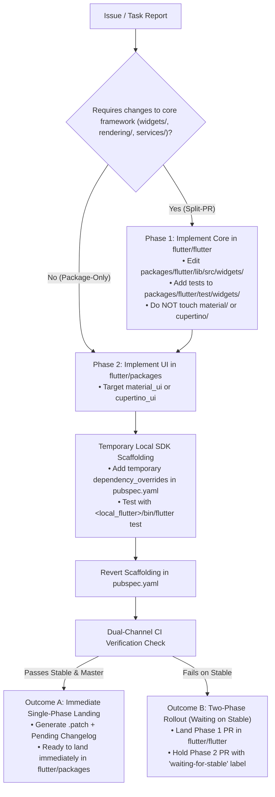

# Material & Cupertino Packages Decoupling Skill

This skill defines the canonical workflow for contributing to **`material_ui`** and **`cupertino_ui`** in the **[`flutter/packages`](https://github.com/flutter/packages)** repository following the code freeze of Material and Cupertino implementations in `flutter/flutter`.

---

## 1. Repository Directory Mapping

Active development of Material and Cupertino design components has moved to `flutter/packages`. Use this path mapping:

| `flutter/flutter` (Frozen Legacy) | `flutter/packages` (Active Source of Truth) | Subsystem Area |
| :--- | :--- | :--- |
| `packages/flutter/lib/src/material/**` | `packages/material_ui/lib/src/**` | Material widgets, themes, controls |
| `packages/flutter/test/material/**` | `packages/material_ui/test/**` | Material widget & unit tests |
| `packages/flutter/lib/src/cupertino/**` | `packages/cupertino_ui/lib/src/**` | Cupertino widgets, themes, controls |
| `packages/flutter/test/cupertino/**` | `packages/cupertino_ui/test/**` | Cupertino widget & unit tests |
| `examples/api/lib/material/**` | `packages/material_ui/example/lib/**` | Material API sample code |
| `examples/api/lib/cupertino/**` | `packages/cupertino_ui/example/lib/**` | Cupertino API sample code |
| `packages/flutter/lib/fix_data/fix_material/**` | `packages/material_ui/lib/fix_data/**` | Material data migrations |
| `packages/flutter/lib/fix_data/fix_cupertino.yaml` | `packages/cupertino_ui/lib/fix_data/**` | Cupertino data migrations |

> [!IMPORTANT]
> **Code Freeze Rule**: In `flutter/flutter`, files under `packages/flutter/lib/src/{material,cupertino}/` and `packages/flutter/test/{material,cupertino}/` are frozen. Never make semantic code edits to these paths in `flutter/flutter`. The only permitted edits are pure whitespace formatting changes produced by `dart format`.

---

## 2. Multi-Repo Split-PR Orchestration

When a feature or bug fix requires changes to both core framework primitives and design-system components (e.g. adding new context menu buttons or selection features):



---

## 3. Temporary Local SDK Scaffolding & Cleanup

When testing changes in `material_ui` or `cupertino_ui` that depend on local edits in `flutter/flutter`:

1. **Add Temporary Local Override**:
   In `flutter/packages/packages/material_ui/pubspec.yaml` (or `cupertino_ui/pubspec.yaml`):
   ```yaml
   dependency_overrides:
     flutter:
       path: /absolute/path/to/local/flutter/packages/flutter
   ```

2. **Run Tests against Local SDK**:
   ```bash
   # From packages/material_ui or packages/cupertino_ui:
   /absolute/path/to/local/flutter/bin/flutter test
   ```

3. **MANDATORY Scaffolding Cleanup**:
   Before generating a `.patch` or submitting a PR, **revert the `pubspec.yaml` edit**:
   ```bash
   git checkout pubspec.yaml
   ```
   *Never include local absolute paths or temporary `dependency_overrides` in a proposed `.patch` or PR.*

---

## 4. Dual-Channel CI Matrix & Rollout Classification

`flutter/packages` CI runs against **both Flutter `master` and Flutter `stable`**. All package contributions must follow the **Master-First, Stable-Verified** diagnostic protocol:

### Step 1: Draft Against `master`
Implement the cleanest, most idiomatic solution in `material_ui` / `cupertino_ui` using current `master` APIs. Avoid premature shims or dynamic type casts.

### Step 2: Verify Against `stable`
Run static analysis and tests against the official Flutter `stable` channel.

### Step 3: Classify the Rollout

#### Outcome A: Immediate Single-Phase Landing (Dual-Channel Green)
* **Criteria**: Code compiles and passes all tests on both `master` and `stable`.
* **Action**:
  - The `flutter/packages` PR is immediately mergeable.
  - Bump version and update `pending_changelogs/`.

#### Outcome B: Two-Phase Rollout (Blocked on Stable)
* **Criteria**: Code depends on new framework APIs that only exist on `master` (fails analyzer/tests on `stable`).
* **Action**:
  1. **Phase 1**: Land the foundational PR in `flutter/flutter` on `master`.
  2. **Phase 2**: Submit the `material_ui` / `cupertino_ui` PR in `flutter/packages` with the label `waiting-for-stable`.
  3. The package PR lands after the framework changes roll into a stable release (bumping the minimum Flutter SDK constraint in `pubspec.yaml`).

---

## 5. Changelog & Patch Generation

### Creating the Pending Changelog Entry
In `flutter/packages`, PRs require a pending change file rather than directly modifying `CHANGELOG.md`:

1. **Option A: Using the Flutter Packages Tool (`fpt`)**:
   ```bash
   # From packages/material_ui or packages/cupertino_ui:
   fpt update-release-info --current-package --version <bugfix|minor|next> --changelog "<Detailed description of changes>"
   ```
2. **Option B: Manual YAML Template**:
   Copy and fill `packages/material_ui/pending_changelogs/template.yaml` (or `cupertino_ui`).

### Generating Clean Standalone `.patch` Files
When providing changes for review or applying them across worktrees:
```bash
# Generate clean patch from packages/material_ui:
git diff --no-prefix lib/ test/ > material_ui_<feature_name>.patch
```
Ensure the `.patch` does not contain `dependency_overrides` or machine-specific paths.

---

## 6. Pre-Completion Checklist

Before declaring any Material/Cupertino decoupling task complete:
- [ ] **Zero Semantic Diff in `flutter/flutter` Frozen Dirs**:
  Verify `git diff -w --ignore-blank-lines packages/flutter/lib/src/material packages/flutter/lib/src/cupertino` produces zero diff.
- [ ] **Canonical Widget Tests in `flutter/flutter`**:
  If foundation changes were made, verified with `./bin/flutter test packages/flutter/test/widgets/<test_file>.dart`.
- [ ] **Scaffolding Cleaned**:
  Confirmed that temporary `dependency_overrides` in `pubspec.yaml` were removed.
- [ ] **Dual-Channel CI Assessed**:
  Classified rollout as `[Immediate Single-Phase Landing]` or `[Two-Phase Rollout (Waiting on Stable)]`.
- [ ] **Standalone `.patch` Verified**:
  Generated clean `.patch` targeting `material_ui` / `cupertino_ui`.
- [ ] **Pending Changelog Created**:
  Added changelog entry in `pending_changelogs/`.
