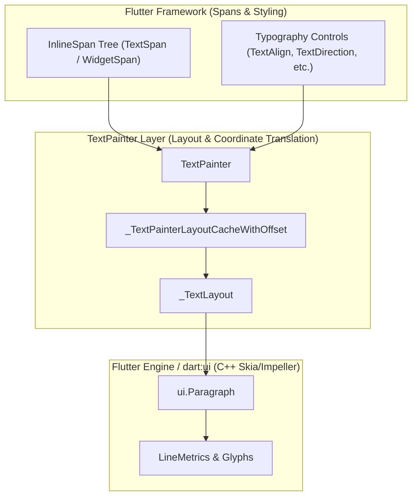
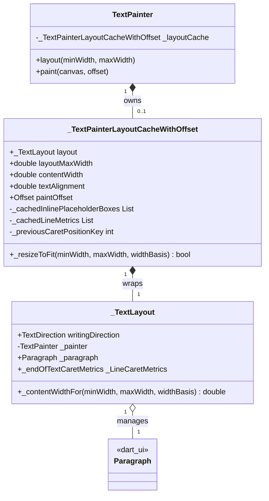
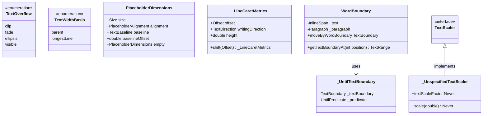
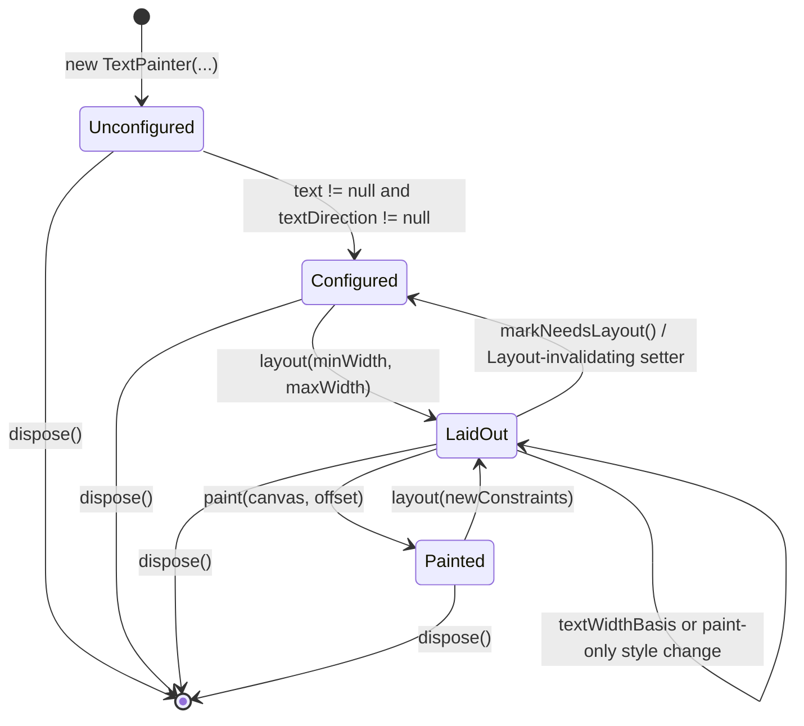

# Complete LLM Specification: `TextPainter` (`lib/src/painting/text_painter.dart`)

This document is an exhaustive, self-contained technical specification of Flutter's `TextPainter` and its supporting classes in `lib/src/painting/text_painter.dart`.

It is structured specifically for LLMs and automated reasoning systems so that **no direct source-code inspection is required** to understand, invoke, modify, or debug `TextPainter` behavior.

---

## 1. Core Architecture & Spatial Coordinate Systems



### The Spatial Coordinate Systems (Critical LLM Invariant)
A common source of bugs when reasoning about `TextPainter` is conflating the underlying engine's coordinate system with the canvas coordinate system reported by `TextPainter`:

1. **Paragraph Space (`ui.Paragraph`)**:
   * The origin `(0.0, 0.0)` is the top-left of the shaped paragraph.
   * Its horizontal width is the constraint width passed to `ui.ParagraphConstraints(width: layoutMaxWidth)`.
2. **Painter / Canvas Space (`TextPainter`)**:
   * The origin `(0.0, 0.0)` is the top-left of the area reported by `TextPainter.size`.
   * Its horizontal extent is `[0.0, contentWidth]`.
   * When `textAlignment > 0.0` (e.g., center or right alignment) and `contentWidth < layoutMaxWidth`, the underlying `ui.Paragraph` is shifted horizontally by `_TextPainterLayoutCacheWithOffset.paintOffset.dx`.

```
Canvas / Painter Space Origin (0, 0)
 |
 v
 +---------------------------------------------------------+  <-- 0.0
 | TextPainter content bounding box (width = contentWidth) |
 |   +-------------------------------------------------+   |
 |   | Shifter origin: (paintOffset.dx, 0)             |   |
 |   |   [Engine ui.Paragraph text lines]              |   |
 |   +-------------------------------------------------+   |
 +---------------------------------------------------------+  <-- height
 0   ^                                                     ^
     |--- paintOffset.dx                                   |--- contentWidth
```

> [!IMPORTANT]
> **Coordinate Translation Rule**: All public geometry methods on `TextPainter` (`TextPainter.computeLineMetrics()`, `TextPainter.getBoxesForSelection()`, `TextPainter.getOffsetForCaret()`) automatically translate engine `ui.Paragraph` coordinates into **Painter / Canvas Space** by adding `paintOffset`. Conversely, hit-testing methods (`TextPainter.getPositionForOffset()`, `TextPainter.getClosestGlyphForOffset()`) subtract `paintOffset` before querying the engine.

### Platform Text Color Divergence
* **Native Platforms (iOS, Android, macOS, Linux, Windows)**: Default text style color in engine LibTxt is **White** (`0xFFFFFFFF`).
* **Web**: Default text style color is **Black** (`0xFF000000`).
* If painting directly to canvas on a white background without setting `TextStyle.color`, text will be invisible on native platforms by default.

---

## 2. In-Depth Internal Architecture: `_TextLayout` & `_TextPainterLayoutCacheWithOffset`

To understand how `TextPainter` achieves high performance without redundant engine calls, an LLM must understand the division of responsibilities between its two core internal classes:



### 1. `_TextLayout`: Paragraph Geometry & EOT Anchors
`_TextLayout` is the direct wrapper around `ui.Paragraph` that encapsulates paragraph-level metrics and text directionality:
* **Why `_paragraph` is Non-Final**: Unlike most wrapper fields, `_paragraph` is non-final (`ui.Paragraph _paragraph;`) so that `TextPainter` can replace the underlying `ui.Paragraph` in-place when purely visual styles change (when `TextPainter._rebuildParagraphForPaint = true`), without discarding `_TextLayout` or recalculating layout geometry.
* **Delegated Intrinsic & Line Extents**: Caches and delegates `width`, `height`, `minIntrinsicLineExtent`, `maxIntrinsicLineExtent`, and `longestLine` directly to `ui.Paragraph`.
* **Baseline Calculation**: `_TextLayout.getDistanceToBaseline(TextBaseline baseline)` queries `_paragraph.alphabeticBaseline` or `_paragraph.ideographicBaseline`.
* **End-of-Text Caret Anchor (`_TextLayout._endOfTextCaretMetrics`)**:
  * Lazily computes the caret position and height when the cursor is at `(text.length, downstream)`.
  * *Trailing Whitespace Mechanics*: Uses `_painter.plainText` to inspect the final character of the last line (`numberOfLines - 1`). Whitespace character definitions refer to Java/ICU (not Unicode-Zs):
    * `0x0009` (horizontal tab): Treated as trailing whitespace (`hasTrailingSpaces = true`).
    * `0x00A0` (no-break space), `0x2007` (figure space), `0x202F` (narrow no-break space): Treated as non-whitespace (`hasTrailingSpaces = false`) because they contribute to line width.
    * Other characters matching `\p{Space_Separator}`: Treated as trailing whitespace.
  * If `hasTrailingSpaces && lastGlyph != null`, it anchors the caret to the trailing edge of the whitespace glyph (`graphemeClusterLayoutBounds.right` for LTR, `.left` for RTL) with glyph height. Otherwise, it anchors to `lineMetrics.left + lineMetrics.width` (LTR) or `lineMetrics.left` (RTL) with `lineMetrics.height`.

### 2. `_TextPainterLayoutCacheWithOffset`: Canvas Positioning & Lazy Caching
`_TextPainterLayoutCacheWithOffset` sits above `_TextLayout` to manage **canvas-level coordinate placement, constraint tracking, and lazy metrics caching**:
* **Input Constraint Tracking**: Stores `layoutMaxWidth` (the width passed to `ui.ParagraphConstraints`) and mutable `contentWidth` (the clamped horizontal width reported by `TextPainter.width`).
* **Computed `paintOffset` Getter**: Evaluates the horizontal shift:
  ```dart
  Offset get paintOffset {
    if (textAlignment == 0) return Offset.zero;
    if (!paragraph.width.isFinite) return const Offset(double.infinity, 0.0);
    final double dx = textAlignment * (contentWidth - paragraph.width);
    return Offset(dx, 0);
  }
  ```
* **Lazy Result Caching**:
  * **`inlinePlaceholderBoxes`**: Lazily invokes `paragraph.getBoxesForPlaceholders()` and caches the result in `_cachedInlinePlaceholderBoxes`.
  * **`lineMetrics`**: Lazily invokes `paragraph.computeLineMetrics()` and caches in `_cachedLineMetrics`.
  * **`_previousCaretPositionKey`**: Stores an integer cache key identifying the last queried cursor offset and leading/trailing edge anchor (`offset` if leading edge, `-offset - 1` if trailing edge). When `TextPainter.getOffsetForCaret()` or `TextPainter.getFullHeightForCaret()` is called repeatedly at the same cursor location, `TextPainter._computeCaretMetrics()` returns the cached `_caretMetrics` in $O(1)$ time without re-querying `ui.Paragraph` glyph boxes.
* **Stateful Relayout Optimization (`_TextPainterLayoutCacheWithOffset._resizeToFit`)**:
  * Evaluated when `TextPainter.layout(minWidth, maxWidth)` is called on an existing cache.
  * Fast-path 1: `if (maxWidth == contentWidth && minWidth == contentWidth)` mutates `contentWidth` and returns `true`.
  * Infinite recovery check: `if (!paintOffset.dx.isFinite && !paragraph.width.isFinite && minWidth.isFinite)` returns `false` to force layout recomputation.
  * Relayout avoidance check: `if (skipLineBreaking)` mutates `contentWidth` in-place and returns `true`, bypassing engine shaping entirely.

---

## 3. Comprehensive Guide to Supporting Public & Private Types



### 1. Public Supporting Enums & Classes

#### `const double kDefaultFontSize = 14.0;`
The default font size (in logical pixels) matching engine LibTxt defaults if none is specified in `TextStyle`.

#### `enum TextOverflow`
Defines how overflowing text is visually treated in higher-level widgets:
* `.clip`: Clips overflowing text at container bounds.
* `.fade`: Fades overflowing text to transparent.
* `.ellipsis`: Inserts an ellipsis character/string.
* `.visible`: Renders overflowing glyphs outside container bounds.
* **Important Layering Invariant**: `TextPainter` **does not have a `TextOverflow` property**. `TextPainter` only accepts `ellipsis` (`String?`) and `maxLines` (`int?`). Widgets such as `Text`, `RichText`, and `RenderParagraph` map `TextOverflow.ellipsis` to `TextPainter.ellipsis = '\u2026'`, while handling `.fade`, `.clip`, and `.visible` via compositing and canvas clip layers.

#### `enum TextWidthBasis`
Determines how `contentWidth` of multiline text is calculated:
* `.parent`: Takes up the full width given by the parent (`maxIntrinsicLineExtent` clamped to constraints).
* `.longestLine`: Tightly wraps to the width of the longest line (`longestLine` clamped to constraints).

#### `class PlaceholderDimensions`
An `@immutable` class describing the spatial dimensions of an empty space reserved in text for an inline widget (`WidgetSpan`):
* **Fields**: `final Size size;`, `final ui.PlaceholderAlignment alignment;`, `final TextBaseline? baseline;`, `final double? baselineOffset;`.
* **Sentinel Value**: `static const PlaceholderDimensions empty = PlaceholderDimensions(size: Size.zero, alignment: ui.PlaceholderAlignment.bottom);`
* **Equality & Formatting**: Overrides `==` and `hashCode`. Customizes `toString()` to display baseline offset details when `alignment` is `ui.PlaceholderAlignment.baseline`.

#### `class WordBoundary extends TextBoundary`
A word-boundary locator wrapping `_text` and `_paragraph`:
* **`WordBoundary.getTextBoundaryAt(int position)`**: Clamps negative position via `max(position, 0)` and delegates to `_paragraph.getWordBoundary()`, implementing Unicode Standard Annex #29 (UAX #29) default word boundaries.
* **`WordBoundary.moveByWordBoundary`**: A specialized `TextBoundary` used by Flutter text widgets for OS keyboard shortcuts (*Ctrl+Left/Right* or *Option+Left/Right*). Wraps `this` in an `_UntilTextBoundary` with `_skipSpacesAndPunctuations`.
* **Surrogate Code Point Extraction (`_codePointFromSurrogates`, `_codePointAt`)**: Decodes surrogate pairs (`0xD800` high surrogate + `0xDC00` low surrogate) to evaluate full Unicode scalar code points for supplementary punctuation characters.
* **Hard Newline Break Rules (`WordBoundary._isNewline`)**: Matches `0x000A` (LF), `0x0085` (NEL), `0x000B` (VT), `0x000C` (FF), `0x2028` (LS), and `0x2029` (PS). **Carriage Return (`0x000D` / `\r`) is explicitly NOT treated as a hard line break.**

---

### 2. Private Internal Helper Classes

#### `class _LineCaretMetrics`
An immutable value object representing the geometry of a caret anchored to a glyph:
* **Fields**: `final Offset offset;` (top-start corner), `final TextDirection writingDirection;` (determines whether cursor paints to the left or right of `offset`), `final double height;` (recommended vertical height).
* **`shift(Offset offset)`**: Returns a new `_LineCaretMetrics` shifted by `offset` (or `this` if `offset == Offset.zero`).

#### `class _UntilTextBoundary extends TextBoundary`
A decorator that wraps a `TextBoundary` and an `UntilPredicate` (`typedef UntilPredicate = bool Function(int offset, bool forward);`):
* **Behavior**: In `getLeadingTextBoundaryAt` and `getTrailingTextBoundaryAt`, repeatedly steps backward or forward through word boundaries until the predicate returns `true`.
* **Usage**: Allows `WordBoundary.moveByWordBoundary` to customize standard UAX #29 boundaries to match platform keyboard shortcuts.

#### `class _UnspecifiedTextScaler extends TextScaler`
A private sentinel subclass of `TextScaler`:
* **Role**: Default parameter `const _UnspecifiedTextScaler()` for `textScaler` in the `TextPainter` constructor.
* **Why it exists**: Enables `TextPainter` to distinguish whether a caller explicitly passed a custom `TextScaler` or relied on the deprecated `textScaleFactor = 1.0` parameter. During constructor initialization, if `textScaler == const _UnspecifiedTextScaler()`, it resolves to `TextScaler.linear(textScaleFactor)`.
* **Contract**: Calling `textScaleFactor` or `scale(double fontSize)` on it throws `UnimplementedError()` with return type `Never`.

---

## 4. Exhaustive Constructor & Property Reference (Invalidation Matrix)

When a setter is called on `TextPainter`, it triggers specific internal invalidation states:

| Property | Type | Default | Nullable? | Assertions / Invariants | Setter Invalidation Behavior |
| :--- | :--- | :--- | :--- | :--- | :--- |
| **`text`** | `InlineSpan?` | `null` | Yes* | Must pass `.debugAssertIsValid()`. *Must be non-null before `layout()`. | Evaluates `RenderComparison`: if `layout`, calls `markNeedsLayout()`; if `paint`, sets `_rebuildParagraphForPaint = true`; clears `_cachedPlainText`; if style changed, disposes and nulls `_layoutTemplate`. |
| **`textAlign`** | `TextAlign` | `TextAlign.start` | No | None. | Calls `markNeedsLayout()`. |
| **`textDirection`** | `TextDirection?` | `null` | Yes* | *Must be non-null before `layout()` and before `preferredLineHeight`. | Calls `markNeedsLayout()`; disposes and nulls `_layoutTemplate`. |
| **`textScaler`** | `TextScaler` | `_UnspecifiedTextScaler` (`1.0`) | No | Must not use both `textScaleFactor != 1.0` and custom `textScaler`. | Calls `markNeedsLayout()`; disposes and nulls `_layoutTemplate`. |
| **`textScaleFactor`** | `double` | `1.0` | No | *(Deprecated)*. | Sets `textScaler = TextScaler.linear(value)`. |
| **`maxLines`** | `int?` | `null` | Yes | If non-null, `assert(maxLines > 0)`. | Calls `markNeedsLayout()`. |
| **`ellipsis`** | `String?` | `null` | Yes | `assert(value == null \|\| value.isNotEmpty)`. | Calls `markNeedsLayout()`. |
| **`locale`** | `Locale?` | `null` | Yes | Passed to `ui.ParagraphStyle`. | Calls `markNeedsLayout()`. |
| **`strutStyle`** | `StrutStyle?` | `null` | Yes | Determines line height bounding. | Calls `markNeedsLayout()`. |
| **`textWidthBasis`** | `TextWidthBasis` | `.parent` | No | `.parent` vs `.longestLine`. | **Does NOT call `markNeedsLayout()`**. Preserves `_layoutCache`; sets `_debugNeedsRelayout = true` in debug mode; adjusts `contentWidth` on next `layout()`. |
| **`textHeightBehavior`** | `TextHeightBehavior?` | `null` | Yes | Controls leading/trailing half-leading. | Calls `markNeedsLayout()`. |

### Placeholder Dimensions Setup (`setPlaceholderDimensions`)
* **Signature**: `void setPlaceholderDimensions(List<PlaceholderDimensions>? value)`
* **Behavior**: If `value` is null, empty, or equals existing `_placeholderDimensions`, returns early. Otherwise, in debug mode asserts that `value.length` matches the count of `PlaceholderSpan`s in `text`, assigns `_placeholderDimensions = value`, and calls `markNeedsLayout()`.
* **Lifecycle Requirement**: If `setPlaceholderDimensions()` is omitted when `text` contains `WidgetSpan`s, placeholders are ignored during layout and `inlinePlaceholderBoxes` will return invalid/empty boxes.

### Plain Text Caching (`plainText`)
* **Signature**: `String get plainText`
* **Behavior**: Extracts raw string from `text.toPlainText(includeSemanticsLabels: false)`. Returns `''` if `text == null`.
* **Caching**: Cached in `_cachedPlainText`. Invalidated automatically whenever `text` is reassigned.

### Paint-Only Style Rebuilds (`_rebuildParagraphForPaint`)
* **Rule**: Modifying a property on an `InlineSpan` inside `text` that only affects painting (`TextStyle.color`, `TextStyle.foreground`, `TextStyle.shadows`, `TextStyle.decorationColor`) does not alter glyph shaping or line breaking.
* **Mechanism**: Sets `_rebuildParagraphForPaint = true`. When `paint(canvas, offset)` is called, `TextPainter` recreates the immutable `ui.Paragraph` using the existing `layoutMaxWidth` without invoking line-breaking again. If `paint()` is never called (e.g., measurement only), the paragraph rebuild is avoided entirely.

---

## 5. Preconditions, Postconditions, and Lifecycle Invariants



### State Contract Table
LLMs must verify painter state before calling properties or methods:

| Method / Getter | Valid in `Unconfigured`? | Valid in `Configured` (Unlaid-out)? | Valid in `LaidOut` / `Painted`? | Failure Mode if Invalid |
| :--- | :---: | :---: | :---: | :--- |
| `preferredLineHeight` | **No** (if `textDirection == null`) | **Yes** | **Yes** | Assertion error (`assert(textDirection != null)` in `_createParagraphStyle`). |
| `markNeedsLayout()` | **Yes** | **Yes** | **Yes** | None. |
| `dispose()` | **Yes** | **Yes** | **Yes** | Throws assertion failure if called twice (`debugDisposed`). |
| `layout(...)` | **No** | **Yes** | **Yes** | Throws `StateError` if `text` or `textDirection` is null. |
| `paint(canvas, offset)` | **No** | **No** | **Yes** | Throws `StateError` ("text geometry not yet calculated"). |
| `width`, `height`, `size` | **No** | **No** | **Yes** | Assertion failure (`_debugAssertTextLayoutIsValid` or `_debugNeedsRelayout`). |
| `minIntrinsicWidth`, `maxIntrinsicWidth` | **No** | **No** | **Yes** | Assertion failure (`_debugAssertTextLayoutIsValid`). |
| `didExceedMaxLines` | **No** | **No** | **Yes** | Assertion failure (`_debugAssertTextLayoutIsValid`). |
| `inlinePlaceholderBoxes` | **No** (returns `null`) | **No** (returns `null`) | **Yes** | Returns `null` if unlaid-out; returns `<TextBox>[]` if infinite offset. |
| `computeDistanceToActualBaseline(...)` | **No** | **No** | **Yes** | Assertion failure (`_debugAssertTextLayoutIsValid`). |
| `computeLineMetrics()` | **No** | **No** | **Yes** | Assertion failure (`_debugAssertTextLayoutIsValid` or `_debugNeedsRelayout`). |
| `getOffsetForCaret(...)` | **No** | **No** | **Yes** | Assertion failure (`_debugAssertTextLayoutIsValid`). |
| `getFullHeightForCaret(...)` | **No** | **No** | **Yes** | Assertion failure (`_debugAssertTextLayoutIsValid`). |
| `getBoxesForSelection(...)` | **No** | **No** | **Yes** | Assertion failure (`_debugAssertTextLayoutIsValid` or `_debugNeedsRelayout`). |
| `getPositionForOffset(...)` | **No** | **No** | **Yes** | Assertion failure (`_debugAssertTextLayoutIsValid` or `_debugNeedsRelayout`). |
| `getClosestGlyphForOffset(...)` | **No** | **No** | **Yes** | Assertion failure (`_debugAssertTextLayoutIsValid` or `_debugNeedsRelayout`). |
| `wordBoundaries`, `getWordBoundary(...)` | **No** | **No** | **Yes** | Assertion failure (`_debugAssertTextLayoutIsValid`). |
| `getLineBoundary(...)` | **No** | **No** | **Yes** | Assertion failure (`_debugAssertTextLayoutIsValid`). |

---

## 6. Mathematical Geometry & Relayout Engine

### 1. The `contentWidth` Formula (`TextPainter.width`)
When `layout(minWidth: min, maxWidth: max)` completes, `TextPainter.width` (`contentWidth`) is computed via `_TextLayout._contentWidthFor`:

```dart
double contentWidth = switch (textWidthBasis) {
  TextWidthBasis.parent => clampDouble(maxIntrinsicLineExtent, minWidth, maxWidth),
  TextWidthBasis.longestLine => clampDouble(longestLine, minWidth, maxWidth),
};
```

* **`maxIntrinsicLineExtent` (`ui.Paragraph.maxIntrinsicWidth`)**: The horizontal space needed if the entire text were on a single unwrapped line (including trailing space).
* **`longestLine` (`ui.Paragraph.longestLine`)**: The visual width of the widest line *after* line wrapping has occurred.

### 2. The `paintOffset` Formula
When rendering on canvas, `_TextPainterLayoutCacheWithOffset.paintOffset` is evaluated:

```dart
Offset paintOffset = switch (textAlignment) {
  0.0 => Offset.zero,
  _ when !paragraph.width.isFinite => const Offset(double.infinity, 0.0),
  _ => Offset(textAlignment * (contentWidth - paragraph.width), 0.0),
};
```

Where `textAlignment` is a fraction between `0.0` and `1.0` derived from `textAlign` and `textDirection` via `TextPainter._computePaintOffsetFraction`:
* `0.0` → `left`, LTR `start`/`justify`, RTL `end`
* `0.5` → `center`
* `1.0` → `right`, LTR `end`, RTL `start`/`justify`

### 3. Relayout Avoidance Condition (`_TextPainterLayoutCacheWithOffset._resizeToFit`)
When `layout(minWidth, maxWidth)` is called on an already laid-out painter:

```dart
// Branch 1: Constraints match current contentWidth exactly
if (maxWidth == contentWidth && minWidth == contentWidth) {
  contentWidth = layout._contentWidthFor(minWidth, maxWidth, widthBasis);
  return true;
}

// Branch 2: Recover from infinite paintOffset
if (!paintOffset.dx.isFinite && !paragraph.width.isFinite && minWidth.isFinite) {
  return false;
}

// Branch 3: Skip line breaking if constraints or intrinsics allow
final double maxIntrinsicWidth = paragraph.maxIntrinsicWidth;
final bool skipLineBreaking =
    maxWidth == layoutMaxWidth ||
    ((paragraph.width - maxIntrinsicWidth) > -precisionErrorTolerance &&
     (maxWidth - maxIntrinsicWidth) > -precisionErrorTolerance);
if (skipLineBreaking) {
  contentWidth = layout._contentWidthFor(minWidth, maxWidth, widthBasis);
  return true;
}
return false;
```

### 4. Infinite Constraints & Degradation
* **The Infinite `maxWidth` 2-Pass Trick**: When `maxWidth == double.infinity` and `paintOffsetAlignment != 0`, `TextPainter.layout()` lays out with `double.infinity`, reads `layout.maxIntrinsicLineExtent`, and re-lays out `ui.Paragraph` at that finite width so `paintOffset.dx` is finite.
* **Degradation under Unresolved Infinite Constraints**: If `minWidth == double.infinity` and `maxWidth == double.infinity` with non-start alignment, `paintOffset.dx` resolves to `double.infinity`. In this state:
  * `TextPainter.paint()` early-returns without drawing.
  * `TextPainter.inlinePlaceholderBoxes` returns `<TextBox>[]`.
  * `TextPainter.computeLineMetrics()` returns `const <ui.LineMetrics>[]`.
  * `TextPainter.getBoxesForSelection()` returns `<TextBox>[]`.

---

## 7. Typography, Caret, & Selection API Specification

### 1. Caret Positioning (`TextPainter.getOffsetForCaret`, `TextPainter.getFullHeightForCaret`)
* **Signatures**:
  * `Offset getOffsetForCaret(TextPosition position, Rect caretPrototype)`
  * `double getFullHeightForCaret(TextPosition position, Rect caretPrototype)`
* **Preconditions**: Painter must be in `LaidOut` state; `_debugAssertTextLayoutIsValid` must pass.
* **Caret Placement Rules (`TextPainter._computeCaretMetrics`)**:
  1. **Empty Paragraph (`numberOfLines < 1`)**: `_computeCaretMetrics` returns `null`. `getOffsetForCaret` computes $dx = \text{paintOffsetAlignment} \times \text{contentWidth}$, $dy = 0.0$ (leaving width reservation to `RenderEditable`).
  2. **Offset Zero Upstream (`TextPosition(offset: 0, affinity: TextAffinity.upstream)`)**: Coerced to `(0, downstream)` (leading edge of first character).
  3. **End-of-Text (`position.offset == text.length`, downstream)**: Uses `_TextLayout._endOfTextCaretMetrics`.
  4. **Newline Breaks (`position.affinity == TextAffinity.upstream`)**: If `position.offset - 1` is a newline character (`WordBoundary._isNewline`), converts location to `(offset, downstream)` so the caret renders at the start of the new line.
  5. **Carriage Return (`\r`)**: Explicitly excluded from `WordBoundary._isNewline`.
  6. **Multi-Code-Unit Graphemes (Emojis/Ligatures)**: Biased toward backspace / left-arrow behavior. If downstream and `offset` is inside a multi-code-unit grapheme cluster, moves to `graphemeRange.end`.
  7. **SkParagraph Zero-Size Bug Workaround**: Placeholders with `size == Size.zero` return collapsed grapheme ranges `(0, 0)`; handled by evaluating at `offset + 1`.
  8. **Truncated/Invisible Glyphs (`glyphInfo == null`)**: Falls back to `_endOfTextCaretMetrics` shifted by `-baseline` of `_layoutTemplate`.
  9. **RTL Directionality**: In RTL text, `getOffsetForCaret` subtracts `caretPrototype.width` from `offset.dx` before clamping to `[0, contentWidth]`.
* **Caret Height Rule**:
  * If strut is disabled (`strutStyle == null`, `StrutStyle.disabled`, or `fontSize == 0.0`), returns the glyph box height from `_LineCaretMetrics.height`.
  * If strut is active, queries `_getOrCreateLayoutTemplate().getBoxesForRange(0, 1, boxHeightStyle: .strut)`.
  * If degenerate (`TextStyle.height != 0` with `fontSize == 0.0`), falls back to `preferredLineHeight`.

### 2. Bidirectional Text Selection (`TextPainter.getBoxesForSelection`)
* **Signature**: `List<TextBox> getBoxesForSelection(TextSelection selection, {ui.BoxHeightStyle boxHeightStyle = ui.BoxHeightStyle.tight, ui.BoxWidthStyle boxWidthStyle = ui.BoxWidthStyle.tight})`
* **Precondition**: `selection.isValid` must be `true`; painter must be `LaidOut`.
* **Behavior**: Returns one `TextBox` per visually contiguous run, shifted by `paintOffset`. Leading or trailing newlines produce zero-width `TextBox`es. Multi-code-unit glyphs are excluded if only partially enclosed by `selection`. Returns a fixed-length (non-growable) list.

### 3. Hit-Testing & Word/Line Boundaries
* **`TextPainter.getClosestGlyphForOffset(Offset offset)`**: Maps 2D pixel coordinate `offset - paintOffset` to the nearest glyph's layout bounds, code unit range, and writing direction. Returns `null` if text is empty or entirely clipped/ellipsized away.
* **`TextPainter.getPositionForOffset(Offset offset)`**: Maps 2D canvas coordinate to logical `TextPosition` and `TextAffinity`.
* **`TextPainter.getWordBoundary(TextPosition position)`**: Returns `TextRange` of the word surrounding `position` per UAX #29.
* **`TextPainter.wordBoundaries`**: Returns a `WordBoundary` object exposing `moveByWordBoundary` for platform keyboard shortcut word jumping.
* **`TextPainter.getLineBoundary(TextPosition position)`**: Returns `TextRange` of the line surrounding `position`, excluding trailing newlines.

### 4. UTF-16 Surrogate Navigation Utilities
* **`TextPainter.getOffsetAfter(int offset)`**: Returns `offset + 2` if `codeUnitAt(offset)` is a high surrogate (`isHighSurrogate == true`), else `offset + 1`. Returns `null` if `offset` is out of bounds.
* **`TextPainter.getOffsetBefore(int offset)`**: Returns `offset - 2` if `codeUnitAt(offset - 1)` is a low surrogate (`isLowSurrogate == true`), else `offset - 1`. Returns `null` if `offset - 1` is out of bounds.
* **`TextPainter.isHighSurrogate(int value)`**: `assert(_isUTF16(value)); value & 0xFC00 == 0xD800`.
* **`TextPainter.isLowSurrogate(int value)`**: `assert(_isUTF16(value)); value & 0xFC00 == 0xDC00`.
* **Limitation**: Only handles 2-code-unit surrogate pairs (Unicode scalar values `U+10000..U+10FFFF`). Does not handle multi-scalar grapheme clusters (e.g. ZWJ sequences, skin tone modifiers, flags).

---

## 8. Complete Checklist of Public Methods & Members in `TextPainter`

### Public Methods & Static Helpers (21)
1. `TextPainter({InlineSpan? text, TextAlign textAlign = TextAlign.start, TextDirection? textDirection, double textScaleFactor = 1.0, TextScaler textScaler = const _UnspecifiedTextScaler(), int? maxLines, String? ellipsis, Locale? locale, StrutStyle? strutStyle, TextWidthBasis textWidthBasis = TextWidthBasis.parent, TextHeightBehavior? textHeightBehavior})`
2. `void setPlaceholderDimensions(List<PlaceholderDimensions>? value)`
3. `void markNeedsLayout()`
4. `void layout({double minWidth = 0.0, double maxWidth = double.infinity})`
5. `void paint(Canvas canvas, Offset offset)`
6. `void dispose()`
7. `static double computeWidth({required InlineSpan text, required TextDirection textDirection, TextAlign textAlign = TextAlign.start, double textScaleFactor = 1.0, TextScaler textScaler = TextScaler.noScaling, int? maxLines, String? ellipsis, Locale? locale, StrutStyle? strutStyle, TextWidthBasis textWidthBasis = TextWidthBasis.parent, TextHeightBehavior? textHeightBehavior, double minWidth = 0.0, double maxWidth = double.infinity})`
8. `static double computeMaxIntrinsicWidth({required InlineSpan text, required TextDirection textDirection, TextAlign textAlign = TextAlign.start, double textScaleFactor = 1.0, TextScaler textScaler = TextScaler.noScaling, int? maxLines, String? ellipsis, Locale? locale, StrutStyle? strutStyle, TextWidthBasis textWidthBasis = TextWidthBasis.parent, TextHeightBehavior? textHeightBehavior, double minWidth = 0.0, double maxWidth = double.infinity})`
9. `static bool isHighSurrogate(int value)`
10. `static bool isLowSurrogate(int value)`
11. `Offset getOffsetForCaret(TextPosition position, Rect caretPrototype)`
12. `double getFullHeightForCaret(TextPosition position, Rect caretPrototype)`
13. `int? getOffsetAfter(int offset)`
14. `int? getOffsetBefore(int offset)`
15. `List<TextBox> getBoxesForSelection(TextSelection selection, {ui.BoxHeightStyle boxHeightStyle = ui.BoxHeightStyle.tight, ui.BoxWidthStyle boxWidthStyle = ui.BoxWidthStyle.tight})`
16. `ui.GlyphInfo? getClosestGlyphForOffset(Offset offset)`
17. `TextPosition getPositionForOffset(Offset offset)`
18. `TextRange getWordBoundary(TextPosition position)`
19. `TextRange getLineBoundary(TextPosition position)`
20. `List<ui.LineMetrics> computeLineMetrics()`
21. `double computeDistanceToActualBaseline(TextBaseline baseline)`

### Public Properties, Fields & Getters / Setters (23)
1. `InlineSpan? get text` / `set text(InlineSpan? value)`
2. `TextAlign get textAlign` / `set textAlign(TextAlign value)`
3. `TextDirection? get textDirection` / `set textDirection(TextDirection? value)`
4. `double get textScaleFactor` / `set textScaleFactor(double value)` *(Deprecated)*
5. `TextScaler get textScaler` / `set textScaler(TextScaler value)`
6. `String? get ellipsis` / `set ellipsis(String? value)`
7. `Locale? get locale` / `set locale(Locale? value)`
8. `int? get maxLines` / `set maxLines(int? value)`
9. `StrutStyle? get strutStyle` / `set strutStyle(StrutStyle? value)`
10. `TextWidthBasis get textWidthBasis` / `set textWidthBasis(TextWidthBasis value)`
11. `TextHeightBehavior? get textHeightBehavior` / `set textHeightBehavior(TextHeightBehavior? value)`
12. `List<TextBox>? get inlinePlaceholderBoxes` *(Read-only, nullable before layout)*
13. `String get plainText` *(Read-only)*
14. `double get preferredLineHeight` *(Read-only, requires `textDirection != null`)*
15. `double get minIntrinsicWidth` *(Read-only, requires layout)*
16. `double get maxIntrinsicWidth` *(Read-only, requires layout)*
17. `double get width` *(Read-only, requires layout)*
18. `double get height` *(Read-only, requires layout)*
19. `Size get size` *(Read-only, requires layout)*
20. `bool get didExceedMaxLines` *(Read-only, requires layout)*
21. `WordBoundary get wordBoundaries` *(Read-only, requires layout)*
22. `bool debugPaintTextLayoutBoxes` *(Debug field; when true, paints cyan `#00FFFF` boxes for character bounds)*
23. `bool get debugDisposed` *(Debug read-only getter)*
