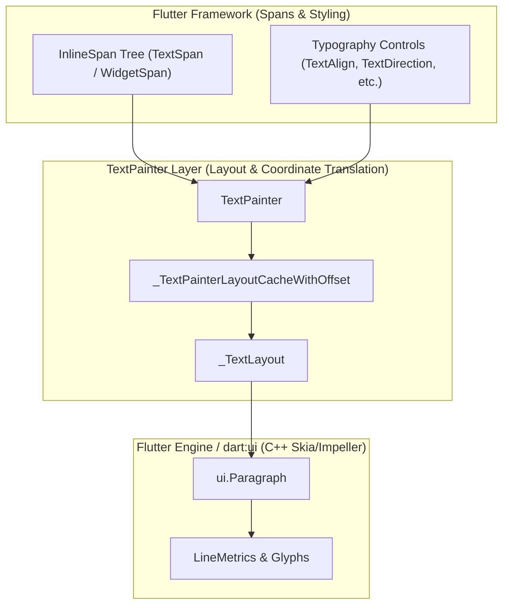
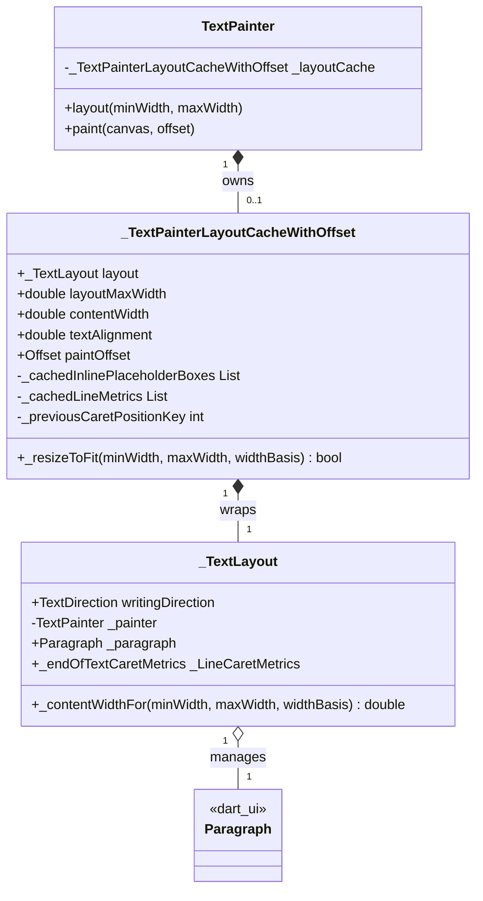
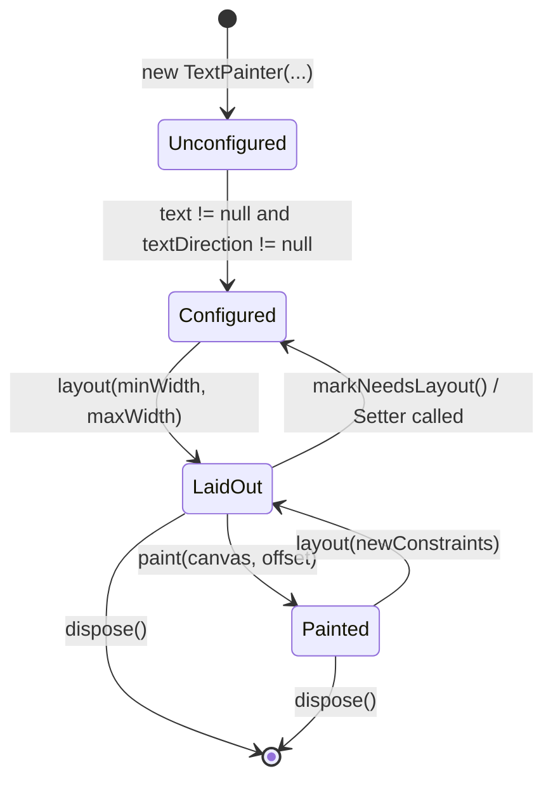

# Complete LLM Specification: `TextPainter` (`lib/src/painting/text_painter.dart`)

This document is an exhaustive, self-contained technical specification of Flutter's [`TextPainter`](file:///Users/roliv/flutter/packages/flutter/lib/src/painting/text_painter.dart#L589-L1840) and its supporting classes in [`lib/src/painting/text_painter.dart`](file:///Users/roliv/flutter/packages/flutter/lib/src/painting/text_painter.dart). 

It is structured specifically for LLMs and automated reasoning systems so that **no direct source-code inspection is required** to understand, invoke, modify, or debug `TextPainter` behavior.

---

## 1. Core Architecture & Spatial Coordinate Systems



### The Spatial Coordinate Systems (Critical LLM Invariant)
A common source of bugs when reasoning about `TextPainter` is conflating the underlying engine's coordinate system with the canvas coordinate system reported by `TextPainter`:

1. **Paragraph Space (`ui.Paragraph`)**:
   * The origin `(0.0, 0.0)` is the top-left of the shaped paragraph.
   * Its horizontal width is the constraint width passed to `ui.ParagraphConstraints(width: layoutMaxWidth)`.
2. **Painter / Canvas Space (`TextPainter`)**:
   * The origin `(0.0, 0.0)` is the top-left of the area reported by `TextPainter.size`.
   * Its horizontal extent is `[0.0, contentWidth]`.
   * When `textAlignment > 0.0` (e.g., center or right alignment) and `contentWidth < layoutMaxWidth`, the underlying `ui.Paragraph` is shifted horizontally by [`paintOffset.dx`](file:///Users/roliv/flutter/packages/flutter/lib/src/painting/text_painter.dart#L452-L462).

```
Canvas / Painter Space Origin (0, 0)
 |
 v
 +---------------------------------------------------------+  <-- 0.0
 | TextPainter content bounding box (width = contentWidth) |
 |   +-------------------------------------------------+   |
 |   | Shifter origin: (paintOffset.dx, 0)             |   |
 |   |   [Engine ui.Paragraph text lines]              |   |
 |   +-------------------------------------------------+   |
 +---------------------------------------------------------+  <-- height
 0   ^                                                     ^
     |--- paintOffset.dx                                   |--- contentWidth
```

> [!IMPORTANT]
> **Coordinate Translation Rule**: All public geometry methods on `TextPainter` ([`computeLineMetrics()`](file:///Users/roliv/flutter/packages/flutter/lib/src/painting/text_painter.dart#L1794), [`getBoxesForSelection()`](file:///Users/roliv/flutter/packages/flutter/lib/src/painting/text_painter.dart#L1666), [`getOffsetForCaret()`](file:///Users/roliv/flutter/packages/flutter/lib/src/painting/text_painter.dart#L1447)) automatically translate engine `ui.Paragraph` coordinates into **Painter / Canvas Space** by adding `paintOffset`. Conversely, hit-testing methods ([`getPositionForOffset(Offset)`](file:///Users/roliv/flutter/packages/flutter/lib/src/painting/text_painter.dart#L1714), [`getClosestGlyphForOffset(Offset)`](file:///Users/roliv/flutter/packages/flutter/lib/src/painting/text_painter.dart#L1696)) subtract `paintOffset` before querying the engine.

---

## 2. In-Depth Internal Architecture: `_TextLayout` & `_TextPainterLayoutCacheWithOffset`

To understand how `TextPainter` achieves high performance without redundant engine calls, an LLM must understand the division of responsibilities between its two core internal classes:



### 1. `_TextLayout` ([lines 295–420](file:///Users/roliv/flutter/packages/flutter/lib/src/painting/text_painter.dart#L295-L420)): Paragraph Geometry & EOT Anchors
`_TextLayout` is the direct wrapper around `ui.Paragraph` that encapsulates paragraph-level metrics and text directionality:
* **Why `_paragraph` is Non-Final**: Unlike most wrapper fields, `_paragraph` is non-final (`ui.Paragraph _paragraph;`) so that `TextPainter` can replace the underlying `ui.Paragraph` in-place when purely visual styles change (when `_rebuildParagraphForPaint = true`), without discarding `_TextLayout` or recalculating layout geometry.
* **Delegated Intrinsic & Line Extents**: Caches and delegates `width`, `height`, `minIntrinsicLineExtent`, `maxIntrinsicLineExtent`, and `longestLine` directly to `ui.Paragraph`.
* **End-of-Text Caret Anchor (`_endOfTextCaretMetrics`)**:
  * Lazily computes the caret position and height when the cursor is at `(text.length, downstream)`.
  * *Trailing Whitespace Mechanics*: Uses `_painter.plainText` to inspect the final character of the last line (`numberOfLines - 1`). If the character is a trailing whitespace (matched by `_regExpSpaceSeparators`, excluding tab `0x0009`, NBSP `0x00A0`, figure space `0x2007`, and NNBSP `0x202F`), it anchors the caret to the trailing edge of the whitespace glyph (`graphemeClusterLayoutBounds`). Otherwise, it anchors to `lineMetrics.left + lineMetrics.width`.

### 2. `_TextPainterLayoutCacheWithOffset` ([lines 426–529](file:///Users/roliv/flutter/packages/flutter/lib/src/painting/text_painter.dart#L426-L529)): Canvas Positioning & Lazy Caching
`_TextPainterLayoutCacheWithOffset` sits above `_TextLayout` to manage **canvas-level coordinate placement, constraint tracking, and lazy metrics caching**:
* **Input Constraint Tracking**: Stores `layoutMaxWidth` (the width passed to `ui.ParagraphConstraints`) and `contentWidth` (the clamped horizontal width reported by `TextPainter.width`).
* **Computed `paintOffset` Getter**: Evaluates the horizontal shift `Offset(textAlignment * (contentWidth - paragraph.width), 0.0)` needed to align center- or right-aligned text within `contentWidth`.
* **Lazy Result Caching (Memory & Performance Optimization)**:
  * **`inlinePlaceholderBoxes`**: Lazily invokes `paragraph.getBoxesForPlaceholders()` and caches the result in `_cachedInlinePlaceholderBoxes`.
  * **`lineMetrics`**: Lazily invokes `paragraph.computeLineMetrics()` and caches in `_cachedLineMetrics`.
  * **`_previousCaretPositionKey`**: Stores an integer cache key identifying the last queried cursor offset and leading/trailing edge anchor (`offset` if leading edge, `-offset - 1` if trailing edge). When `getOffsetForCaret()` or `getFullHeightForCaret()` is called repeatedly at the same cursor location, `_computeCaretMetrics` returns the cached `_caretMetrics` in O(1) time without re-querying `ui.Paragraph` glyph boxes.
* **Stateful Relayout Optimization (`_resizeToFit`)**:
  * Evaluated when `layout(minWidth, maxWidth)` is called on an existing cache.
  * Mutates `contentWidth` in-place and returns `true` if constraints can be satisfied without soft line-break changes, bypassing engine shaping entirely.

---

## 3. Comprehensive Guide to Supporting Public & Private Types

Beyond `TextPainter` and its layout caches, [`text_painter.dart`](file:///Users/roliv/flutter/packages/flutter/lib/src/painting/text_painter.dart) defines several core public enums/classes and private helper classes that govern text rendering, boundaries, and caret metrics:


### 1. Public Supporting Enums & Classes

#### `enum TextOverflow` ([lines 47–59](file:///Users/roliv/flutter/packages/flutter/lib/src/painting/text_painter.dart#L47-L59))
Controls how text that overflows its container bounds is visually treated:
* `.clip`: Clips overflowing text at the container edge.
* `.fade`: Fades the overflowing edge to transparent.
* `.ellipsis`: Inserts an ellipsis string (e.g. `"..."` or `"\u2026"`) to indicate overflow.
* `.visible`: Renders overflowing glyphs outside the container's bounds without clipping.

#### `enum TextWidthBasis` ([lines 152–162](file:///Users/roliv/flutter/packages/flutter/lib/src/painting/text_painter.dart#L152-L162))
Determines how the horizontal width (`contentWidth`) of multiline text is calculated:
* `.parent`: Takes up the full width given by the parent (`maxIntrinsicLineExtent` clamped to constraints).
* `.longestLine`: Tightly wraps to the width of the longest line (`longestLine` clamped to constraints). Ideal for chat bubbles.

#### `class PlaceholderDimensions` ([lines 74–147](file:///Users/roliv/flutter/packages/flutter/lib/src/painting/text_painter.dart#L74-L147))
An `@immutable` class describing the spatial dimensions of an empty space reserved in text for an inline widget (`WidgetSpan`):
* **Fields**: `final Size size;`, `final ui.PlaceholderAlignment alignment;`, `final TextBaseline? baseline;`, `final double? baselineOffset;`.
* **Sentinel Value**: `static const PlaceholderDimensions empty = PlaceholderDimensions(size: Size.zero, alignment: ui.PlaceholderAlignment.bottom);`
* **Equality & Formatting**: Overrides `==` and `hashCode` based on all fields, and customizes `toString()` to display baseline offset details when `alignment` is `ui.PlaceholderAlignment.baseline`.

#### `class WordBoundary extends TextBoundary` ([lines 177–269](file:///Users/roliv/flutter/packages/flutter/lib/src/painting/text_painter.dart#L177-L269))
A word-boundary locator wrapping `_text` and `_paragraph`:
* **`getTextBoundaryAt(int position)`**: Delegates directly to `_paragraph.getWordBoundary`, which implements Unicode Standard Annex #29 (UAX #29) default word boundaries.
* **`moveByWordBoundary`**: A specialized `TextBoundary` used by Flutter text widgets for OS keyboard shortcuts (*Ctrl+Left/Right* or *Option+Left/Right*). It wraps `this` in an `_UntilTextBoundary` with `_skipSpacesAndPunctuations` to skip trailing spaces and punctuation when jumping words.

---

### 2. Private Internal Helper Classes

#### `class _LineCaretMetrics` ([lines 534–562](file:///Users/roliv/flutter/packages/flutter/lib/src/painting/text_painter.dart#L534-L562))
An immutable value object representing the geometry of a caret (I-beam) anchored to a glyph or ligature:
* **Fields**: `final Offset offset;` (top-start corner), `final TextDirection writingDirection;` (determines whether the cursor paints to the left or right of `offset`), `final double height;` (recommended vertical height).
* **`shift(Offset offset)`**: Returns a new `_LineCaretMetrics` shifted by `offset` (or `this` if `offset == Offset.zero`).
* **Usage**: Used by `_TextLayout._endOfTextCaretMetrics` and cached in `TextPainter._caretMetrics` to position cursors without redundant layout box queries.

#### `class _UntilTextBoundary extends TextBoundary` ([lines 271–293](file:///Users/roliv/flutter/packages/flutter/lib/src/painting/text_painter.dart#L271-L293))
A decorator that wraps a `TextBoundary` and an `UntilPredicate` (`typedef UntilPredicate = bool Function(int offset, bool forward);`):
* **Behavior**: In `getLeadingTextBoundaryAt` and `getTrailingTextBoundaryAt`, it repeatedly steps backward or forward through word boundaries until the predicate returns `true`.
* **Usage**: Allows `WordBoundary.moveByWordBoundary` to customize standard UAX #29 boundaries to match platform keyboard shortcuts.

#### `class _UnspecifiedTextScaler extends TextScaler` ([lines 1842–1849](file:///Users/roliv/flutter/packages/flutter/lib/src/painting/text_painter.dart#L1842-L1849))
A private sentinel subclass of `TextScaler`:
* **Role**: Used as the default parameter `const _UnspecifiedTextScaler()` for `textScaler` in constructors and static helpers.
* **Why it exists**: Enables `TextPainter` to distinguish whether a caller explicitly passed a custom `TextScaler` or relied on the deprecated `textScaleFactor = 1.0` parameter. During constructor initialization, if `textScaler == const _UnspecifiedTextScaler()`, it resolves to `TextScaler.linear(textScaleFactor)`.
* **Contract**: Calling `textScaleFactor` or `scale(double fontSize)` on it throws an `UnimplementedError()` because it is only meant as a sentinel identity token.

---

## 4. Exhaustive Constructor & Property Reference (Invalidation Matrix)

When a setter is called on `TextPainter`, it triggers specific internal invalidation states. LLMs must adhere to these invalidation rules when mutating existing painters:

| Property | Type | Default | Nullable? | Assertions / Invariants | Setter Invalidation Behavior |
| :--- | :--- | :--- | :--- | :--- | :--- |
| **`text`** | `InlineSpan?` | `null` | Yes* | Must pass `.debugAssertIsValid()`. *Must be non-null before `layout()`. | Calls [`markNeedsLayout()`](file:///Users/roliv/flutter/packages/flutter/lib/src/painting/text_painter.dart#L781); clears `_cachedPlainText`. |
| **`textAlign`** | `TextAlign` | `TextAlign.start` | No | None. | Calls `markNeedsLayout()`. |
| **`textDirection`** | `TextDirection?` | `null` | Yes* | *Must be non-null before `layout()`. | Calls `markNeedsLayout()`. |
| **`textScaler`** | `TextScaler` | `_UnspecifiedTextScaler` (`1.0`) | No | Must not use both `textScaleFactor != 1.0` and a custom `textScaler`. | Calls `markNeedsLayout()`. |
| **`maxLines`** | `int?` | `null` | Yes | If non-null, `assert(maxLines > 0)`. | Calls `markNeedsLayout()`. |
| **`ellipsis`** | `String?` | `null` | Yes | E.g., `"\u2026"` (`...`). | Calls `markNeedsLayout()`. |
| **`locale`** | `Locale?` | `null` | Yes | Passed to `ui.ParagraphStyle`. | Calls `markNeedsLayout()`. |
| **`strutStyle`** | `StrutStyle?` | `null` | Yes | Determines line height bounding. | Calls `markNeedsLayout()`. |
| **`textWidthBasis`** | `TextWidthBasis` | `.parent` | No | `.parent` vs `.longestLine`. | Calls `markNeedsLayout()`. |
| **`textHeightBehavior`** | `TextHeightBehavior?` | `null` | Yes | Controls leading/trailing half-leading. | Calls `markNeedsLayout()`. |

### Plain Text Caching (`plainText`)
* **Signature**: `String get plainText` ([line 832](file:///Users/roliv/flutter/packages/flutter/lib/src/painting/text_painter.dart#L832))
* **Behavior**: Extracts the raw UTF-16 string from `text.toPlainText(includeSemanticsLabels: false)`.
* **Caching**: Cached in `_cachedPlainText`. Invalidate automatically whenever `text` is reassigned.

### Paint-Only Style Rebuilds (`_rebuildParagraphForPaint`)
* **Rule**: Modifying a property on an `InlineSpan` inside `text` that *only* affects painting (such as `TextStyle.color`, `TextStyle.foreground`, `TextStyle.shadows`, or `TextStyle.decorationColor`) does not alter glyph shaping or line breaking.
* **Mechanism**: To prevent expensive re-layout, such updates set `_rebuildParagraphForPaint = true` ([line 754](file:///Users/roliv/flutter/packages/flutter/lib/src/painting/text_painter.dart#L754)). When `paint(canvas, offset)` is called, `TextPainter` recreates the immutable `ui.Paragraph` using the existing `layoutMaxWidth` without invoking line-breaking again.

---

## 5. Preconditions, Postconditions, and Lifecycle Invariants



### State Contract Table
LLMs must verify painter state before calling properties or methods:

| Method / Getter | Valid in `Unconfigured`? | Valid in `Configured` (Unlaid-out)? | Valid in `LaidOut` / `Painted`? | Failure Mode if Invalid |
| :--- | :---: | :---: | :---: | :--- |
| `preferredLineHeight` | **Yes** | **Yes** | **Yes** | None (Uses dummy `_layoutTemplate`). |
| `markNeedsLayout()` | **Yes** | **Yes** | **Yes** | None. |
| `dispose()` | **Yes** | **Yes** | **Yes** | Throws if called twice (`debugDisposed`). |
| `layout(...)` | **No** | **Yes** | **Yes** | Throws `StateError` if `text` or `textDirection` is null. |
| `paint(canvas, offset)` | **No** | **No** | **Yes** | Throws `StateError` ("text geometry not yet calculated"). |
| `width`, `height`, `size` | **No** | **No** | **Yes** | Assertion failure (`_debugAssertTextLayoutIsValid`). |
| `minIntrinsicWidth`, `maxIntrinsicWidth` | **No** | **No** | **Yes** | Assertion failure (`_debugAssertTextLayoutIsValid`). |
| `didExceedMaxLines` | **No** | **No** | **Yes** | Assertion failure (`_debugAssertTextLayoutIsValid`). |
| `computeLineMetrics()` | **No** | **No** | **Yes** | Assertion failure (`_debugAssertTextLayoutIsValid`). |
| `getOffsetForCaret(...)` | **No** | **No** | **Yes** | Assertion failure (`_debugAssertTextLayoutIsValid`). |
| `getBoxesForSelection(...)` | **No** | **No** | **Yes** | Assertion failure (`_debugAssertTextLayoutIsValid`). |
| `getPositionForOffset(...)` | **No** | **No** | **Yes** | Assertion failure (`_debugAssertTextLayoutIsValid`). |
| `getClosestGlyphForOffset(...)` | **No** | **No** | **Yes** | Assertion failure (`_debugAssertTextLayoutIsValid`). |
| `wordBoundaries`, `getWordBoundary` | **No** | **No** | **Yes** | Assertion failure (`_debugAssertTextLayoutIsValid`). |
| `getLineBoundary(...)` | **No** | **No** | **Yes** | Assertion failure (`_debugAssertTextLayoutIsValid`). |

---

## 6. Mathematical Geometry & Relayout Engine

### 1. The `contentWidth` Formula (`TextPainter.width`)
When `layout(minWidth: min, maxWidth: max)` completes, `TextPainter.width` (`contentWidth`) is computed via [`_TextLayout._contentWidthFor`](file:///Users/roliv/flutter/packages/flutter/lib/src/painting/text_painter.dart#L414-L419):

```dart
double contentWidth = switch (textWidthBasis) {
  TextWidthBasis.parent => clampDouble(maxIntrinsicLineExtent, minWidth, maxWidth),
  TextWidthBasis.longestLine => clampDouble(longestLine, minWidth, maxWidth),
};
```

* **`maxIntrinsicLineExtent` (`ui.Paragraph.maxIntrinsicWidth`)**: The horizontal space needed if the entire text were on a single unwrapped line (including trailing space).
* **`longestLine` (`ui.Paragraph.longestLine`)**: The visual width of the widest line *after* line wrapping has occurred.

### 2. The `paintOffset` Formula
When rendering on canvas, `_TextPainterLayoutCacheWithOffset.paintOffset` ([line 452](file:///Users/roliv/flutter/packages/flutter/lib/src/painting/text_painter.dart#L452)) is evaluated:

```dart
Offset paintOffset = switch (textAlignment) {
  0.0 => Offset.zero,
  _ when !paragraph.width.isFinite => const Offset(double.infinity, 0.0),
  _ => Offset(textAlignment * (contentWidth - paragraph.width), 0.0),
};
```

Where `textAlignment` is a fraction between `0.0` and `1.0` derived from `textAlign` and `textDirection` via [`_computePaintOffsetFraction`](file:///Users/roliv/flutter/packages/flutter/lib/src/painting/text_painter.dart#L1432-L1442):
* `0.0` → `left`, LTR `start`/`justify`, RTL `end`
* `0.5` → `center`
* `1.0` → `right`, LTR `end`, RTL `start`/`justify`

### 3. Relayout Avoidance Condition (`_resizeToFit`)
When `layout(minWidth, maxWidth)` is called on an already laid-out painter, [`_resizeToFit`](file:///Users/roliv/flutter/packages/flutter/lib/src/painting/text_painter.dart#L471-L516) evaluates whether shaping/line-breaking can be skipped:

```dart
final bool skipLineBreaking =
    maxWidth == layoutMaxWidth ||
    ((paragraph.width - maxIntrinsicWidth) > -precisionErrorTolerance &&
     (maxWidth - maxIntrinsicWidth) > -precisionErrorTolerance);
```
* **LLM Invariant**: If new input `maxWidth` is identical to `layoutMaxWidth`, OR if both the existing paragraph width and the new `maxWidth` are strictly `>= maxIntrinsicWidth`, no line wrapping changes. `TextPainter` updates `contentWidth` and `paintOffset` in O(1) time without calling the engine.

### 4. The Infinite `maxWidth` + Non-Left Alignment Two-Pass Trick
* **The Problem**: If `layout(minWidth: 0, maxWidth: double.infinity)` is called with `textAlign: TextAlign.center` (`textAlignment = 0.5`), laying out `ui.Paragraph` with `width = double.infinity` would produce `paintOffset.dx = 0.5 * (contentWidth - infinity) = -infinity`, which would invalidate all canvas arithmetic operations.
* **The Two-Pass Resolution ([lines 1251–1283](file:///Users/roliv/flutter/packages/flutter/lib/src/painting/text_painter.dart#L1251-L1283))**:
  1. Detect condition: `adjustMaxWidth = !maxWidth.isFinite && paintOffsetAlignment != 0`.
  2. Lay out `ui.Paragraph` with `width: double.infinity`.
  3. Measure `newInputWidth = layout.maxIntrinsicLineExtent`.
  4. **Re-layout** `ui.Paragraph` with `width: newInputWidth`.
  5. Resulting `paintOffset.dx` is finite and centered correctly.

---

## 7. Typography, Caret, & Selection API Specification

### 1. Caret Positioning (`getOffsetForCaret`, `getFullHeightForCaret`)
* **Signatures**:
  * `Offset getOffsetForCaret(TextPosition position, Rect caretPrototype)` ([line 1447](file:///Users/roliv/flutter/packages/flutter/lib/src/painting/text_painter.dart#L1447))
  * `double getFullHeightForCaret(TextPosition position, Rect caretPrototype)` ([line 1496](file:///Users/roliv/flutter/packages/flutter/lib/src/painting/text_painter.dart#L1496))
* **Preconditions**: Painter must be in `LaidOut` state; `_debugAssertTextLayoutIsValid` must pass.
* **Caret Placement Rules ([_computeCaretMetrics](file:///Users/roliv/flutter/packages/flutter/lib/src/painting/text_painter.dart#L1568-L1646))**:
  1. **Empty Paragraph**: Returns `Offset.zero`; height falls back to `preferredLineHeight`.
  2. **End-of-Text (`position.offset == text.length`, downstream)**: Uses [`_endOfTextCaretMetrics`](file:///Users/roliv/flutter/packages/flutter/lib/src/painting/text_painter.dart#L364-L412).
     * *Trailing Whitespace Rule*: Unicode whitespace definition refers to Java/ICU (not Unicode-Zs). Characters `0x0009` (tab), `0x00A0` (NBSP), `0x2007` (figure space), and `0x202F` (NNBSP) are **not** treated as trailing space separators for EOT anchor calculation.
  3. **Newline Breaks (`position.affinity == TextAffinity.upstream`)**: If `position.offset - 1` is a newline character (`0x000A`, `0x0085`, `0x000B`, `0x000C`, `0x2028`, `0x2029`), `TextPainter` overrides standard upstream rules to display the caret at the start of the new line.
  4. **Multi-Code-Unit Graphemes (Emojis/Ligatures)**: Biased toward backspace behavior (left-arrow-key-biased).
  5. **SkParagraph Zero-Size Bug Workaround**: Placeholders with `size == Size.zero` return collapsed grapheme ranges; `TextPainter` detects `graphemeRange.isCollapsed` and evaluates at `offset + 1`.
* **Caret Height Rule**:
  * If `strutStyle` is null or `.disabled` (or `fontSize == 0.0`), returns the glyph box height.
  * If strut is active, queries `getBoxesForRange(0, 1, boxHeightStyle: .strut)` on `_getOrCreateLayoutTemplate()`.

### 2. Bidirectional Text Selection (`getBoxesForSelection`)
* **Signature**: `List<TextBox> getBoxesForSelection(TextSelection selection, {ui.BoxHeightStyle boxHeightStyle, ui.BoxWidthStyle boxWidthStyle})` ([line 1666](file:///Users/roliv/flutter/packages/flutter/lib/src/painting/text_painter.dart#L1666))
* **Precondition**: `selection.isValid` must be `true`; painter must be `LaidOut`.
* **LLM Invariant (Why `List<TextBox>`?)**: In bidirectional text (LTR mixed with RTL), logically contiguous code units in `selection` can be visually disjoint on screen. Returns one `TextBox` per visually contiguous run, shifted by `paintOffset`. Multi-code-unit glyphs are excluded if only partially enclosed by `selection`.

### 3. Hit-Testing & Word/Line Boundaries
* **`ui.GlyphInfo? getClosestGlyphForOffset(Offset offset)`** ([line 1696](file:///Users/roliv/flutter/packages/flutter/lib/src/painting/text_painter.dart#L1696)): Maps 2D pixel coordinate `offset - paintOffset` to the nearest glyph's layout bounds, code unit range, and writing direction.
* **`TextPosition getPositionForOffset(Offset offset)`** ([line 1714](file:///Users/roliv/flutter/packages/flutter/lib/src/painting/text_painter.dart#L1714)): Maps 2D canvas coordinate to logical `TextPosition` and `TextAffinity`.
* **`TextRange getWordBoundary(TextPosition position)`** ([line 1730](file:///Users/roliv/flutter/packages/flutter/lib/src/painting/text_painter.dart#L1730)): Implements Unicode Standard Annex #29 (UAX #29) word boundaries.
  * **OS Keyboard Shortcut Boundary**: `wordBoundaries.moveByWordBoundary` ([line 268](file:///Users/roliv/flutter/packages/flutter/lib/src/painting/text_painter.dart#L268)) skips trailing space separators and punctuation when jumping between words, matching standard OS shortcut behavior (*Ctrl+Left/Right* or *Option+Left/Right*).
* **`TextRange getLineBoundary(TextPosition position)`** ([line 1750](file:///Users/roliv/flutter/packages/flutter/lib/src/painting/text_painter.dart#L1750)): Returns the character range of the line surrounding `position`, excluding the trailing newline character.

### 4. UTF-16 Surrogate Navigation Utilities
* **`int? getOffsetAfter(int offset)`** ([line 1412](file:///Users/roliv/flutter/packages/flutter/lib/src/painting/text_painter.dart#L1412)): Returns `offset + 2` if `codeUnitAt(offset)` is a high surrogate (`isHighSurrogate == true`), else `offset + 1`.
* **`int? getOffsetBefore(int offset)`** ([line 1423](file:///Users/roliv/flutter/packages/flutter/lib/src/painting/text_painter.dart#L1423)): Returns `offset - 2` if `codeUnitAt(offset - 1)` is a low surrogate (`isLowSurrogate == true`), else `offset - 1`.
* **`static bool isHighSurrogate(int value)`** ([line 1392](file:///Users/roliv/flutter/packages/flutter/lib/src/painting/text_painter.dart#L1392)): `value & 0xFC00 == 0xD800`.
* **`static bool isLowSurrogate(int value)`** ([line 1405](file:///Users/roliv/flutter/packages/flutter/lib/src/painting/text_painter.dart#L1405)): `value & 0xFC00 == 0xDC00`.

---

## 8. Complete Checklist of Public Methods & Members in `TextPainter`

Below is the exhaustive API index of all **21 public methods, constructors, and static helpers** and **20 public properties/getters/setters** in `TextPainter`:

### Public Methods & Static Helpers (21)
1. `TextPainter({InlineSpan? text, TextAlign textAlign = TextAlign.start, TextDirection? textDirection, double textScaleFactor = 1.0, TextScaler textScaler = const _UnspecifiedTextScaler(), int? maxLines, String? ellipsis, Locale? locale, StrutStyle? strutStyle, TextWidthBasis textWidthBasis = TextWidthBasis.parent, TextHeightBehavior? textHeightBehavior})`
2. `void setPlaceholderDimensions(List<PlaceholderDimensions>? value)`
3. `void markNeedsLayout()`
4. `void layout({double minWidth = 0.0, double maxWidth = double.infinity})`
5. `void paint(Canvas canvas, Offset offset)`
6. `void dispose()`
7. `static double computeWidth({required InlineSpan text, required TextDirection textDirection, ...})`
8. `static double computeMaxIntrinsicWidth({required InlineSpan text, required TextDirection textDirection, ...})`
9. `static bool isHighSurrogate(int value)`
10. `static bool isLowSurrogate(int value)`
11. `Offset getOffsetForCaret(TextPosition position, Rect caretPrototype)`
12. `double getFullHeightForCaret(TextPosition position, Rect caretPrototype)`
13. `int? getOffsetAfter(int offset)`
14. `int? getOffsetBefore(int offset)`
15. `List<TextBox> getBoxesForSelection(TextSelection selection, {ui.BoxHeightStyle boxHeightStyle, ui.BoxWidthStyle boxWidthStyle})`
16. `ui.GlyphInfo? getClosestGlyphForOffset(Offset offset)`
17. `TextPosition getPositionForOffset(Offset offset)`
18. `TextRange getWordBoundary(TextPosition position)`
19. `TextRange getLineBoundary(TextPosition position)`
20. `List<ui.LineMetrics> computeLineMetrics()`
21. `double computeDistanceToActualBaseline(TextBaseline baseline)`

### Public Properties, Fields & Getters / Setters (22)
1. `InlineSpan? get text` / `set text(InlineSpan? value)`
2. `TextAlign get textAlign` / `set textAlign(TextAlign value)`
3. `TextDirection? get textDirection` / `set textDirection(TextDirection? value)`
4. `double get textScaleFactor` / `set textScaleFactor(double value)` *(Deprecated)*
5. `TextScaler get textScaler` / `set textScaler(TextScaler value)`
6. `String? get ellipsis` / `set ellipsis(String? value)`
7. `Locale? get locale` / `set locale(Locale? value)`
8. `int? get maxLines` / `set maxLines(int? value)`
9. `StrutStyle? get strutStyle` / `set strutStyle(StrutStyle? value)`
10. `TextWidthBasis get textWidthBasis` / `set textWidthBasis(TextWidthBasis value)`
11. `TextHeightBehavior? get textHeightBehavior` / `set textHeightBehavior(TextHeightBehavior? value)`
12. `String get plainText` *(Read-only)*
13. `double get preferredLineHeight` *(Read-only, valid before layout)*
14. `double get minIntrinsicWidth` *(Read-only, requires layout)*
15. `double get maxIntrinsicWidth` *(Read-only, requires layout)*
16. `double get width` *(Read-only, requires layout)*
17. `double get height` *(Read-only, requires layout)*
18. `Size get size` *(Read-only, requires layout)*
19. `bool get didExceedMaxLines` *(Read-only, requires layout)*
20. `WordBoundary get wordBoundaries` *(Read-only, requires layout)*
21. `bool debugPaintTextLayoutBoxes` *(Debug field)*
22. `bool get debugDisposed` *(Debug read-only getter)*
